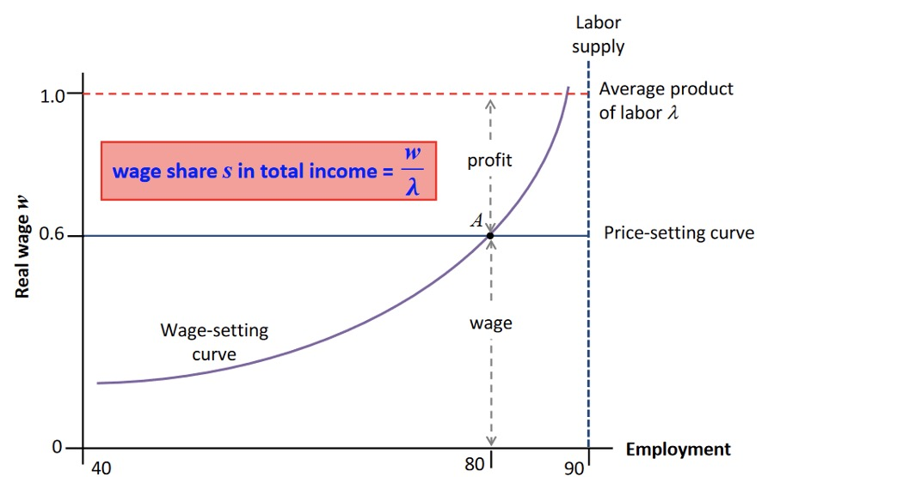
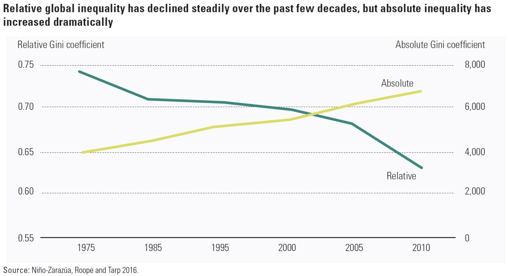
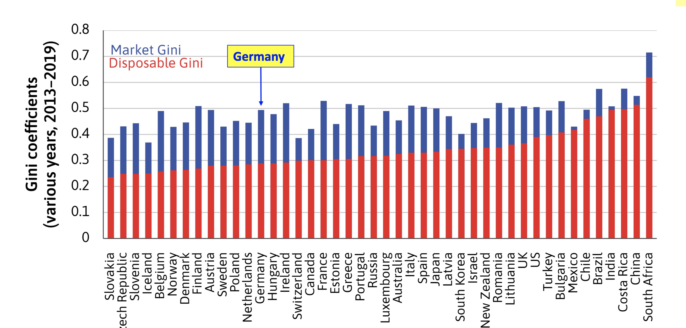

# 21.04.2023 Inequality

Labor Market = Division of Output

- employed
- unemployed
- Firm-owners

## Measuring Inequality

- Lorenz Curve: 
- Gini Coefficient: Measure of Ineq. from 0 to 1

Calculating Gini:

1. $G = \frac{1}{2*n^2*u} \sum_j \sum_i n_j * n_i * | y_j - y_i |$
2. $G = \frac{A}{A+B}$

Principles of an inequality measure

- **Anonymity** : insensitive to permutations (change of rich to poor etc.)
- **Population**: Clone / Double Population = no effect
- **Dalton**: Transfer from rich to poor = no effect
- **relative income principle**: double all incomes = no effect

Lorenz for given example with workers:

- mean wage employed: $\frac{0.6}{80} = 0.0075$
- mean wage capitalists: $\frac{0.4}{0.1} = 0.04$
- $u = \frac{10*0+80*0.0075+10*0.04}{n=100} = 0.01$

$$
G = \frac{1}{2*100^2*0.01} * [10*80* |0-0.0075]+80*10*|0.0075-0|+... ] \\
G = 0.36
$$

### Effects on Inequality

rises with:

- Unenplyoment rate $\uparrow$
- productitivity $\uparrow$ at constant wage
- number of employers = market power $\uparrow$ = lower wage $\downarrow$

## Global Inequality

How did Globalistaion effect Ineq.?

Why:

- high rates of growth 
- especially populous southeast (China)

### Redistribution

Market Income is very inuequally distributed

but Redistribution leads to more equal societies!

