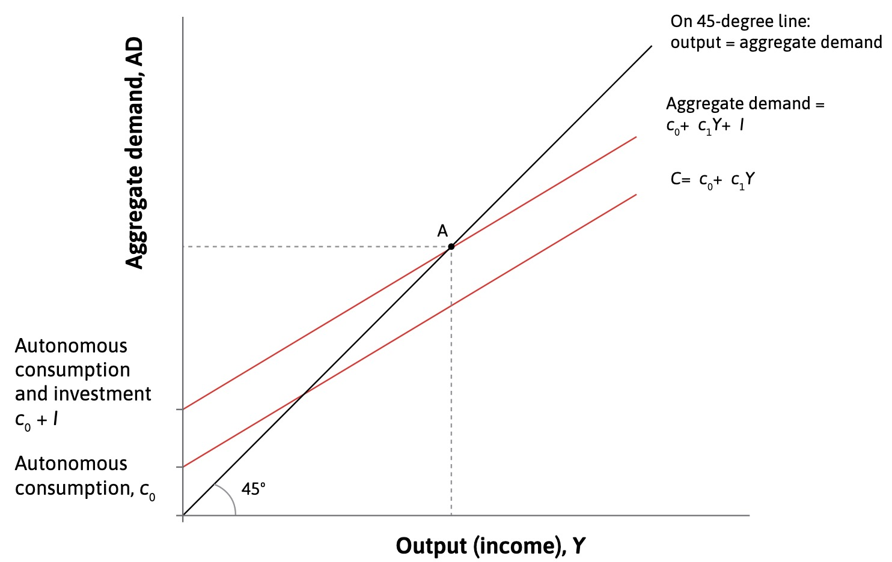
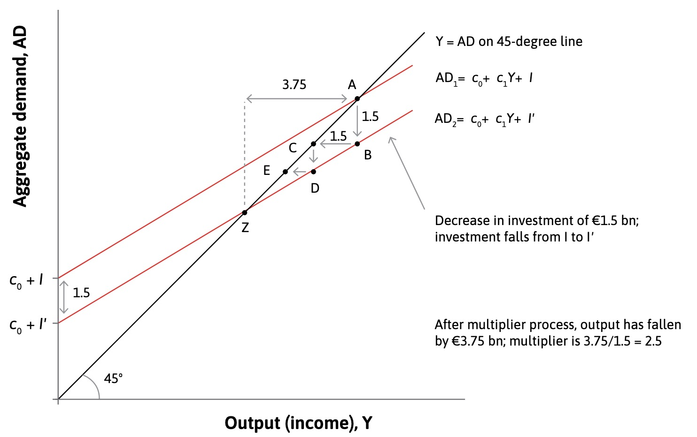

# 24.05.2023 Fiscal Policy

[Chapter 14](https://www.core-econ.org/the-economy/book/text/14.html)

## Aggregate Demand

Aggregate Consumption

- autonomous consumption = fixed amount based on future income
    - slope of function = marginal propensity to consume
    - additional consumption based on more income in period etc
- 45° Line where AD = Aggregate Output
    - state of normal economy
- Investment: does not depend on output
    - added to AD Line

implicit assumption: underutilized capacity in economy

### The multiplier

A Decrease (or Increase) in Investments leads to a higher decrease in Income than the original 

- original negative investment = 1.5bn€
- expected point afterwards = C
- but households now have less money and this leads to ripple effects = Z

Determining the Multiplier

$$
Y = AD = C+I \\
= c_0 + c_1 Y+I \\ 
Y(1-c_1) = c_0+I \\
Y = \underbrace{\frac{1}{1-c_1}}_{multiplier} \times
\underbrace{c_0+I}_{autonomous \ D.}
$$

with $c_1$ = marginal propensity to consume

### Household Spending

Has *Target Wealth*: level to maintain based on expectations

optimizes *broad wealth*: assets - debt, including future earnings

> **Paradox of thrift** (Sparparadoxon): aggregate attempts of all households to increase savings during a recession does not actually increase savings

- Autonomous Consumption declines => AD curve downwards
- Income + Labor Demand declines  => Recession
- higher savings at lower income = absolute lower savings

### Firms Investments

Decicsions depend:

- Discount rate *p* of owner (opprt. cost)
- interest rate *r*
- profit rate of investment $\Pi$

Investment when: $\Pi > p+r$

Example: individual firms

The Aggregate Economy: sinking interest rates = more Projects

### Government and Imports

Government Spending and Net Exports = shift 45° Line up

> **marginal propensity to import (m)**: fraction of additional dollar spend on imports of household

Net Exports $= X-M = X-mY$

Combined Formula

$$
AD = c_o + c_1(1-t)Y + I+G+X-mY
$$
With t = Tax rate

## Fiscal Policy

How does Government Policy impact Aggregate Demand and the Business Cycle?

=> severity of Business cycle shrinked with bigger government

### Policy before Keynes

after David Ricardo:

- wages and prices adjust
- no long-term disturbances
- only role of government = avoid deficits

=> orthodox policy = austerity

> **Economics**: Allocation of scarce resources

### Policy after Keynes

*in the long run, we're all dead*

- government intervention can provide benefits to society
- due to the money multiplier
- the effect of fiscal stimulus is more than the money used for it

> **Economics**: study of how agents allocate resources and *how those choices affect society*

### Government Role

Stabilizing

- non-cyclical expenditures (education)
- income redistribution (consumption smoothing)
- investments in recessions

Destabilizing

- trough Austerity in Crisis
- political business cycle

Depends on Multiplier:

> empiric research suggests: multiplier in crisis is above 1 (even IMF says so) and austerity is therefore a very dumb idea...

The Multiplier over the business cycle:

- in crisis: high because of anticipation and underused capacity
- in booms: lower (but often above 1)

### Governments finances

| Revenues        | Expenditures      |
| --------------- | ----------------- |
| Income Tax      | social transfers  |
| Value Added Tax | public investment |
| Inheritance Tax | interest          |

Definitions:

> **primary budget deficit**: revenou minus expenditures (excl. interest)

> **sovereign debt crisis**: situation, where gov. bonds are deemed to risky, -> not abel to borrow

Instruments for sustainable debt:

- running surplus (in booms)
- creating inflation
- benefitting *g > r*

## AD and unemployment

| Supply Side                                         | Demand Side                                   |
| --------------------------------------------------- | --------------------------------------------- |
| *labor market model*                                | *multiplier model*                            |
| Medium-run: wages + prices change, all other const. | short run: employment changes, al other fixed |
|            |      |

Connected by: *production function*

$$
Y = \lambda \cdot N
$$

- N = employment
- $\lambda$ = labour productivity

both connected:

- shifts in AD: cyclical changes in employment (but not curve shifting anywhere)

