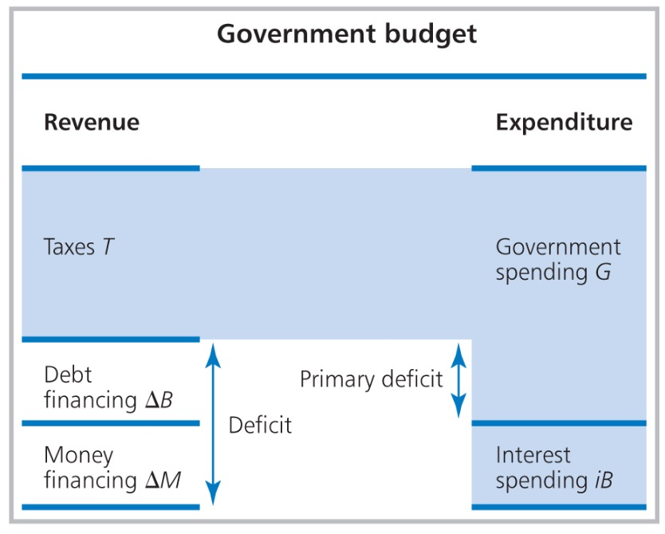

# 07.06.2023 Budget Deficits and Debt

## Government Budget 

- Budget Deficit: $\Delta B = G + iB - T$
- Primary Deficit: $G_T$
- Budget Constraint: $T + \Delta B = G+iB$

Financing Options

- Bonds Issuing: $\Delta B \uparrow$ 
- Money Printing: $\Delta M \uparrow$
- sell assets / privatise (**bah**)

Maastricht Treaty EU

- Debt to GDP Ratio: $b = \frac{ B }{Y} \le 60$
    - all government entities (local etc.)
- Deficit Ratio: $\frac{ \Delta B }{Y} \le 3\%$

Equilibrium Debt Ratio: $b^* = \frac{ g-t }{y-r}$ 

Scenarios:

- Debtor: *A + D*
- Creditor: *B + C*

**=> Debt is also dependent on Economic Growth, nut just deficits**

### Phase Line

Movement of Debt over Time, 

- depends on $\Delta b$ (Neuverschuldung) 
- and level of $b$ (Grad der Verschuldung)

Cases: 

- A = Debtor ($\Delta b>0 \ \&\ b > 0$)
- B = Creditor ($\Delta b<0 \ \&\ b < 0$)
- C = short run debtor
- D = short run creditor

### European Central Bank

can do Seigniorage (Münzgewinn) = Profit from creating money

- Profits are shared by the national banks
- and given to finance ministers

even Non-Euro members have to contribute

## Interest Rate and Debt

Interest Rate *i* on Debt fluctuates wildly

- dependent on Default Probability $\omega$
- and riskless interest rate $i_0$
- judged by credit rating agencies with rating *R* (AAA -> D)

## European Debt Crisis

Policy Options:

**Austerity** (Fiscal Compact 2013)

- rules similiar to Maastricht
- aggavates recession 
- makes investments difficult

=> bad idea! doesnt work

**Bailout** (European Stability Mechanism)

- Help from other european insitutions
- debt refinancing, but cuts to programmes
- also newer in NextGenEU (Covid)

**Quantitative Easing** (PSPP)

- ECB buys Bonds with fresh money
- lowers interest rate for deficits
