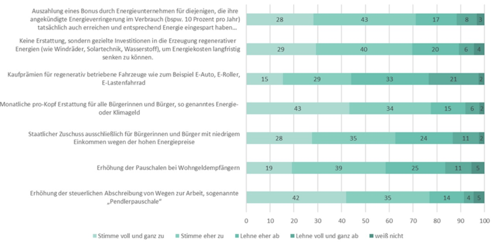
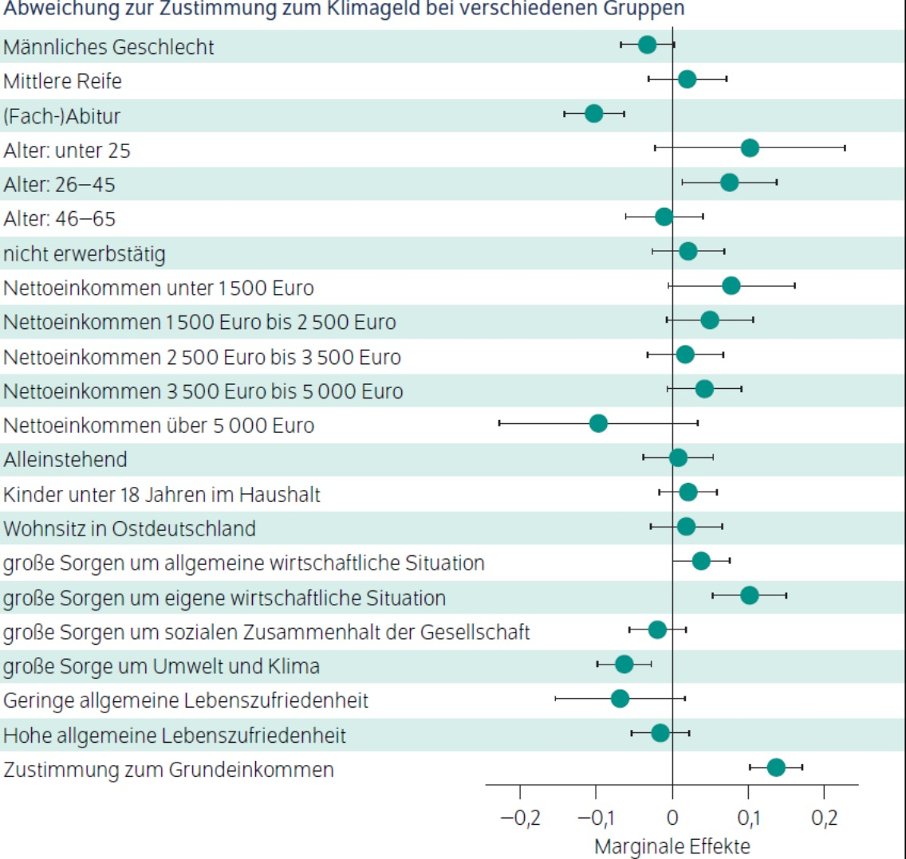
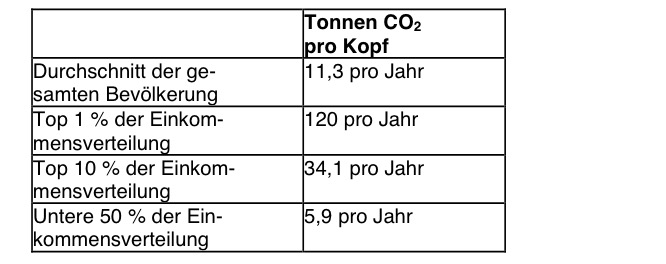
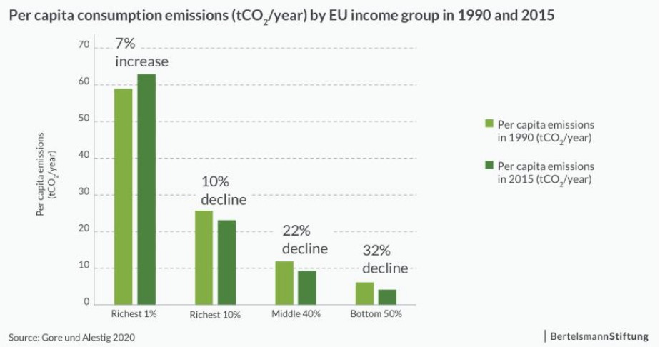
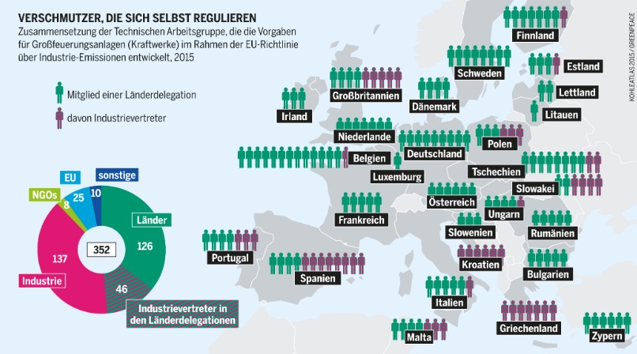

# Lesenotizen

- [Lesenotizen](#_lesenotizen)
  * [2a) Digitale Macht](#_2a-digitale-macht)
  * [2b) Kartellrecht digital](#_2b-kartellrecht-digital)
  * [3a) EZB in der Krise](#_3a-ezb-in-der-krise)
  * [3b) Haushaltspezifische Inflationsraten](#_3b-haushaltspezifische-inflationsraten)
  * [3c) Kann EZB Inflation eindämmen?](#_3c-kann-ezb-inflation-eindämmen)
  * [4a) Deindustrialisierung](#_4a-deindustrialisierung)
  * [4b) Green Economy](#_4b-green-economy)
  * [5a) Klimageld](#_5a-klimageld)
  * [5b) nachhaltige Soziale Marktwirtschaft](#_5b-nachhaltige-soziale-marktwirtschaft)
  * [5c) Einkommensänderung - Umweltauswirkungen](#_5c-einkommensänderung-umweltauswirkungen)
  * [6a) FFF und politischer Wandel](#_6a-fff-und-politischer-wandel)
  * [6b) grüne Regierungen](#_6b-grüne-regierungen)
  * [6c) Kohle Lobbyismus](#_6c-kohle-lobbyismus)

## 2a) Digitale Macht

```
title: "Big Data als Geschäftsmodell: Wie mit der Macht der Internetfirmen umgehen?"
author: Katarina Barley
date: 2018
```

- Verschwimmung online-offline
- Alle industriellen Revolutionen - wie umgehen?
=> staatliche Aufabe = Gestaltung + Folgenschätzung

### Zustand

- starke Dependenz auf Digitalplattformen
	- GDP-Benefit = 17500$ Suchaschinen
- Potenzial für Gesellschaft
- aber Bedrohund Diskurs durch Tracking
- Diskriminierung aufgrund Bias

### Forderung

- Überprüfbarkeit von Algorithmen
- Mithilfe Transparenz
- Entscheidungsschwach bei Usern über Ausmaß Digitalisierung
	- Selbstbestimmung


## 2b) Kartellrecht digital

```
title: "KOnzernmacht in der Digitalen Welt"
author: "Kampagne Konzernmacht beschränken"
date: Dez 2018
```


### Zustand

- soziale Ungleichheit durch Digitalisierung
	- Verschiebung Arbeit + Kapital
- entfesselter Wettbewerb
- Negative Folgen insbesondere. Schwellenländer

#### Daten als Rohstoff

- Daten = Rohstoff neuer Ökonomie
- Auswertung über Persönlichkeit etc
- Unzureichende Infos

Vorteile Großunternehmen:

- Datenvorpsrung
- Netzwerk Effekte
- Kombination von Diensten

=> Gatekeeper

Problem: 

- Erfassung großer Unternehmen
- keine Wettbewerbstheorien
- Kartellrecht: Monopole nicht verboten

Folge: Monopoelisierung

- auf Angebot + Nachfrageseite
- Demokratiegefahr

#### intransparente Algorithmen

- Geheimhaltung von Algo
- Potenzial der Manipulation
	- Bspw. Suchmaschinen
	- Emotionalität gefördert

### Forderungen

- stärkeres Kartellrecht
	- für Schutz der Demokratie
- Einschränkung Akquisitionen 

Kartellrecht Anpassungen:

- Ansatz überdenken, dass Monopole erlaubt sind
	- nur Konsumentenwohlfahrt relevant
	- Reduziert auf Preise
- Missbrauch untersuchen
	- Mittelaufstockung für Behörde
- Sektoruntersuchungen
- Kopplungsverbot
- Selbtsbevorzugungsverbot
- Datenschutzaspekt stärken
	- Bei Untersuchtung Marktstellung
	- Bei Fusionen
- Vorsorgeprinzip bei Fusionen

Zusätzlich:

- Datenschutz stärken
- Algorithmentransparenz

=> soziale Marktwirtschaft im digitalen Zeitalter

Transformation mitdenken!


## 3a) EZB in der Krise

```
title: "Die Europäische Zentralbank und ihre Rolle in der Krise"
author: Peter Becker et al
date: 2020
```


### EZB Aufbau

Aufgaben

- einheitliche Geldpolitik Euroraum
- Preisstabilität

Aufbau

- Direktorium (6 unabhängige)
- EZB-Rat (Dir. + nationale Zentralbankchefs)


- Entschiedungsprozesse im Konsens!
- aber keine Lähmung, da im Notfall Mehrheitsregel


Unabhängigkeit: (da effektivere Zieldurchsetzung)

- politische / institutionelle U.
- Funktionelle U. (Eigene Zielsetzung von 2%)
- Persönliche U. (keine Amtsenthebung, einmalig)
- Finanzielle U. (eigenes Kapital)
- Rechtliche U. (vor EuGH bspw.)


### Instrumente

bis Krise: Leitzinsfestsetzung (unkritisch)

Danach: Erweiterung der Instrumente da Untergrenze erreicht

- Liquiditätsausweitung insbesondere durch Offenmarktgeschäfte
- Ankauf Staatsanleihen

=> einzige Institution, die Euro gerettet hat


### Kritik an EZB


- Mandat
    - Überschreitung des Kompetenzbereichs
    - durch OMT (Offenmarktgechäfte) = Staatsfinanzierung
    - BVerfG- Urteil
- Geldpolitischer Kurs
    - Niedrigzins = Sparenteignung
    - Deutschland profitiert nicht davon
- Leigitimation
    - Technokraten mit politischer Führungsrolle 
    - insbesondere bei Troika
    - Exekutive übernimmt Handlungen


Problem der EZB:

- sie ist einziger Akteur, der wirklich den Euro rettet
- fehlende Fiskalpolitik der Mitgliedsstaaten
- keine Alternativen
- und sie macht inzwischen viel Outreach

=> institutionelle Architektur der Eurozone muss sich weiterentwickeln!


## 3b) Haushaltspezifische Inflationsraten

```
title: "IMK Policy Brief: Haushaltsspezifische Teuerungsraten"
author: Silke Tober
date: Jan 2022
```


Haushalte = markante Unterschiede in individueller Inflation

- je nach Haushaltstyp und Einkommen
    - PKW-Fortbewegung vs Bahn
    - Heizöl vs Strom/Gas Heizung
    - Anzahl Kinder / Menschen im Haushalt
- Berechnug anhand Einkommens/Verbraucherstichprobe Destatis


Ergebnisse

- höchste Inflation: Paar mit mittlerem Einkommen, 2 Kinder
- aber: geringe Einkommen nicht so stark 
    - da sich PKW überhaupt nicht leisten können etc.
    - aber Preisanstieg Lebensmittel + Energie = schwer substituierbar
    - Hartz IV = Stromkosten werden nicht übernommen


Gründe:

- starker Anstieg Energiepreise
    - Kraftstoffe
    - Haushaltsenergie
    - indiriekt dadurch Nahrungsmittel


## 3c) Kann EZB Inflation eindämmen?

```
title: "Kann die EZB die Inflation eindämmen"
author: "Bundeszentrale für politische Bildung"
date: Jan 2023
```


### Ja - Peter Bofinger

- Inflation ist nicht EZB-verursacht
    - nciht aufgrund Geldschwemme
    - Nachfrage = unter Vorkrisenniveau
- kolelktive Fehleinschätzung aller

Aktion der EZB:

- Aktiv sein
- Erwartungen nicht verfestigen
    - Kerninflationsanstieg bekämpfen
- EZB = extreme Zinserhöhungen im letzten Jahr
- zwar späte Reaktion, aber mit langem Atem reicht es aus
    - insbesondere Abflauen Energiepreise


Problem:

- Entscheidung zw. Wirtschaftseinbruch und hoher Inflation
- Lohnentwicklung kommt erst noch


### Nein - Thomas Mayer

also im Prinzip ja aber nein

- Inflation = Monetaristisch
- und aufgrund Überhang Geldnachfrage verursacht
    - Überhang Geldangebot
- komisches Beispiel um das ganze zu veranschaulichen... (Motor)

Lösung:

- neben den Zinserhöhungen
- Anleiheverkäufe der Staaten

aber:

- Staaten haben hohe Schuldenquoten
- keine Möglichkeit, höhere Zinsen zu zahlen
- Furcht vor Anstieg der Arbeitslosigkeit
- "dumme Politiker" die Fiskalpolitik machen


## 4a) Deindustrialisierung

```
title: Deindustrialisierung, Transformation und eine moderne Industriepolitik
author: Arno Brandt
date: 2022
```


Stand:

- Anteil verarbeitendes Gewerbe = Rückgang in modernen Volkswirtschaften
- hohe Energiepreise = Belastung für Industrie

Analyse:

- Unterscheidung kurz/mittel/langfristig
- Stabilisierung der Energiepreise kurzfristig von BReg
    - mittelfristige Stabilität verbessert
    - Erleichtert zukünftige Anpsasungsleistungen
- Grüne Transformation = neue Anpassung
    - Dekarbonisierung der Industrie
    - Problem = Pfadabhängigkeiten
    - Märkte = keine Rettung dann

=> neue Struktur / Industriepolitik

- gesellschaftliche Ziele
- Missionsorientierte Politik (nach Mazzucato)
- Neubestimmung Verhätlnis Staat / Markt
- nicht kurzfristig denken


Vergleich zu USA / China

- beide inzischen aktive Industriepolitik
    - Made in China 2025
    - Investment Reduction Act
- beide protektionistisch
- China = strategische Ausrichtung
    - Subventionen für Solarindustrie


Reaktion der EU

- gegen Protektionismus
- Diversifikation Absatzmärkte
- Großprojekte
- Digital und Ökologische Transformation vereinen
    - wie im NextGen Programm der EU
- nicht nur Innovation, auch sozialtransformation


## 4b) Green Economy

```
title: "Übergang in eine Green Economy: Systemische Hemmnisse und praktische Lösungsansätze"
author: Elke Örtl, Umweltbundesamt
date: 2017
```


Was braucht es für den Übergang in eine Green Economy?

#### Herausforderungen auf globaler Ebene

- planetare Grenzen = absolut
    - begrenzte Menge an CO2-Senken, Fläche, ...
    - bei wachsender Weltbevölkerung

- Klimawandel
    - besondere Grenze der Aufnahmefähigkeit der Atmosphäre
    - zivilisatorische Grenze jetzt Emission, nicht Verfügbarkeit Öl
    - Pariser Abkommen = globale Vereinbarung

- Urbanisierung
    - Mehrheit der Menschen = Konzentration in Stadt
    - gleichwertige Lebensverhältnisse
    - Probleme: Ressourcen, Abwasser, Versorgung

- Rohstoffverbrauch
    - Gesamtes Periodensystem
    - wenig Recycling

- Reboundeffekt gegen Effizienz
    - keine Entkopplung
    - trotz Effizienz Anstieg des absoluten Ressourcenverbrauchs


=> Grenzen sind absilut, Menschliches Verhalten ist nicht angepasst


#### Auswirkungen auf Energie und Rohstoffwirtschaft

Interdependenz zwischen beiden 

notwenidige Änderungen:

- Energiewende (20% des Endenergiebedarfes)
    - Energieversorgung muss *vollständig* dekarbonisiert werden
    - alles aus regenerativem Strom mit anschließender Umwanldung (Power to X)
    - Problem: Fluktuation
        - aber eurpäisches Verbundnetz
- Verkehrswende (30% Endenergiebedarfs)
    - ÖPNV
    - Elektrisierung des Verkehrs
    - Schiffverkehr = nur über Treibstoffe aus regenerativen Quellen
- Wärmewende (50% des Endenergiebedarfs)
    - Wärmepumpen für kleinere Häuser
    - Fernwärme für größere


Bemerkungen:

- Kohleausstieg unvermeidbar
- CCS nicht für fossile Brennstoffe sondern Biomasse
- Power to X sehr relevant
- Abfallverbrennung als Großkraftwerke
    - Grundlast / Reservefähig


#### Konsequenzen für Recycling und Entsorgung

Neue Recycling:

- Ausweitung der Rohstoffe  (bisher Glas, Papier etc.)
- auf Seltene Erden, Lithium ...
- auf globaler Ebene

Problem:

- keine weltweiten Sammelsysteme
- Dissipation (geringere Konzentration)
- hochwertigeres Recycling


Klärschlamm

- Abfallprodukt aus Kläranlage
- Möglichkeit zur Wiederverwertung
    - insbesondere angesammelter Phosphor (endlicher Rohstoff)
    - in thermischer Verarbeitung 


- außerdem: neue Stoffströme aus neuen Industrien
- Recycling / Verbrennung schließen sich nciht aus

#### Vision

für globale Herausforderungen = globale Lösungen

- Energiewende + Rohstoffwende
    - Bedingen einander
    - sind notwendig, aber nciht hinreichend
- aktive Gestaltung des Strukturwandels
    - auch Technologieoffenheit (aber strategisch eingesetzt)
- Städte = neue Industriestandorte
    - aufgrund standortnahen Recyclings
- über Wachstum nachdenken
    - was soll wachsen, was soll schrumpfen?

=> wir brauchen eine Green Economy


## 5a) Klimageld

```
title: "Hohe Zustimmung für Klimageld – vor allem bei Personen mit großen Sorgen um die eigene wirtschaftliche Situation"
author: DIW Aktuell
date: 2022
```


Zahlung aus CO2-Steuereinnahmen an jeden Bürger

- für Sozialausgleich von Klimapolitik
- verteilungspolitisch sinnvoll

Studie zu Akzeptanz von Klimageld

- Methodik: repräsentative Befragung zu 7 verschiedenen Methoden
- höchste Zustimmung: Klimageld (drei Viertel) und Pendlerpauschale
    - Insbesondere bei Geringverdienern



Soziodemografische Faktoren dabei



## 5b) nachhaltige Soziale Marktwirtschaft

```
title: "Ökologische Transformation fair gestalten: Die soziale Frage ist keine Nebensache"
author: Daniel Posch, Bertelsmann Stiftung
date: 2023
```


> Wohlstand für alle innerhalb planetarer Grenzen

Zustand:

- Klimawandel verschärft Ungleichheit
- zwischen Ländern (Norden Süden)
- aber auch innerhalb Land zw. Einkommensgruppen
- Einkommensdezil = starker Zusammenhang
    - Betroffenheit von CC
    - und Beitrag zu CC

Ungleichheit = Emissionstreiber, da

1. Conspicuous Consumption von Mittelschicht = schädigend
2. keine Mittelschicht = keine weite Verbreitung von Innovation
3. politische Einflussnahme Reicher gegen Schutz
4. Vermögenswerte Reicher Menschen = emissionsintensiv



### ungleiche Beitrag 

Verteilung der GHG-Emissionen

- Global: Nord-Süd Verhältnis
    - Industrienationen = historische Emissionen akkumuliert
- Deutschland: Reich-Arm
    - trotz sinkenden Emissionen (verdeckt)
    - Emissionen konzentrieren sich an Spitze
    - stärkere Reduktion bei ärmeren




### Betroffenheit und Ungleichheit

niedrigere Einkommen = stärker betroffen

- höhere Exposition
    - öfter in Regionen mit Starkwetterereignissen (auch DE)
    - schlechtere Gebäude
- Niedrigere Bewältigungskapazität
    - Preissteigerungen
    - kein Geld für Anpassungen


### Konsequenzen für Klimapolitik

- kann regressive Verteilungswirkung haben
    - muss aber nicht!
    - insbesondere CO2 Preis = regressiv
    - stärkere Belastung unterer Einkommen bei Energie
- Muss sozial abgefedert werden
    - beispielsweise über Klimagled
- in Kombination mit Investitionen
    - insbesondere öffentlich
    - Fördermittel für Wärmewende


mögliches Instrument: *Klimasoli*

> **Klimasoli:** zweckgebundene Form der progressiven Besteuerung hoher Einkommen und Vermögen gepaart mit einer Nutzungsabgabe auf ausgewählte (besonders) energieintensive Konsumkategorien” (Posch, 2023, p. 8)

- stark bei oberen Einkommensgruppen
- Reduzierung Luxusemissionen
- Verteilung der sozialgerechten Transformationlast


außerdem: Klimakreditkarte

> **Klimakreditkarte:** subventionierter Bezug vordefinierter Menge an lebenswichtigen Gütern

- für einkommenschwache
- nach Subventionsmenge = Marktpreis
- wie Gaspreisbremse? (nur ohne Begrenzung auf Gruppen)


## 5c) Einkommensänderung - Umweltauswirkungen

```
title: Wirkungen veränderter Einkommen auf den Ressourcenverbrauch
author: Lea Elsemann, Umweltbundesamt
date: 2021
```

Treiber von stärkerer Umweltbelastung:

- Einkommen
- Landnutzung
- Bildungsabschluss (aber nicht welche Richtung)
- Wohnortgröße (negativer Zusammenhang)
    - Menschen in Großstädten weniger als auf Land
- Alter (negaitver Z.)


Fazit:

- Einkommen = zentraler Treiber Ressourcenverbrauch
    - vor allem wegen Mobilität
    - und mehr Wohnfläche
- keine Entkopplung
- höhere Bildung = mehr Mobilität = mehr Verbrauch
- Alter 
    - mehr Ressourcen Wohnen
    - weniger Ressourcen Mobilität
- Stadt = weniger


=> Umwelt Kuznets Kurve = nicht empirisch belegt

- Ordnungspolitik statt Informationskampagnen
- Fokus: Mobilität dekarbonisieren
    - Anreizsysteme (möglicherweise progressiv)
- außerdem: Wohnen
    - Wohnflächen redutzieren / effizienter nutzen


## 6a) FFF und politischer Wandel

```
title: "Die grüne Transformation in Wirtschaft und Politik – wo liegen Chancen und Risiken?"
subtitle: "Trägt die Fridays-for-Future-Bewegung zum politischen Klimawandel bei?"
author: ifo Schnelldienst
date: 2022
```


Hypothese: FFF Demonstrationen erhöhen den Stimmenanteil der Grünen

### Problem: 

- Zuordnung der Demonstrierenden zu Wahlkreisen
- regionale Stärke der Demos

### Methodik: (Big Data Economics)

- Website von FFF / lokale Gruppen
- Demoanmeldungen Polizei
- Mobilitätsmatrix Telefondaten

$$
Wahlergebnisse = \beta * Streikpartizipation
$$

Kontrolle:

- Niederschlag
- Kontrolle Umweltbewusstsein

### Ergebnisse:

Mehr Streik:

- mehr Stimmen für Grüne
- Mehr Wahlbeteiligung
- Aber v.a. Wanderung 
  - v.a von SPD / Linke


## 6b) grüne Regierungen

```
title: "Die grüne Transformation in Wirtschaft und Politik – wo liegen Chancen und Risiken?"
subtitle: "Grüne Regierungen: Liefern sie das, was sie versprechen?"
author: ifo Schnelldienst
date: 2022
```


Regierungswechsel in BW = quasi-exogen (Fukushima)

Methode:

- Vergleich reales BW mit syntethischem Kontroll-BW
- synthetisches BW = for Landtagswahl fortgeführtes

Kontrolle mit anderen Bundesländern

ergebnisse:

- keine Reaktion CO2 und Energieträger
- weniger Windkraft
- inklusivere Schulbildung

aber: keine kausalen Effekte!

> “Manche strukturellen Reformen lassen sich am ehesten von politischen Parteien durchsetzen, von denen man es nicht erwartet” 

Only Nixon could go to China

## 6c) Kohle Lobbyismus

```
title: "Lobbyismus: Bezahlt, um zu verhindern"
author: Cindy Baxter, Böll Stiftung
date: 2015
```


Kohle Lobby = wichtiger Bestandteil der Klimapolitik

Methoden:

- Erneuerbare diskreditieren
- Grenzwerte verhindern
- staatliche Energiekonzerne entsenden Vertreter



USA:

- Spendengelder (an Republikaner)
- Gesetze selber schreiben (ALEC)

Australien

- Positionen besetzen
- Stimmung in Medien gegen Klimawandel 


