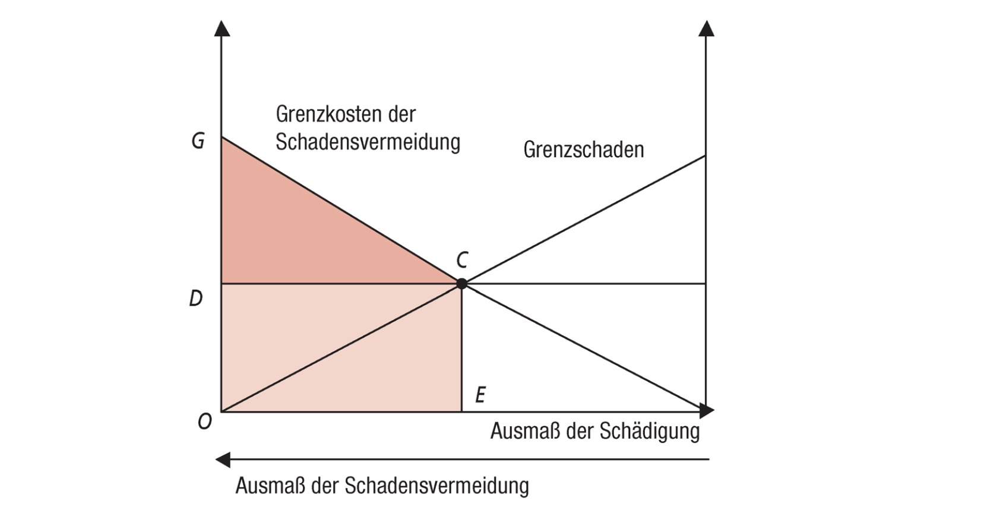
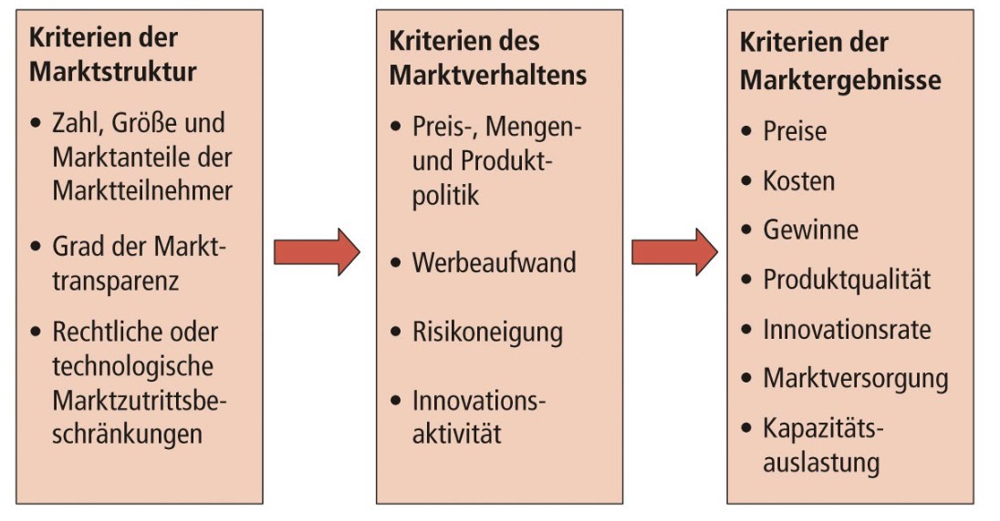
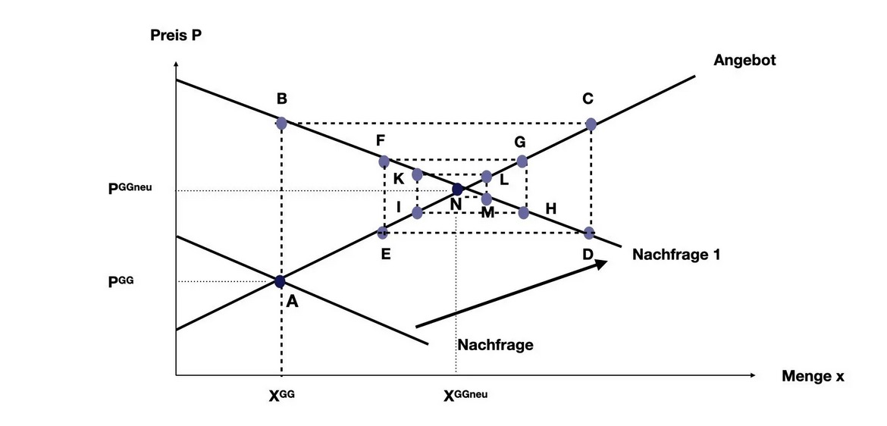
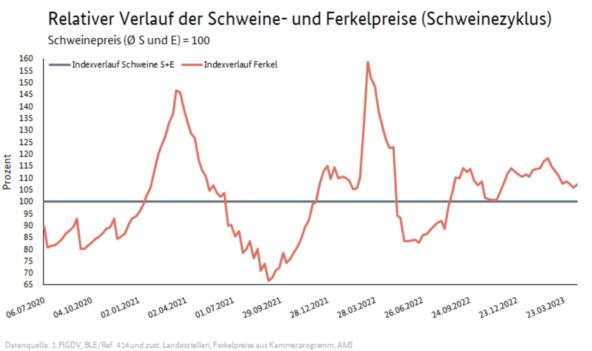

# 04.05.2023 Marktversagen

natürliche Monopole

- hohe Fixkosten
- geringe variable Kosten
- Unteilbarkeit

Lösungen:

- Kartellregulierung
- Verstaatlichung
- Steuern / Subventionen

## Deregulierungsmethoden

### Staatliche Förderung der Bestreitbarkeit

- Abgrenzung zw. berstirbaren und nicht bestreibtaren Märkten
- Abbau von Makrtzugangsbeschränkungen
- Förderung von Substitutionskonkurrenz

### Internalisierung externer Effekte

- durchestzbare Haftungsregeln
    - bspw. Umweltschäden
- Prinzip der Gefährdungshaftung = Ersatzpflicht für alle Schäden
- Prinzip der Verschuldungshaftung = Ersatz nur für fahrlässigen Schaden

### Verhandlungslösung (Coase Theorem)

- Zurodnung der Schadensrechte
- dann Verhandlung zwischen Parteien
- Anreiz Minimierung (bspw. Zertifikate)

Achtung: Verteilungswirkung der Ausgangsverteilung

### zeitliche Befristung natürlicher Monopole

- Staat versteigert diese Monopole
- mit Auflagen und Vorgaben
- keine Preisregulierung danach
- Problem: hohe Sunk COsts erschweren nachfolgende Konkurrenten

## Wettbewerbspolitik

nach Schumpetter = kreative Zerstörung

- Produkt / Verfahrensinnovation => ständige Veränderung des Marktes
- Monopolgewinne = Anreiz für Innovatoren
- Imitation = abbau und Diffusion von Monopolgewinne

=> Wettbewerbspolitik = gegen **dauerhafte** Monopole

nach Hayek: Such- und Entdeckungsverfahren

- Preisbildung = Verbreitung von Wissen
- zur Überwindung von Knappheiten

=> Wettbewerbspolitik = Preisbildung funktionsfähig halten

## Wettbewerbsbild

Leitbild = **Funktionsfähiger Wettbewerb**

- Allokationsfunktion
- realer Wettbewerb = komplizierter

Kriterien

- **Marktmacht**
- **Marktverhalten**
- **Markterbegnis**

## Instrumente

der Wettbewerbspolitik

- Spielregeln aufstellen
- Kartellpolitik
- Fusionskontrolle
- Missbrauchsaufsicht
- Patentgesetze et.c (willkürliche Wettbewerbsbeschränkungen)

## Beispiele: Telekomsektor

Problem

- Netzexternalitäten
- Unteilbarkeit / Sunk costs
- Asymmetrische Information

vor 1990:

- Bundespost = Monopol
- wenig entwickelte Märkte

Deregulierung

- Aufteilung in verschiedene Unternehmen
- diskrimierungsfreier Zugang (Nummernportabilität)
- Universaldienst -Regulierung (Große UNternhemen müssen für alle anbieten)
- Netzzugang für Wettbewerber

## Übung 2:

### Cobweb Theorem

- Preisanpassungzyklen
- nicht lagerbare Güter
- verzögerte Anpassung des Angebot (*time lag*)

Darstellung

Beispiel: Schweinezyklus

### Marktversagen

aufgrund asymmetrischer Information

- adverse Selektion (ex ante)
- moral hazard (ex post)

Handlungsoptionen:

- Steuern / Abgaben 
- Subvention

Beispiel: 

- Pigou Steuer (Lenkungsteuer bspw. Tabak)
- Coase Theorem

### natürliches Monopol

Eigenschaften:

- hohe Fixkosten
- geringe variable Kosten
- Unteilbarkeit

