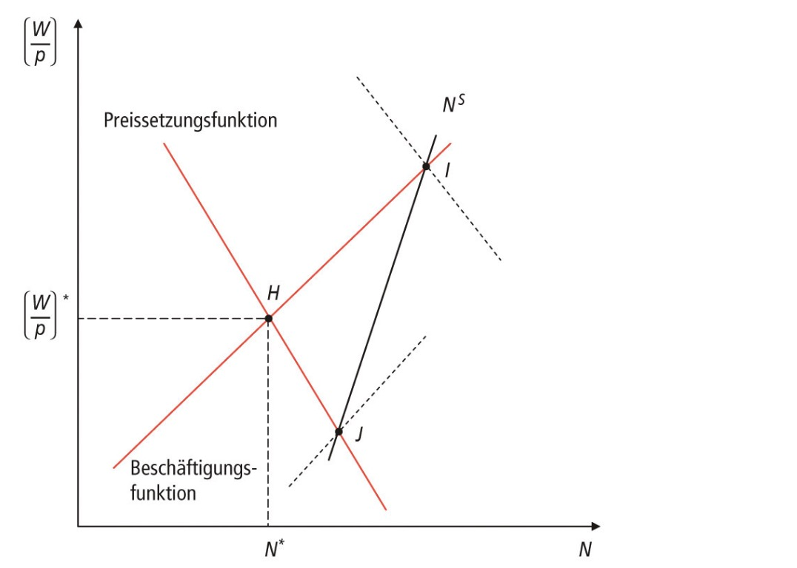
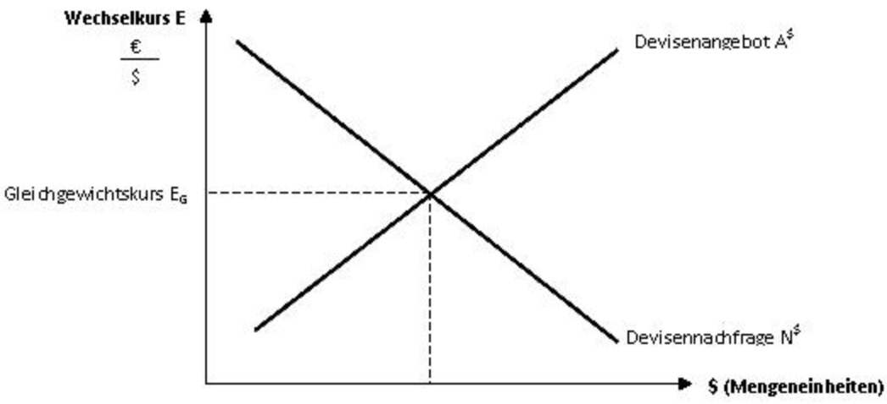

# 01.06.2023  Konjunktur

## Arbeitslosigkeit

erklärt durch Lohnsetzung und Nachfrageentwicklung

Beschäftigungsfunktion:

$$
\frac{ W }{P} = F(N) \frac{ W }{M v^*}
$$

- N = Höhe der Beschäftigung
- W = nominallohn
- v = Umlaufgrschwindigkeit
- M = Geldmenge

=> positiver Zusammenhang: Reallohn und Beschäftigungsmenge

Preissetzungsfunktion: 

$$
\frac{ W }{P} = \frac{ F'(N) }{\mu}
$$

- $\mu$ = Markup / Gewinnzuschlag

=> höhere Marktmacht = geringerer Lohn

Synthesemodell

Gründe Arbeitslosigkeit:

- fehlender Wettbewerb = Preissetzungsfunktion "zu weit links"
- Ausfall Nachfrage = Beschäftigungsfunktion "zu weit links"
- überhöhte Nominallöhne $W/P$

Instrumente:

- mehr $\mu$ = Wettbewerb
- mehr $M$ = mehr monetäre Nachfrage
- weniger $W$ = geringerer Nominallohn

## Zahlungsbilanz

> erfasst den Wert aller ökonomischen Transaktionen zwischen In- und Ausland innerhalb bestimmter Periode

- doppelte Buchführung
    - Aktiv = Deviseneingang
    - Passiv = Devisenabfluss

wichtige Bilanzen

- Leistungsbilanz (current account): Güter etc.
- Kapitalbilanz (capital account)

## Wechselkurs

> **Wechselkurs:** Preis einer Währung, ausgedrückt in anderer, gebildet am Devisemarkt

entweder *Preisnotierung* (Fremd in Eigen,  1 Dollar = 80 Eurocent) oder Mengennotierung

Instrumente:

- feste Wechselkurse
- Handelspolitik
- Geldpolitik (Zinssätze etc.)
