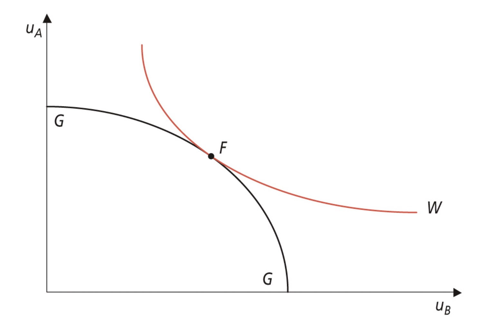

# 06.07.2023 Wohlfahrtsökonomik

> **Wohlfahrtsökonomik:** analysiert die Bedingungen für ein Wohlfahrtsoptimum und die Kriterien für gesellschaftliche Wohlfahrtserhöhungen

Konzepte:

- Pareto Optimum
- Alloaktionsprobleme
- Arten von Gütern (öfftl, privat, ...)

Hauptsätze:

1. jedes Wettbewerbsgleichgewicht = Pareto-optimal
2. Jedes Pareto-Optimum = als Wettbewerbsgleichgewicht realisierbar (bei entsprechender Ausgangsverteilung)

## Soziale Wohlfahrtsfunktion

Bewertung unterschiedlicher Nutzenfunktionen in Möglichkeitenraum

- wird aus indiv. Nutzenfunktionen bestimmt
- bestimmt optimale Verteilung von Gütern
- konvexer Verlauf
- Steigung = Ungleichheitsaversion

Form:

Beispiele:

- Rawls: $\min [u_a,u_b]$
- Bernoulli: $u_a+u_b$

## Unmöglichkeitstheorem

Wie wird Wohlfahrt einer gesamten Gesellschaft bestimmt?

- repräsentatives Individuum
- Diktatur
- Wahlverfahren

problem: Wahlparadoxon ohne eindeutige Aussage

> **Unmöglichkeitstheorem:** kein Verfahren, durch das Präferenzen *über mehr als zwei Zustände* eindeitug realisierbar sind

=> Beschränkung von Wahlen auf zwei Optionen (Bsp.: Deutsche Wohnen und Co enteignen)

## Second Best

Theorie des Second Best:

- Optimalzustand oft nciht erreichbar
- alternativ: Second Best erreichbar

bspw. Philips Kurve

alternativ: Kaldo Hicks Ausgleichszahklungen

