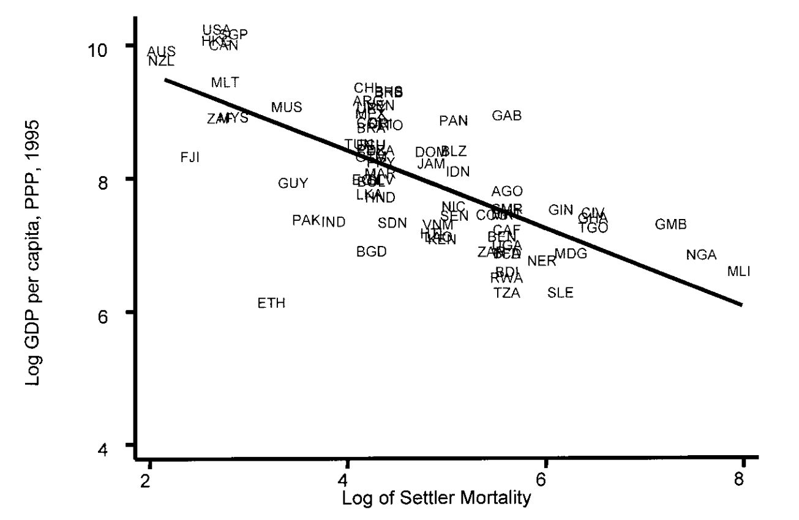

# 12.10.2023 Acemoglu (2001)

Paper: [AEAWeb](https://www.aeaweb.org/articles?id=10.1257/aer.91.5.1369)

### Data

Types of Data Sets

- Cross sectional (100 countries at given point)
- Time series (1 country, 100 years)
- panel data (10 countries, 10 years)

Graph from Paper:

