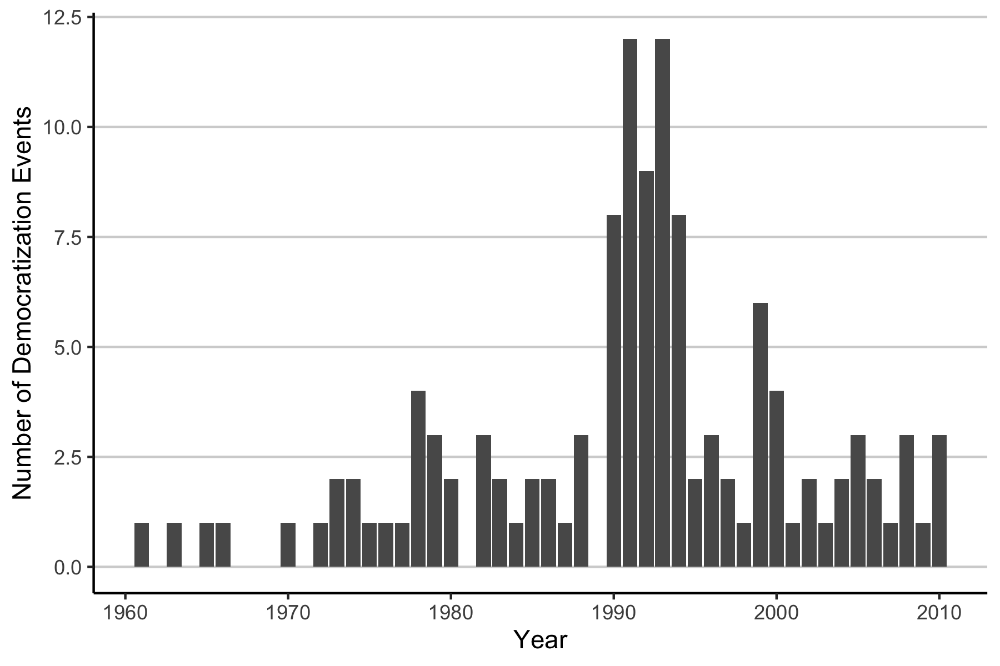
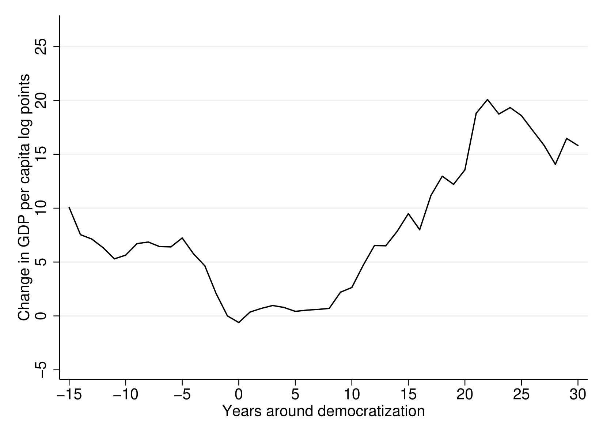
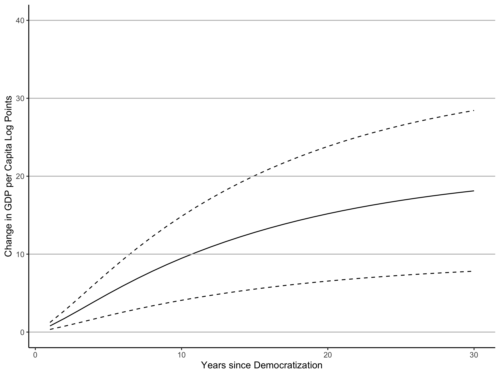
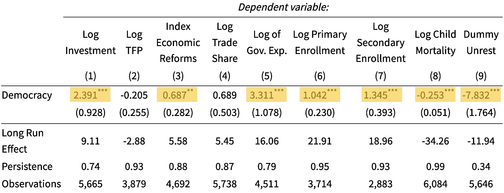
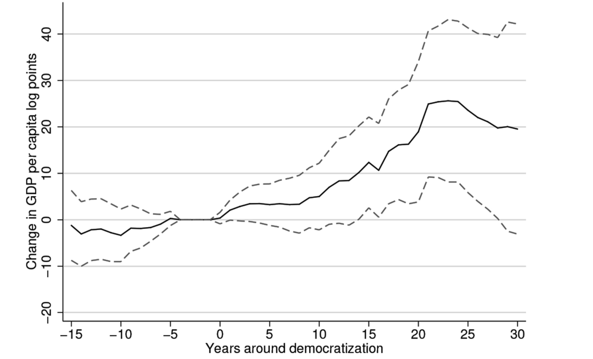

## About the Paper

:::: {.columns}

::: {.column width="60%"}

\

Authors

-   Daron ***A***cemoglu (MIT)
-   Suresh ***N***aidu (Columbia)
-   James ***R***obinson (U. of Chicago)
-   Pascual ***R***estrepo (Boston U.)


\


Publication:

- Journal of Political Economy (JPE)
- Working Paper (NBER): 03/2014
- Final Publication: 02/2019 


:::

::: {.column width="40%"}

:::

::::


[Cover of JPE](https://economics.sas.upenn.edu/sites/default/files/2020-02/jpe%20jan2020.jpg)


---

## Literature on Growth and Democracy

| Authors                                       | Relationship                                      |
| --------------------------------------------- | ------------------------------------------------- |
| @lipsetSocialRequisitesDemocracy1959a         | $\text{growth} \to \text{democracy}$              |
| @barroDemocracyGrowth1996                     | $\text{democracy} \to \ \downarrow \text{growth}$ |
| @giavazziEconomicPoliticalLiberalizations2005 | $\text{democracy} \rightsquigarrow \text{growth}$ |
| @acemogluDemocracyDoesCause2019               | $\text{democracy} \implies \text{growth}$         |
: Literature Examples

Meta Analysis: @colagrossiDoesDemocracyCause2020

---

## Data

Democracy Measure

- constructed from different sources
- dichotomous 
- 1960 - 2010, 184 Countries



See [Online Appendix](https://skriptum.github.io/DDCG/vortrag/4-Figure2.html#plot) for Replication

---

## Problem: GDP Diversity and Dip



$\to$ OLS not applicable

---

## Method

3 Approaches

1. **Dynamic Linear Panel Model** with *Within Estimator*
2. Semiparametric Estimation (*Appendix*)
3. Instrument Variable Regression (*Appendix*)

Panel Formula

$$
\bold{y}_{ct} = \beta \ \bold{D}_t + \sum_{j=1}^p \gamma_j y_{ct-j} + \alpha_c + \delta_t + \epsilon_{ct}
$$

with $p = \{1,2,4,8\}$

---

## Fixed Effects Model


\tiny

```{=latex}
% Table created by stargazer v.5.2.3 by Marek Hlavac, Social Policy Institute. E-mail: marek.hlavac at gmail.com
% Date and time: Mon, Dec 04, 2023 - 12:49:16
\begin{table}[!htbp] \centering 
  \caption{Effect of Democracy on (Log) GDP per Capita} 
  \label{} 
\begin{tabular}{@{\extracolsep{5pt}}lcccc} 
\\[-1.8ex]\hline 
\hline \\[-1.8ex] 
 & \multicolumn{4}{c}{\textit{Dependent variable:}} \\ 
\cline{2-5} 
\\[-1.8ex] & \multicolumn{4}{c}{Log GDP per Capita} \\ 
 & (1) & (2) & (3) & (4) \\ 
\hline \\[-1.8ex] 
 Democracy & 0.973$^{***}$ & 0.651$^{***}$ & 0.787$^{***}$ & 0.887$^{***}$ \\ 
  & (0.240) & (0.229) & (0.228) & (0.239) \\ 
  & & & & \\ 
 lag1 & 0.973$^{***}$ & 1.266$^{***}$ & 1.238$^{***}$ & 1.233$^{***}$ \\ 
  & (0.003) & (0.012) & (0.013) & (0.013) \\ 
  & & & & \\ 
 lag2 &  & $-$0.300$^{***}$ & $-$0.207$^{***}$ & $-$0.214$^{***}$ \\ 
  &  & (0.012) & (0.020) & (0.021) \\ 
  & & & & \\ 
 lag3 &  &  & $-$0.026 & $-$0.021 \\ 
  &  &  & (0.019) & (0.021) \\ 
  & & & & \\ 
 lag4 &  &  & $-$0.043$^{***}$ & $-$0.039$^{*}$ \\ 
  &  &  & (0.012) & (0.020) \\ 
  & & & & \\ 
 lag5 &  &  &  & $-$0.019 \\ 
  &  &  &  & (0.020) \\ 
  & & & & \\ 
\hline \\[-1.8ex] 
Persistence:  & 0.973 & 0.967 & 0.963 & 0.96 \\ 
Long run effect:  & 35.587 & 19.599 & 21.24 & 22.008 \\ 
Effect after 25 years:  & 17.791 & 13.8 & 16.895 & 17.715 \\ 
Observations & 6,790 & 6,642 & 6,336 & 5,688 \\ 
\hline 
\hline \\[-1.8ex] 
\textit{Note:}  & \multicolumn{4}{r}{$^{*}$p$<$0.1; $^{**}$p$<$0.05; $^{***}$p$<$0.01} \\ 
\end{tabular} 
\end{table} 
```

\normalsize

---

## Trend Estimate



---

## Channels

|     |
| ------------------------------------------------------------ |
: Effects of Democracy on Potential Mechanisms


Democratization => **state capacity & human capital building**


## Interlude: Replication in R

- [Model Specification](https://skriptum.github.io/DDCG/vortrag/2-Panel-Models.html)
- [Results Table](https://skriptum.github.io/DDCG/vortrag/3-Table2.html) 
- [Trend Estimate](https://skriptum.github.io/DDCG/vortrag/4-Figure2.html#plot)
- [Channels Table](https://skriptum.github.io/DDCG/vortrag/6-IVReg.html)


---

## Critique

- Dichotomous Measure of Democracy [@pelkeReanalysingLinkDemocracy2023]
- Short Time Frame 
- Sensitivity to Sample Selection [@eberhardtDemocracyDoesCause2019]

---

## References

\tiny

::: {#refs}
:::

\normalsize

---

## Discussion Questions

1. Are there **alternative political frameworks** that could also facilitate these mechanisms (state capacity and education expansion) or is it easier in democracies?
2. Could there be **non-linear relationships** between democracy and economic growth, e.g optimal level of democracy? 
3. What actionable **policy recommendations** can be drawn from the observed link between democracy and economic growth?


::: notes

*Are there **alternative political frameworks** that could also facilitate these mechanisms (state capacity and education expansion) or is it easier in democracies?* 

- elephant in the room = China (achieved both)
- communist states in general = high state capacity


*Could there be **non-linear relationships** between democracy and economic growth, e.g optimal level of democracy?* 

- a level of democracy beyond which growth is hurt?
- for example monetary policy = undemocratic in most democracy today


*What are the **Policy Implications** drawn from the link*

:::


---

## Appendix: Semiparametric



---

## Appendix: IV

First Stage:

$$
y_{ct} = \beta D_{ct} + \sum_{j=1}^p \gamma_j y_{ct-j} + \alpha_c + \delta_t + \epsilon_{ct}
$$

Second Stage: with D as IV:

$$
D_{ct} = \sum_{j=1}^p \pi_j Z_{ct-j}+ \sum_{j=1}^p \phi y_{ct-j} + \Phi_c+ \mu_t+ v_{ct}
$$

Z = average of democracy in Region $\times$ initial regime cell

Results see [Online Appendix](https://skriptum.github.io/DDCG/vortrag/6-IVReg.html)

