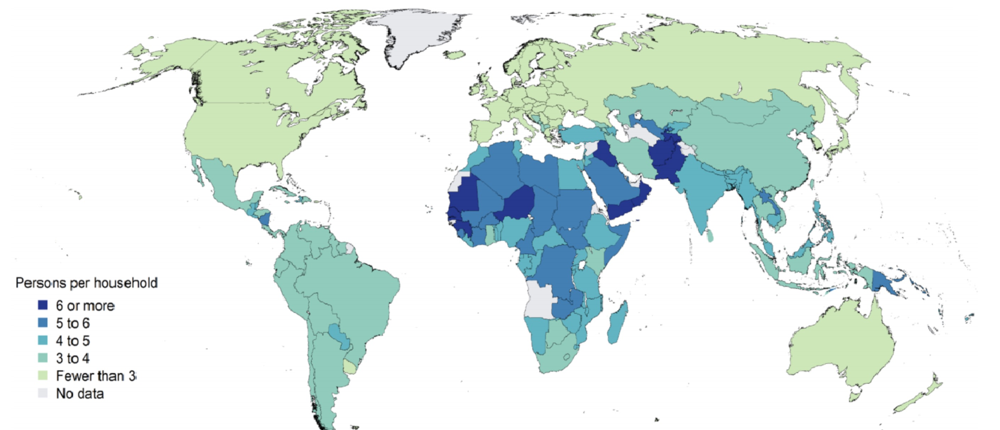

# 06.11.2023 Households

## Definition

> **Household:** 
>
> - unit of residence comprised of one / more individuals
> - common provision of shared resources
> - decisions relevant for economic processes

diverse institutions, vary by size:

*Economic* Interest in Households:

- economic unit with allocative decisions
- Non-market production of goods

*Feminist* Interest in HH

- Invisible / devalued repro. work
- inequal allocation of responsibilities

## New Household Economics

Neoclassical Econ and HH

- not compatible with methodological individualism
- household utility function as function of individuals 

Gary Becker's **New Household Economics**:

- Producer of Market / Non Market Goods
    - Market Good = Labour
    - Non Market Good = Care-Work, Meals etc
    - Primary Input = Time
- scarce resource = time & income
- single utility function

Assumptions:

- income-pooling hypothesis
- altruistic household head

Focus on Comparative Advantage

- drives specialisation in specific activities
- lower OC of low-paid member => focus on care work
- reinforces inequality between men and women

## Feminist Critique

- joint welfare function does not exist
    - empirical gender bias against girls (malnutrition)
- Paradox of altruism in HH and selfish in market
    - why not selfish in HH?
- HH labor is not substitutable 
    - male labor does not subst. when women work more wage-labour
- Income Pooling
    - empirical evidence against (antropological and economical)
    - Individual incomes => not maximize HH welfare
- stark focus on heterosexual nuclear families

Relevant Question for Analysis of a Region / People / Group:

- What are the significant units of production / consumption?
- What are the major flows and transfers of resources between units & indiv.?

## Households in FPE

Work in HH:

- industrialization = separation of work into physical factories
- structural divide: factory = profit, HH = non-profit
- HH work is devalued
- not accounted for in Indicatos (e.g GDP)

Households = Institutions (not microeconomic)

- embedded in socio-economic system
- external relations are relevant

Relations in HH:

- site of production and social reproduction
- with internal power relations
- state mediates Relations between HH and global markets
    - e.g. regualtion on remittances

