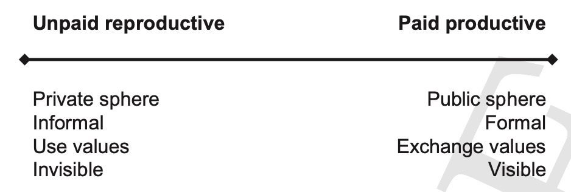

# 20.11.2023 Labor Market Inequalities

FPE and Labour Market:

- gendered institution
- unequal power relations
- unpaid work = reproductive work

## Work as a continuum

**Standard Economics:**

- Labour market = demand and supply => equilibrium
- unemployment = choice
- natural rate of unemployment

Womens Position

- Preferences 
- no theory of the household
- Labour/ leisure model (opportunity costs)

**Housework in Classical**

- Mincer / Becker: 3 way split (home / leisure / home production)
- joint utility function
- occupations chosen by lowest opportunity cost

**FPE:**

- houesork = necessary for capitalist production
- work = continuum 
    - Right = wage work, formalized & protected
    - left = work for consumption (e.g. cooking), not "legitimate" labour
- Most = somewhere in the middle => fragmentation

## Gender Wage Gap

only one way of measuring disparities! (e.g. quality of work)

- OECD countries = 15% gap
- non-OECD countries = more

**Classical** Explanation = Human Capital Theory

- higher skills, qualifications => higher wage
- women = lower human capital => lower wage
    - lower educations
    - human capital more focused on non-market outcome

Reason for decisions

- different preferences
- women anticipate less time in wage labor = less investment
- lower risk
- Anticipation of Discrimination => less investment
- discrimination in access

Why dumb:

- cost of education
- accumulation of privilege by men
- reinforcemnt in household
- Oversimplified 

## Segmentation in Labour Market

> **horizontal occupational segregation:** women in lower-paid & different jobs

> **vertical occupational segregation**: women in lower-paid grades of companies than man

**Women in Classical Theory:**

- considered less reliable
- less valuablke to economy
- different type of jobs (because investment in other skills)

=> *horizontal occupational segregation* (women do different jobs)

also:

- nurturing nature
- lower physical abilities
- less likely to join union

vertical segregation

- women too emotional
- conflict with responsibilites at home

=> glass ceiling

**FPE**:

- lack of mobility
- inequality in choices
- Discriminatory  policies

labour-market segmentation theory

- primary market: good jobs, stable employment, low turnover (think auto worker)
- secondary market: insecure, high turnover, no security (think cashier)

## Time use

different use of time of genders, women:

- More time in repr. labor
- not classified as economic activity
- Key factor for inequality

Time = commodified factor, gendered usage

> **time agency:** confidence and ability to make and act upon strategic choices about how to allocate one’s time

Women = less time agency

- paid + unpaid work
- less time for investment in human capital (Abendschule)

=> vertical segregation

- home based work = more flexibility
- choice of part time work

=> horizontal segregation

## Interventions for equality

Types of Equality:

- eq. of outcome
- eq. of opportunities

Policies

- public infrastructure => more time autonomy
- indirect: investment in education, water-dwelling etc.
- care-leave
    - but could be counterproductive
    - because of gendered usage

## Labor Market Change

Globalization => Outsorcing in low-wage countries

- pro: growth in manufacturing, employment creation
- Contra: unequal power relations => poor conditions
    - often subcontracted
    - non-standard types of employment
- Women = concentrated at lower end of hierarchies

> **fragmented labor markets:** labour markets defined by an accumulation of insecurities, non-standard employment + low wages 

also

- Gig Work
    - Pro: flexibility
    - Contra: extreme pressure
    - reduced access for women (less phones)

## Covid 19

Gendered impacts

- higher susceptiblity of encountering the virus (hospital etc.)
- increase in unpaid care work (closing of daycare etc.)
- emplyoment suffered in sectors (restaurants / hospitality)

## Questions

- Using critiques developed by feminist political economy, describe the weaknesses in theories that characterize the labour market as a divided institution.

- Given the benefits of employment for women, are low-paying precarious jobs better than no jobs?

- Is economic growth based on exploitation justified if there is a promise of prosperity in the future?

- Using a case study of your choice (by government or the private sector), describe how an intervention aimed at reducing gender inequality in the labour market may be undermined by women’s disproportionate responsibility for unpaid or unwaged work.