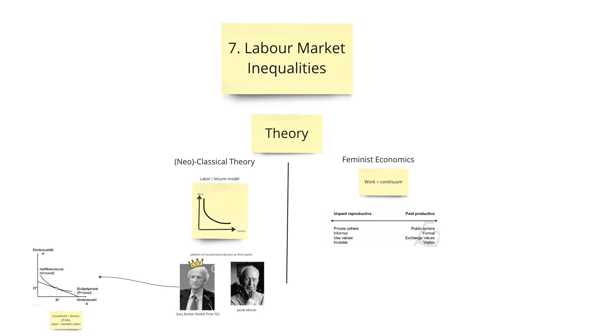

\

I would like to thank Amelie Betz, Anita Lehner and all those involved in organizing the Pluralist Economics Network's Certificate Project, along with the sponsors at the Institute for New Economic Thinking. 

`\pagenumbering{gobble}`{=latex}

`\pagebreak`{=latex}

`\pagenumbering{arabic}`{=latex}

# Introduction {-}

On the 9th of October 2023, Claudia Goldin won the Nobel Prize in Economics, making her only the third women to receive one of the prestigious prizes [@smialekClaudiaGoldinWins2023]. Goldin's groundbreaking contributions spotlight women's progress in the workforce, an achievement that resonates deeply with the core themes of Feminist Economics. This paper delves into the intersection of Goldin's Nobel Prize-winning work with the broader discourse of feminist economics, unraveling the implications and advancements that her recognition signifies for the study and understanding of gender dynamics within economic systems.

Throughout this portfolio, I aim to articulate [my motivations](#motivation) for undertaking this course, document my [learning process](#learning), and critically examine [Goldin's scientific achievements](#essay), whose work highlights the advancing landscape of economic research with a focus on women's issues.

# Motivation {#motivation}

My academic journey mainly revolved around neoclassical education, a space strangely quiet on discussions about women's roles in economics. In one lecture, grounded in Gary Becker's ideas, women were briefly seen as rational choice-makers, stripped of the complexities of discrimination and historical context. This limited perspective made me curious, making me question the adequacy of this seemingly gender-neutral approach.

Keen to gain a more comprehensive understanding, I enrolled in the "Feminist Political Economy" course. My previous studies lacked insights into how economic structures relate to history, especially in the context of gender dynamics. Simultaneously, I aimed to grasp the feminist school of thought in economics, seeing it as a valuable alternative framework offering insights into women's experiences within economic systems.

While I haven't personally faced gender injustice, I've observed the unfairness tied to societal gender norms. Even though it doesn't directly impact me, I can see how these norms play a role in creating inequalities. Joining this course is my way of trying to understand the reasons behind these issues and how they're built into our systems. I'm eager to learn more about the structural aspects that contribute to gender injustices, hoping to gain a clearer picture of these complex dynamics.

# Learning Journey {#learning}

The "Feminist Political Economy" course has been a valuable learning experience, meeting my expectations in a practical sense. It has allowed me to explore gender injustices more thoroughly, shedding light on the structural factors contributing to gender disparities. Additionally, the course has effectively addressed the Eurocentrism in my previous knowledge, offering insights into white privileges [@mcintoshWhitePrivilegeUnpacking2019] and diverse gender norms across societies. This analytical approach has not only expanded my understanding of global gender dynamics but has also prompted thoughtful reflection on my own position within these systems.

Exploring concepts championed by Feminist Economists in the course has been eye-opening. The idea of "Buen Vivir" stands out, offering a stark contrast to Western utopian ideals like socialism [@lanzaBuenVivirIntroduction2012]. Rooted in indigenous South American philosophy, Buen Vivir emphasizes community well-being and environmental sustainability. Additionally, delving into the integration of women into political projects like the "Green New Deal" [@bauhardtEcofeministPoliticalEconomy2022], that focus too much on technological solutions to societal problems have opened my eyes for these other perspectives, which are commonly missing in courses on Economic Policy . These insights have not only broadened my theoretical framework but also instilled hope for alternative economic and political models centered around inclusivity and sustainability.

The chapters in the book [@cantillonFeministPoliticalEconomy2023] presented a notable departure from the data-heavy approach during my bachelor's studies, where I often encountered slides filled with graphs and statistics, sometimes feeling tedious but offering a concrete understanding. In contrast, the lecture for this chapter took a more theoretical and narrative route. This shift posed a challenge for me in adapting, as I perceived a lack of in-depth empirical data in the chapters, motivating to explore data-driven perspectives that align more with my accustomed style.

The reflective process prompted by the course has unveiled a connection between my initial discomfort with the material and a predisposition against qualitative research. Having been exclusively taught quantitative methods in university, my lack of personal knowledge in qualitative approaches led me to view it as a somewhat primitive or less sophisticated form of research. However, the course has acted as a catalyst, opening my eyes to the value and nuanced insights that qualitative research can offer, especially the field research on the role of gas during war [@dolan-evansPipesProfitsPeace2023]. This shift in perspective marks a personal growth, encouraging me to be more open-minded and appreciative of diverse research methodologies.

Another challenge on this learning journey has been adapting to the open-ended nature of the final paper, a departure from my previous experience with multiple-choice exams. Having never tackled a paper as a course exam in my academic history, the degree of freedom in choosing a topic presented a novel and somewhat daunting task. This shift demanded a new set of skills in topic selection, research design, and effective communication—a transition I found to be both challenging and ultimately rewarding in fostering a more independent and critical approach to academic work.

The on-site weekends were quite informative, thanks to the practical sharing of personal experiences by fellow participants. The choice of texts was thoughtful, introducing me to various topics within feminist political economy. Engaging discussions further enhanced my grasp of the subject, making the on-site sessions a valuable component of the learning process.

Observing the weekend discussions brought attention to the active role of men, myself included, who frequently dominated conversations without necessarily being more informed on the topics. This prompted a critical self-reflection on my part, urging me to reconsider my contribution. Moving forward, I aim to explore ways to foster more inclusive spaces that encourage women's participation. This endeavor is particularly crucial within our local Pluralist Economics group, where I've noticed similar gendered participation patterns in discussions.

Building on these learnings, the next chapter delves into a scientific analysis of Claudia Goldin's achievements within mainstream and neoclassical economics. By scrutinizing her work, I aim to draw connections between feminist perspectives and mainstream economic thought, uncovering the potential for a more integrated and inclusive economic framework.

`\pagebreak`{=latex}

# Feminist Critique of Economic Paradigms {#essay}

In this chapter, I embark on an analytical exploration of Claudia Goldin's body of work, employing a feminist economics perspective as the guiding lens. A fundamental query underscores my examination: does Claudia Goldin align with the designation of a feminist economist? The context of the 2023 Nobel Prize in Economic Sciences, awarded upon her, serves as a catalyst for my investigation, prompting me to scrutinize whether this recognition signifies the incorporation of feminist economics into the mainstream discourse. 

## The Nobel Prize

The Nobel Prize in Economic Sciences, awarded by the Sveriges Riksbank, stands as the pinnacle of achievement in the field of economics, even though it is not one of the original prizes conceived by Alfred Nobel. Claudia Goldin's recognition in 2023 as one of the laureates marked a historic moment, as she joined the ranks of only three women, including Esther Duflo and Elinor Ostrom, to receive this honor. 

Historically, the Nobel Prize has predominantly favored contributions aligned with neoclassical and mainstream economic theories. It is important to distinguish between those two streams of economics. Neoclassical economics is a school of thought that emerged in the mid-20th century and emphasizes rational choices made by individual consumers, producers, and investors. The theory of neoclassical economics is developed from a set of axioms and assumptions centered around the concept of equilibrium in competitive markets. Mainstream Economics is a broader term and includes parts of other schools of thought that are incorporated next to the hegemonial neoclassical economics into the so called "Mainstream" [@colanderDeathNeoclassicalEconomics2000]. 

However, recent years have witnessed a notable opening to alternative perspectives, with behavioral economics and game theory gaining recognition by being awarded the Nobel Prize [@nasarSometimesDismalNobel2001]. It reflects a broader acknowledgment of a more diverse range of economic theories and perspectives beyond the traditional neoclassical framework and symbolizes a "acceptance stamp" of these ideas and their incorporation into mainstream [@boettkeImpactNobelPrize2012].

## Claudia Goldin's Background

Claudia Goldin, coming from the University of Chicago, a hub of neoliberalism, received her education under the guidance of Gary Becker. His academic focus involved marginal choice analysis, where families were viewed as pragmatic units making rational decisions about work and family size [@beckerTreatiseFamilyEnlarged1991]. This is very far from the feminist economists view on family, which focuses more on societal norms and historical shifts.

Notably, her formative years coincided with the surge of the second women's movement that deeply influenced her when she earned her PhD in 1972. She eventually became the first tenured female economics professor at Harvard and the third women at the head of the influential American Economic Association. Notwithstanding her education deeply rooted in neoclassical economics, Goldin carved out a pioneering role in her mostly male-dominated field [@walkerProfileHarvardEconomist2018].

She extended her commitment to gender inclusivity by instituting the Undergraduate Women in Economics Program. This program, designed to address gender disparities in the distribution of people taking on an economics majors at American universities, provides female undergraduates pursuing economics with a supportive environment, mentorship, and access to resources and networking opportunities. Designed as a Randomized Control Trial (RCT) with scientific backing, it had a measurable effect on the amount of women pursuing an economics degree [@avilovaWhatCanUWE2018].

## Household

In Goldin's exploration of neoclassical economic concepts, the traditional portrayal of the household as a 'black box' is confronted. Departing from the income pooling and equal benefit assumptions, often associated with figures like Gary Becker, Goldin examines the household as a more complex entity [@flowersClaudiaGoldinWork2023]. Becker's notion of the household as a profit-maximizing firm is questioned, especially concerning the equal distribution of household income [@beckerTreatiseFamilyEnlarged1991].

When delving into her specific works, Goldin takes a nuanced approach. In scrutinizing differentials in earnings between men and women, she deviates from the strict confines of Gary Becker's framework. Her research on pay trajectories after childbirth for fathers and mothers unveils the 'parenthood effect' and the 'price of being female.' Unlike the neoclassical paradigm, Goldin doesn't perceive the household as a black box but as a socio-economically shaped entity, influenced by broader societal forces [@goldinWhenKidsGrow2022]. 

Yet, it's essential to note that a significant portion of Goldin's work adheres to the standard neoclassical household model. Predominantly focused on apparently white middle-class women in high-income countries, her analyses often omit deviations from this norm, such as single-parent households. The rising prevalence of non-common households remains largely unexplored in her work, underscoring certain limitations in the scope of her research.

On a personal level, delving into economic household analysis rooted in rational choice models, especially those championed by Goldin, has felt unconvincing. The constrained rationality framework she employs seems limiting, and I find more value in statistically describing the nuanced differences. This course has been pivotal in steering me towards alternatives, leaning more towards the sociological approach employed by Feminist Political Economy. It has made me question the neoclassical household model ingrained in my education, leaving me unconvinced of its true explanatory power.

## Labour Market

In the neoclassical framework, the labor market is predominantly seen as a playground governed by the forces of demand and supply. This perspective emphasizes the concept of human capital, as elucidated in the human capital theory by Gary Becker and Jacob Mincer. Human capital theory posits that individuals invest in their education and skills, considering them as valuable assets in the labor market [@mincerOntheJobTrainingCosts1962]. The Gender Wage Gap in this framework is a result of diverging preferences of both genders to invest in their individual human capital.

In contrast to that, Feminist Economics looks at labor market inequalities in a broader way than just human capital. FPE points out barriers that stop women from building up human capital, like the high cost of education. It also talks about the accumulation of human capital by men, keeping gender pay gaps in place. Addtionally, it highlights the creation of human capital in the household, which is not taken into account by neoclassical economics [@cloudModestProposalInclusion1996]. All of this is amplified by negative stereotypes about women, leading to discrimination and a structural inequality on the labor market, which is therefore characterized as a gendered institution [@elsonLaborMarketsGendered1999]. 

Claudia Goldin conducts a historical analysis to uncover the reasons behind women's historical absence from the workforce. She identifies barriers such as regulations preventing women from taking certain jobs and deeply ingrained societal norms. Despite acknowledging these hindrances, Goldin proposes a model depicting women as (constrained) rational actors, similar to the human capital model. She highlights the evolving nature of society, emphasizing that it has become more rational for women to invest in education and skills and therefore the Gender Wage Gap is shrinking [@goldinUnderstandingGenderGap1990]. Goldin's approach navigates a middle path, recognizing both historical constraints and the changing dynamics that shape women's choices in the workforce, but is ultimately strongly influenced by neoclassical models [@galvezClaudiaGoldinBrand2023]. 

## Feminist Movements

Feminist Political Economy emerges from the broader feminist movement and collective actions of women. It views Research as a "central component in praxis, providing a guide to, and a reflection on action" [@armstrongFeministPoliticalEconomy1989, p. 6]. The FPE framework uniquely explores the potential of feminist movements, providing analyses that describe the diverse and impactful nature of women's movements.

Similarly, Claudia Goldin goes beyond merely analyzing abstract technological changes and delves into their tangible impacts on society. For instance, she doesn't just explore the theoretical possibilities of affordable birth control, like the pill. Instead, her research investigates the real-world implementation of the legal right to access the pill, pushed forward by womens movements. Goldin's approach extends beyond innovation to consider the legal and societal dimensions of these changes, emphasizing the importance of understanding not just technological advancements but also their legal and social implications [@goldinPowerPillOral2002].

Looking at the fight for women's rights, she also analyzes the legal and societal barriers that women have had to tackle over time. Her research explains the struggles to gain rights, both in courts and in everyday life. It also talks about movements that opposed these efforts, both in the past and today. By telling this story, one gets a better picture of how women have worked hard for equality and the challenges they faced, including those who disagreed with them [@goldinWhyWomenWon2023].

## Global South

One perspective mostly lacking in Goldins Research is a global one, that acknowledged the differences between different regions and cultures. Although one of her main hypotheses, often referred to as Goldin's U, delves into the historical trajectory of women's employment across countries in the context of economic development. It posits that womens labor force participation rate in the process of development has the shape of a U, with a first decreasing and then rising form. The theory suppposedly takes a global perspective applicable to all countries, but it is mostly confined to high-income countries [@goldinUShapedFemaleLabor1994]. 

As described by @abrahamAcknowledgementWomenWork2023, in the case of India, the hypothesis does hold for formal employment of women, which has risen in the last decades. But given the predomince of more informal types of work, the theory is not as applicable as described. Additionally, Goldin does not include intersectional influences like race and class on women's employment, for example caste discrimation prevalent in society in the Indian case. These are types of barriers to employment, that play a more emphasized role in a FPE approach, which focuses more on global south based perspective than neoclassical economics.

## Research Methods

Goldin's research has witnessed a notable shift in her approach. While her earlier work predominantly employed a neoclassical methodology involving extensive mathematics and regressions, recent publications signal a move towards a more narrative approach rooted in institutional economics. Drawing inspiration from feminist epistemologists and economists, including Julia Nelson, as acknowledged in [@smallIntellectualTraditionsNobel2023], she cites their influence in her latest book [@goldinCareerFamily2021]. This evolution, emphasizing historical analysis over mathematical abstraction, underscores Goldin's dedication to exploring economic phenomena within historical contexts. This marks a significant departure from her earlier Beckerian Approach, reflecting a substantial transformation in her research trajectory.

Personally, I've been impressed by Goldin's recent research shift. Her move towards a more narrative approach, especially in detailing the history of feminist movements, has caught my attention. It aligns with my belief in the power of movements and political change, a perspective reaffirmed by the diverse movements like the Kurdish we explored in the seminar. It's quite something to see a Nobel Prize-winning economist endorsing the impact of these movements.

## Summary

Claudia Goldin's intellectual journey has evolved from a neoclassical economist to exploring new realms such as institutionalism and feminism. This progression is marked not only by changes in her research topics and methods but also by a growing acknowledgment of feminist perspectives, though she's not entirely anchored in Feminist Political Economy (FPE) yet. This shift has tangible outcomes, notably the establishment of a graduate program exclusively for women, reflecting Goldin's commitment to fostering inclusivity in economics. 

The Nobel Prize awarded to her recognizes the significance of her research in mainstream economics, potentially paving the way for more substantial integration of feminist economics into the mainstream. It could "open a gap" for economist more situated within the feminist school to reach the mainstream of economics. Maybe one day, it will also be teached in undergraduate degrees, eliminating the need for specialized classes like this one, because it is already included in the curriculum. 

I'm eager to see more of Feminist Political Economy (FPE) incorporated into standard bachelor's programs. This could expose a broader audience to this valuable school of thought and offer additional chances for reflective learning, akin to the discussions we had in this course. The Nobel Prize acknowledging Goldin's work feels like a promising step toward making these perspectives a more integral part of mainstream economic education.

`\pagebreak`{=latex}

# Conclusion

The course has equipped me with valuable insights for the future. I now aim to incorporate class and gender considerations more prominently into economic analyses, recognizing the significance of these dimensions. The exposure to the concept of intersectionality, a perspective less emphasized in my prior education, has broadened my understanding. Additionally, the course has better prepared me for discussions with neoclassical economists about gender topics, where before I sometimes failed to convincingly argue with them. 

Perhaps most notably, I have developed an appreciation for qualitative research, expanding beyond my previous quantitative orientation, which will enrich my approach to future research endeavors. Additionally, this exam, though sometimes challenging, has marked my introduction to crafting a course paper, which will certainly be useful in my future studies.

Through critical self-evaluation, I've been examining my own perspectives and biases. It's been eye-opening to understand the privileges in our economic systems and notice how care responsibilities are distributed unevenly. These reflections are not just academic but have personal resonance as I grapple with a deeper understanding of these complex issues due to this course.

`\pagebreak`{=latex}

# References {-}

`\small`{=latex}

::: {#refs}
:::

`\pagebreak`{=latex}

`\pagenumbering{Roman}`{=latex}

# Portfolio {-}

## Miro Board {-}

also available [online](https://miro.com/app/board/uXjVNMmzLXg=/)

{width=85%}

{width=85%}

{width=85%}

{width=85%}

`\pagebreak`{=latex}

## Course Notes {-}

My notes on the lectures are available in an Online Appendix, because the Tool I use for note taking does not lend itself very well to a paged approach in a PDF. 

- [09.10.2023 Introduction to FPE](https://vwl.martenw.com/vwl5/VL_Feminist/2023-10-09-Intro.html)
- [16.10.2023 Global Division of Labor](https://vwl.martenw.com/vwl5/VL_Feminist/2023-10-16-Divison-Labor.html)
- [23.10.2023 Reproduction](https://vwl.martenw.com/vwl5/VL_Feminist/2023-10-23-Reproduction.html)
- [30.10.2023 Care](https://vwl.martenw.com/vwl5/VL_Feminist/2023-10-30-Care.html)
- [06.11.2023 Households](https://vwl.martenw.com/vwl5/VL_Feminist/2023-11-06-Household.html)
- [10.11.2023 Ecofeminism](https://vwl.martenw.com/vwl5/VL_Feminist/2023-11-10-Ecofeminist.html)
    - [Text: FPE and Sustainable Development Goals](https://vwl.martenw.com/vwl5/VL_Feminist/2023-11-10-Ecofeminist.html#fpe-sdg-goals)
    - [Text: FPE and Green New Deal](https://vwl.martenw.com/vwl5/VL_Feminist/2023-11-10-Ecofeminist.html#fpe-green-new-deal)
    - [Text: Pipes, Peace and Profit](https://vwl.martenw.com/vwl5/VL_Feminist/2023-11-10-Ecofeminist.html#fpe-case-study-in-ukraine)

- [11.11.2023 Transformation of the Economy](https://vwl.martenw.com/vwl5/VL_Feminist/2023-11-11-Transformation.html)
- [20.11.2023 Labor Market Inequalities](https://vwl.martenw.com/vwl5/VL_Feminist/2023-11-20-Labour-Market.html)

`\pagebreak`{=latex}

## Affidavit of Authorship {-}

I, Marten Walk, hereby declare and affirm the following under penalty of perjury:

I am the author of the document titled "Feminist Political Economy" dated 01/02/24.

The contents of the document, including but not limited to the text, ideas, and expressions therein, were created solely by me.

I assert that I have not received any unauthorized assistance or contributions from any third party in the creation of the document.

I have not copied, plagiarized, or reproduced the work of others without proper attribution in the document

\

Marten Walk, 01.02.24
