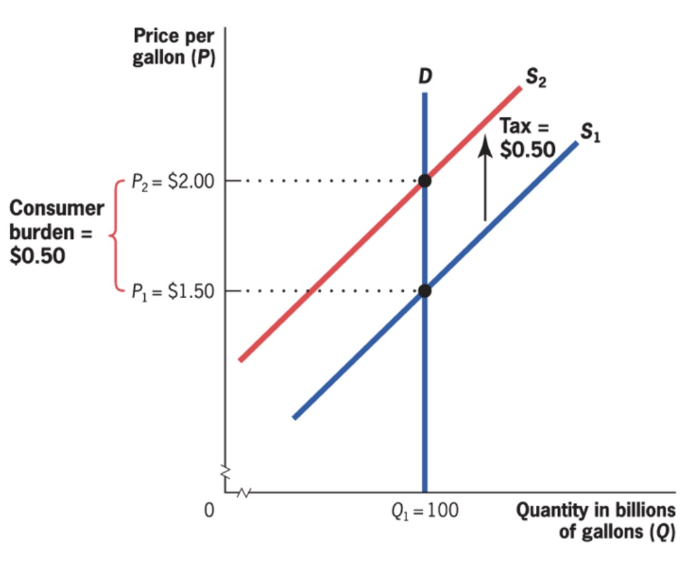
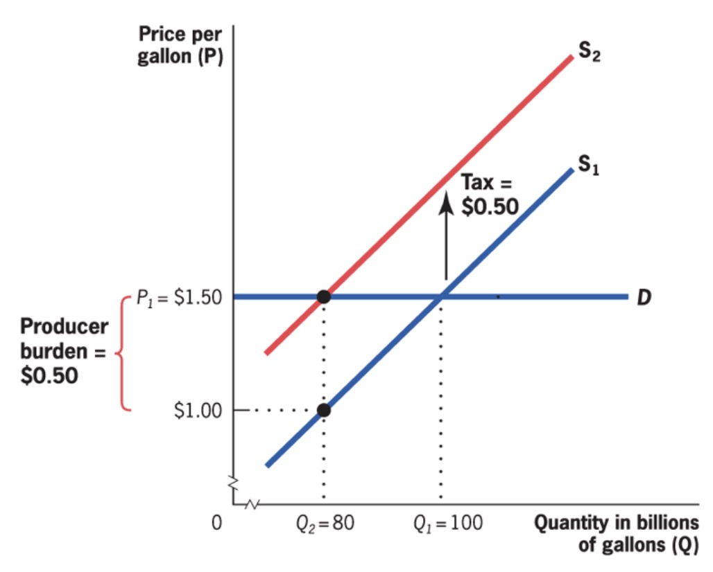

# Public Economics: Summary

Table of Contents

 * [Government Expenditure](#government-expenditure)
 * [Theory of Welfare Economics](#theory-of-welfare-economics)
 * [Empirical Tools](#empirical-tools)
 * [Externalities](#externalities)
 * [Cost-Benefit Analysis](#cost-benefit-analysis)
 * [Asymmetric Information](#asymmetric-information)
 * [Inequality](#inequality)
 * [Welfare Redistribution](#welfare-redistribution)
 * [Taxation](#taxation)
 * [Tax Incidence](#tax-incidence)
 * [Tax Inefficiency](#tax-inefficiency)
 * [Debt](#debt)

---

Study of Government in our Economy

Main Questions

1. When should Government intervene?
2. How?
3. What is the Effect?
4. Why do politicians intervene the way they do?

## Government Expenditure

> **Wagners Law:** Government expenditure grows not only in absolute terms, but also in relative to overall economy

Reasons:

- Fiscal Illusions
- Urbanization
- superior goods by Gov
- Baumol
- Demographic

> **Baumol Effect**: Services = more expensive than goods, Gov provides many services

## Theory of Welfare Economics

### Demand

- with indifference curves of Utility Levels
- and budget constraint

> **Marginal Utility:** increment in utility with one additional unit of good (diminishing)

> **Marginal Rate of Substitution:** Willingness to trade one good for another = Slope of IDC

Price Change Effects: Substitution / Income Effect

> **Elasticity of Demand:** % change in demand due to 1% increase in price

$$
e = \frac{ \frac{ \Delta Q }{Q} }{\frac{ \Delta P }{P}}
$$

- often negative
- if infinite = perfectly elastic demand (horizontal)
- if 0 = perfectly unelastic (vertical)

Demand for Good at Price: derived from multiple Budget Constraints

### Supply

Supply Curve = outcome of profit maximization

- Production Function $q = \sqrt{K * L}$​
- Profit maximization at short term: $p = MC$

### Equilibrium

Social Surplus = net gains from trade in society

- Consumer Surplus = $\Delta$ Utility and Price
- Producer Surplus = $\Delta$ Production Cost and Price

Theorems of Welfare Economics

> **Theorem 1**: competetive Equilibrium (where supply = demand) maximizes social efficiency

> **Theorem 2:** society can attain efficient outcome by *suitably* redistributing resources among individuals + free trade

only under specific conditions!

## Empirical Tools

Correlation vs possible flows of causation

- A -> B
- B -> A
- C -> A & B (third factor)

> **Bias**: source of difference between groups, that is correlated with treatment but not due to t

solved with random assignment in groups

### Randomized Control Trials

2 random groups (treatment & placebo)

Problems

- **external validity**: to other contexts
- **attrition**: reduction of sample size over time (threat to **internal validity**)
- **Expense**

### Observational Data

**Time Series Analysis**: Correlation over Time

- no spearation of correlation / causation
- excluded variables

**Cross Sectional Regression**: statistical magic

- add control variables for better results
- regression line for showing

**quasi-experiments**: change in economic environment create nearly identical groups

- often used in Difference in Difference (DiD) Models
- have to argument that bias is not relevant in this context

**structural modelling**: Estimation of Policy Effect on individual decisions (e.g income effects)

- structural estimation
- reduced form estimates

## Externalities

> **externality**: indirect cost / benefit to uninvolved third party

- type of market failure
- positive / negative
- production / consumption based
    - consumption: individuals consumptions harms others
    - production: firms production harms others

= create difference between **Social Marginal Cost** and **Private Marginal Cost**

> **Private Marginal Cost (PMC):** direct cost to produce one good

> **Social Marginal Cost (SMC):** PMC + costs imposed on others

Example: 

Solution => internalize Externalities

### Private Sector Solution

> **Coase Theorem:** well defined property rights + negotiations => socially optimal market quantity

damaged can demand compensation from damager 

- does not depend on who owns rights (either damage payment or payment for not damaging)
- Problems: 
    - Assignment
    - Free Rider
    - Holdouts 
    - Transaction Costs

=> only for specific problems!

### Public Solutions

**Taxation** / Subsidies = price Based approach

- pigouvian taxes
- align PMC and SMC
- for low SMB of Reduction (Co2)

**Regulation** = quantity based approach

- can be complicated
- and inefficient
- for high SMB of Reduction (nuclear leakage)

right amount of pollution:

### Public Goods

| *Types of Goods* | Excludable   | Non-excludable    |
| ---------------- | ------------ | ----------------- |
| **rival**        | private good | club good         |
| **non-rival**    | common good  | ***public good*** |

Example: atmosphere as a sink for emissions

Provision: aggregate demands (vertically)

Problems with Public Provision of Goods

- Crowd Out
- Provision Mechanism
- Measuring Costs / Benefites
- Measuring Preferences

## Cost-Benefit Analysis

### Measuring Costs

- Normal Costs (Capital, Operation, Maintenance)
- Opportunity Costs (in imperfect markets)

Disocunting Future Costs to *Present Discount Value*
$$
PDV = \frac{ F_1 }{1+r}+\frac{ F_2 }{(1+r)^2}+\frac{ F_3 }{(1+r)^3}+...
$$
for infinite: $\frac{ cost_{per year} }{r}$

### Measuring Benefits

- Time Savings Measuring
- Live Saved Valuation

Methods:

- Market Based = wages
- survey based
- revealed preferences

Example 

### Issues

- Counting Mistakes
- Menschenwürde
- Uncertainty
- Distribution Effects

Alternative: Cost Effectiveness Analysis

## Asymmetric Information

> **asymmetric Information:** different actors have differing levels of information in market

Example: Insurance Market with low risk / high risk people

- average price of insurance = too high for low risk, to cheap for others
- low risk cannot proof they are low risk

=> market failure and adverse selection

market based solution: pooling equilibrium, separating equilibrium

### Problems

> **Adverse Selection**: market situation where buyers and sellers have different information => unequal distribution of benefits to both parties

=> public insurance with mandatory (e.g Krankenkassen)

> **Moral Hazard**: Adverse actions taben by individuals or producers in response to insurance against adverse outcomes

- *ex ante*: changes in behavior that affect insured risk (smoking => lung cancer)
- *ex post*: after risk has materialized (cancer => want every possible treatment)

=> only partial insurance, not full (e.g Arbeitslosengeld 1)

## Inequality

measureable in Income and Wealth

Graphical Representation:

| Lorenz Curve                                                 | Gini Coefficient                                          |
| ------------------------------------------------------------ | --------------------------------------------------------- |
|  |  |

*Equity Effiency Tradeoff*: Societal Decision between these two

- Pareto Efficiency: one person better off without making other person worse off
- Problem: tyranny of status quo

### Social Welfare Function

Aggregation of indivudal utilities in Society

Requirements:

- indidividualistic
- pareto criterion (higher W for pareto-superior distributions)
- inequality aversion

=> no correct SWF!

## Welfare Redistribution

Program Characteristics:

- Eligibility
    - Categorical: restricted to some demographic (e.g Kindergeld)
    - means-tested: restricted by income (e.g Wohngeld)
    - many are both: (e.g Bürgergeld)
- Type
    - Cash Welfare
    - In-Kind (e,g freie Kita)

Leakage in Welfare Programs (Okuns Leaky Bucket)

- Administrative Costs
- Deadweight Loss of Taxation
- moral hazard (of the poor)

Benefit Example
$$
B = G-(\tau \times w \times h)
$$

- G = maximum benefit
- $\tau$ = reduction rate
- $w$ = wage
- $h$​ = hours worked

at $\tau=0.5$

Iron Triangle of Welfare (choose only 2)

- encourage work
- resdistribute more
- lowe costs

Solutions (only partly)

- *Categorical welfare Systems* (compensate for lack of earnings capacity, e.g disabled)
- *ordeal mechanisms* (work requirements etc.)
- *outside option* (higher minimum wage)

## Taxation

### General

> **Tax (German Law)**: cash payment without a specific return, mandatory for all

> **Tax (economics):** compulsory levy without a (individual or group-specific) service in return

Goals:

- generate Revenue
- increase equity
- change individual behavior

Effective Tax Rates on Income

Red = effective Tax, green = marginal tax

> **marginal tax rate**: percentage of the next euro of taxable income paid

> **effective tax rate:** percentage of total income paid

Fairness in Tax System:

- **Vertical equity**: Strong shoulders pay more
- **Horizontal equity**: similar individuals pay equal amounts

### Haig Simons Principle

taxable income = reflect **ability to pay** 

=> deductions for life situations, e.g Pendlerpauschale

- but deviations also existent, e.g deduction for charitable giving
- to induce crowd in and consumer sovereignty
- cost = lost gov revenue

### Unit of Taxation

on what income should taxes be levied? (Family, Marriage, Individual)

- Individual
    - no equity across couples (with same aggregated income, but different shares)
    - but fair taxation for everybody

- Family 
    - income aggregated on family level and taxed
    - = marriage tax, because shared filing = more expensive

- Marriage Splitting
    - income splitted on 2 members of marriage
    - and then taxed
    - disincentivizes work for poorer member of HH

## Tax Incidence

Three Rules

1. Statutory Burden $\neq$ economic burden
2. side of the market = irrelevant
3. party with inelastic supply = bear taxes

> **Economic Incidence**: burden of taxation measured by change in resources available

> **statutory incidence:** burden borne by party that sends check to gov.

| inelastic demand                          | elastic demand                         |
| ----------------------------------------- | -------------------------------------- |
|  |  |
| burden at consumers                       | burden at producers                    |

> **gross price**: market price

> **after-tax price:** gross price - tax (if producer tax) or + tax (if consumer side)

### General Equilibrium Tax Incidence

until now: only *partial equilibrium tax incidence* (impact on one market)

> **General equilibrium tax incidence:** Analysis that considers
> the effects on related markets of a tax imposed on one marke

depends on

- **long run / short run** = shifting elasticities
    - capital in short run = fixed, bears burden
    - in long run = more volatile
- **tax scope** = non-taxed substitutes
- **spill-over effects**
    - income effect = lower real income
    - substitution effect
    - complementary effect = reduce consumption of complementary goods (e.g beer tax and snacknuts consumption)

## Tax Inefficiency

Tax System: Trade off between **Equity & effiency** 

Tax = creates Deadweight Loss (DWL), depends on

- Elasticities (higher elasticity = higher DWL)
- Tax height

$$
DWL = \frac{ \epsilon_s \epsilon_d }{2 (\epsilon_s - \epsilon_d) } * \tau^2 * \frac{ Q }{P}
$$

**marginal DWL:** increase in DWL per unit of taxation

Implications for Efficiency:

- depends on *preexisting distortions*
- progressive tax = higher DWL
- smooth taxes > high short taxes

### Optimal Taxation

**for Commodities:** by Frank Ramsay: ratio of marginal DWL = marginal Revenue

Formula:

$$
\frac{ MDWL_i }{MR_i} = \lambda
$$

ratio $\lambda$ = should besame for all goods

Example 

$$
\frac{ MDWL_A }{MR_A} > \frac{ MDWL_B }{MR_B}
$$

- increase taxation on B
- lower on A

-> elasticity rule: good with higher elast. = lower tax

- but not good for equity (caviar = high elast, wheat = low)

**for Income:**

- total income in society = fixed
- same utility function
- After = everyone same income

Formula: $\frac{ MU }{MR} = \lambda$ same for all (MR = marginal Revenue)

## Debt

> **Governemtn Debt:** amount gov. borrowed on financial markets

> **government deficits / surplus:** yearly increase / decrease 

Types of gov. debt:

- *Explicit*: official debt given out by the financial ministry
- *implicit:* explicit + promised payouts in the future (e.g pensions etc.)

Calculation of implicit debt:

Present Discounted Value:

$$
PDV = \frac{ F_1 }{1+r}+\frac{ F_2 }{1+r}+...
$$

but:

- very hard to calculate
- (heroic) assumptions about r and F

=> focus on explict debt!

### Effects

Short Run: Stabilization

- **Automatic stabilization**: automaitc policies e.g unemployment insurance
- **Discretionary stabilisation**: policy actions taken in response (e.g Gaspreisbremse)

= good for the economy

Long Run: Negative?

- limited private capital investment
- less economic growth due to less private investment

Reality:

- depends on capital markets
- and what the debt is used for...

=> evidence is inconclusive
