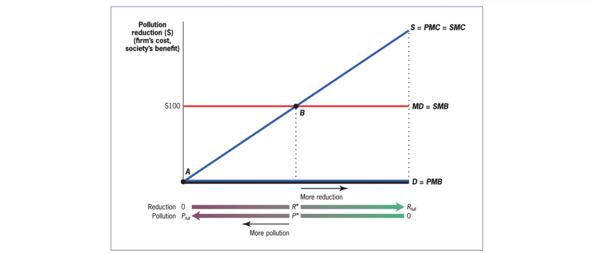

# Public Economics: Summary

Study of Government in our Economy

Main Questions

1. When should Government intervene?
2. How?
3. What is the Effect of interventions?

[TOC]

## Government Expenditure

> **Wagners Law:** Government expenditure grows not only in absolute terms, but also in relative to overall economy

Reasons:

- Fiscal Illusions
- Urbanization
- superior goods by Gov
- Baumol
- Demographic

> **Baumol Effect**: Services = more expensive than goods, Gov provides many services

## Theory of Welfare Economics

### Demand

- with indifference curves of Utility Levels
- and budget constraint

> **Marginal Utility:** increment in utility with one additional unit of good (diminishing)

> **Marginal Rate of Substitution:** Willingness to trade one good for another = Slope of IDC

Price Change Effects: Substitution / Income Effect

> **Elasticity of Demand:** % change in demand due to 1% increase in price

$$
e = \frac{ \frac{ \Delta Q }{Q} }{\frac{ \Delta P }{P}}
$$

- often negative
- if infinite = perfectly elastic demand (horizontal)
- if 0 = perfectly unelastic (vertical)

Demand for Good at Price: derived from multiple Budget Constraints

### Supply

Supply Curve = outcome of profit maximization

- Production Function $q = \sqrt{K * L}$​
- Profit maximization at short term: $p = MC$

### Equilibrium

Social Surplus = net gains from trade in society

- Consumer Surplus = $\Delta$ Utility and Price
- Producer Surplus = $\Delta$ Production Cost and Price

Theorems of Welfare Economics

> **Theorem 1**: competetive Equilibrium (where supply = demand) maximizes social efficiency

> **Theorem 2:** society can attain efficient outcome by *suitably* redistributing resources among individuals + free trade

only under specific conditions!

## Empirical Tools

Correlation vs possible flows of causation

- A -> B
- B -> A
- C -> A & B (third factor)

> **Bias**: source of difference between groups, that is correlated with treatment but not due to t

solved with random assignment in groups

### Randomized Control Trials

2 random groups (treatment & placebo)

Problems

- **external validity**: to other contexts
- **attrition**: reduction of sample size over time (threat to **internal validity**)
- **Expense**

### Observational Data

**Time Series Analysis**: Correlation over Time

- no spearation of correlation / causation
- excluded variables

**Cross Sectional Regression**: statistical magic

- add control variables for better results
- regression line for showing

**quasi-experiments**: change in economic environment create nearly identical groups

- often used in Difference in Difference (DiD) Models
- have to argument that bias is not relevant in this context

**structural modelling**: Estimation of Policy Effect on individual decisions (e.g income effects)

- structural estimation
- reduced form estimates

## Externalities

> **externality**: indirect cost / benefit to uninvolved third party

- type of market failure
- positive / negative
- production / consumption based
    - consumption: individuals consumptions harms others
    - production: firms production harms others

= create difference between **Social Marginal Cost** and **Private Marginal Cost**

> **Private Marginal Cost (PMC):** direct cost to produce one good

> **Social Marginal Cost (SMC):** PMC + costs imposed on others

Example: 

Solution => internalize Externalities

### Private Sector Solution

> **Coase Theorem:** well defined property rights + negotiations => socially optimal market quantity

damaged can demand compensation from damager 

- does not depend on who owns rights (either damage payment or payment for not damaging)
- Problems: 
    - Assignment
    - Free Rider
    - Holdouts 
    - Transaction Costs

=> only for specific problems!

### Public Solutions

**Taxation** / Subsidies = price Based approach

- pigouvian taxes
- align PMC and SMC
- for low SMB of Reduction (Co2)

**Regulation** = quantity based approach

- can be complicated
- and inefficient
- for high SMB of Reduction (nuclear leakage)

right amount of pollution:

### Public Goods

| *Types of Goods* | Excludable   | Non-excludable    |
| ---------------- | ------------ | ----------------- |
| **rival**        | private good | club good         |
| **non-rival**    | common good  | ***public good*** |

Example: atmosphere as a sink for emissions

Provision: aggregate demands (vertically)

Problems with Public Provision of Goods

- Crowd Out
- Provision Mechanism
- Measuring Costs / Benefites
- Measuring Preferences

## Cost-Benefit Analysis

### Measuring Costs

- Normal Costs (Capital, Operation, Maintenance)
- Opportunity Costs (in imperfect markets)

Disocunting Future Costs to *Present Discount Value*
$$
PDV = \frac{ F_1 }{1+r}+\frac{ F_2 }{(1+r)^2}+\frac{ F_3 }{(1+r)^3}+...
$$
for infinite: $\frac{ cost_{per year} }{r}$

### Measuring Benefits

- Time Savings Measuring
- Live Saved Valuation

Methods:

- Market Based = wages
- survey based
- revealed preferences

Example 

### Issues

- Counting Mistakes
- Menschenwürde
- Uncertainty
- Distribution Effects

Alternative: Cost Effectiveness Analysis

## Asymmetric Information

> **asymmetric Information:** different actors have differing levels of information in market

Example: Insurance Market with low risk / high risk people

- average price of insurance = too high for low risk, to cheap for others
- low risk cannot proof they are low risk

=> market failure and adverse selection

market based solution: pooling equilibrium, separating equilibrium

### Problems

> **Adverse Selection**: market situation where buyers and sellers have different information => unequal distribution of benefits to both parties

=> public insurance with mandatory (e.g Krankenkassen)

> **Moral Hazard**: Adverse actions taben by individuals or producers in response to insurance against adverse outcomes

- *ex ante*: changes in behavior that affect insured risk (smoking => lung cancer)
- *ex post*: after risk has materialized (cancer => want every possible treatment)

=> only partial insurance, not full (e.g Arbeitslosengeld 1)

## Inequality

measureable in Income and Wealth

Graphical Representation:

| Lorenz Curve                                                 | Gini Coefficient                                          |
| ------------------------------------------------------------ | --------------------------------------------------------- |
|  |  |

*Equity Effiency Tradeoff*: Societal Decision between these two

- Pareto Efficiency: one person better off without making other person worse off
- Problem: tyranny of status quo

### Social Welfare Function

Aggregation of indivudal utilities in Society

Requirements:

- indidividualistic
- pareto criterion (higher W for pareto-superior distributions)
- inequality aversion

=> no correct SWF!

## Welfare Redistribution

Program Characteristics:

- Eligibility
    - Categorical: restricted to some demographic (e.g Kindergeld)
    - means-tested: restricted by income (e.g Wohngeld)
    - many are both: (e.g Bürgergeld)
- Type
    - Cash Welfare
    - In-Kind (e,g freie Kita)

Leakage in Welfare Programs (Okuns Leaky Bucket)

- Administrative Costs
- Deadweight Loss of Taxation
- moral hazard (of the poor)

Benefit Example
$$
B = G-(\tau \times w \times h)
$$

- G = maximum benefit
- $\tau$ = reduction rate
- $w$ = wage
- $h$​ = hours worked

at $\tau=0.5$

Iron Triangle of Welfare (choose only 2)

- encourage work
- resdistribute more
- lowe costs

Solutions (only partly)

- *Categorical welfare Systems* (compensate for lack of earnings capacity, e.g disabled)
- *ordeal mechanisms* (work requirements etc.)
- *outside option* (higher minimum wage)

## Taxation

