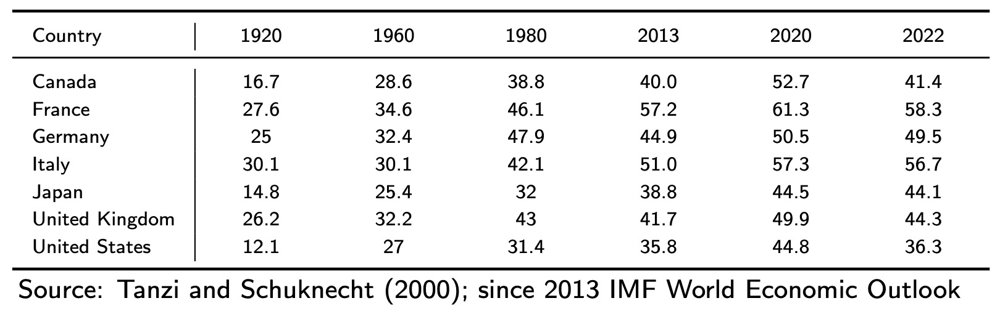

# 11.10.2023 Introduction to Public Econ.

> **Wagners Law:** Governments Size increases not just in absolute terms, but also in relation to overall economy

Explanations:

- Government = superior goods
- fiscal illusion
- Baumol Effect

> **Baumol Effect:**  Services = more expensive over time than goods, Government finances many services (education, healthcare)

End of Wagners Law in 1980

- Neoliberlism
- Globalization (Race to the Bottom)

