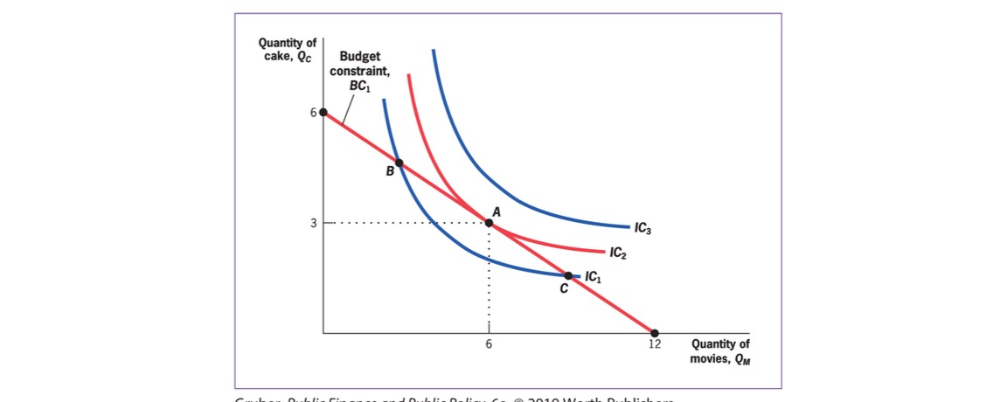
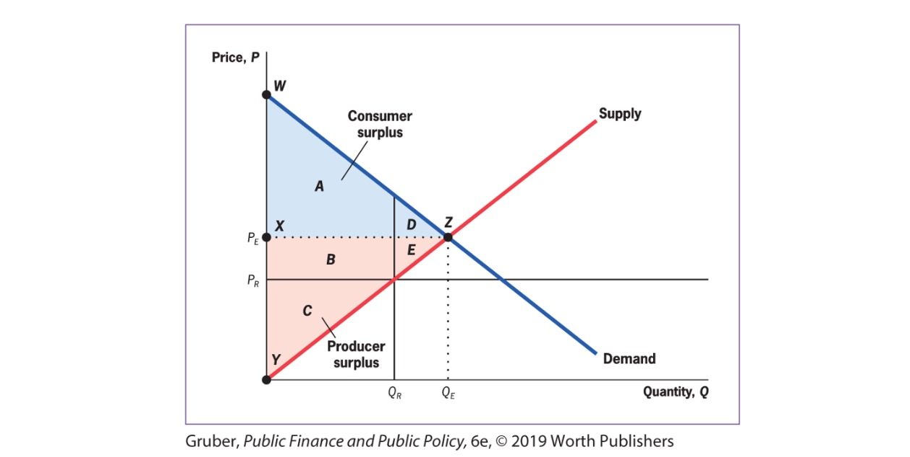

# 18.10.2023 Tools of Public Economics

## Theoretical Framework

Neoclassical / Mainstream Economics

- good in predicting individual behavior
- theory was updated with foundations from other schools of thought

## Demand

for Goods

### Constraint Utility Maximization

Assumption:

- limited resources
- individual has *utility function*
- Aim = maximize welfare

> **Indifference Curve:** graphical Representation of bundles of goods that make qually well off

Underlying math: **Utility Function**

$$
U(Q_C.Q_M) = \sqrt{Q_C \times Q_M}
$$

- marginal utility = derivative, additional utility of one more
- Diminishing Marginal Utility

> **Marginal Rate of Subst.:** Willingness to trade one good for another, slope of IDC

Budget Constraint:
$$
Y = P_C Q_C+P_MQ_M
$$

### Price Changes

can have two effects

- Substitution Effect
- Income Effect

> **Elasticity of Demand:** % change in demand due to 1% increase in price

$$
e = \frac{ \frac{ \Delta Q }{Q} }{\frac{ \Delta P }{P}}
$$

## Supply

Supply Curve = outcome of profit maximization

Production Function: $q = \sqrt{K * L}$

- K = Capital
- L = Labour

Profit Maximization at short term: $p = MC$

## Equilibrium

 at Demand = Supply

Theorems of Welfare Economics

1. The competitive equilibrium, where supply equals demand, maximizes social efficiency.
2. Society can attain any efficient outcome by suitably redistributing resources among individuals and then allowing them to trade freely.

**under specific conditions!**, that almost never exist (full information, no externalities?!)

Problem: Equity Effiency Tradeoff

