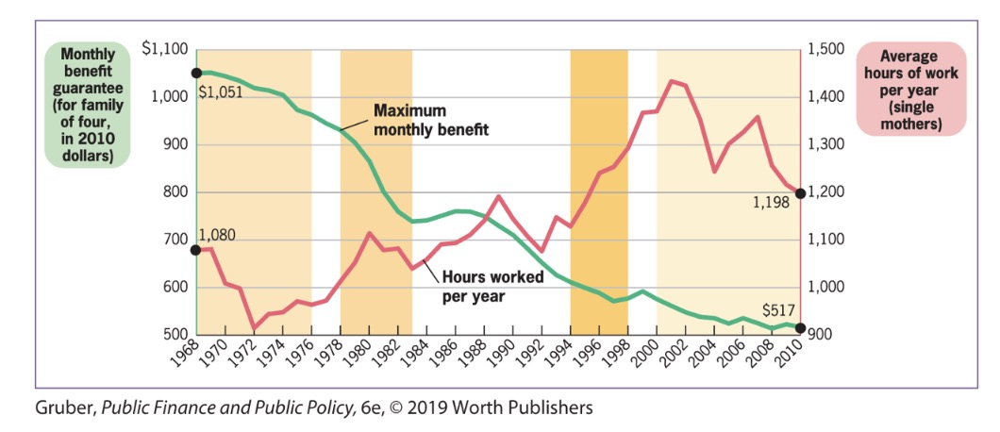
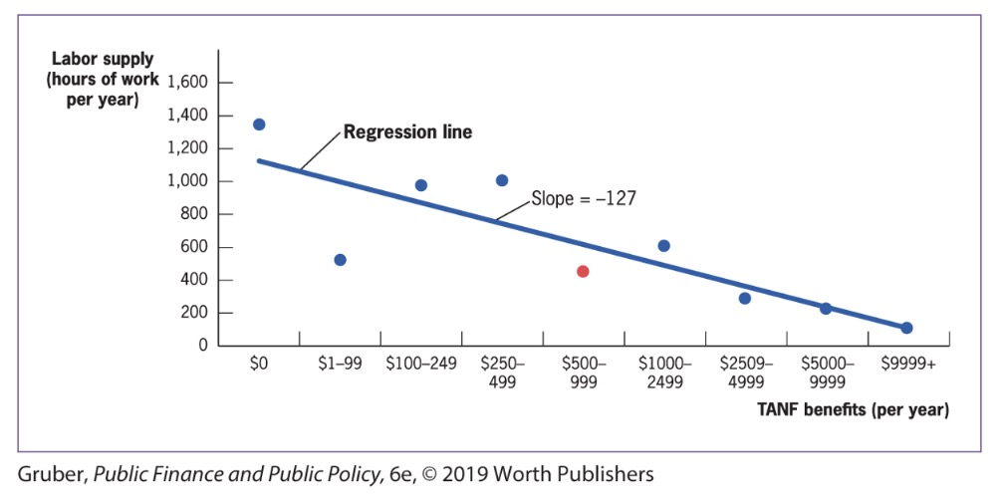
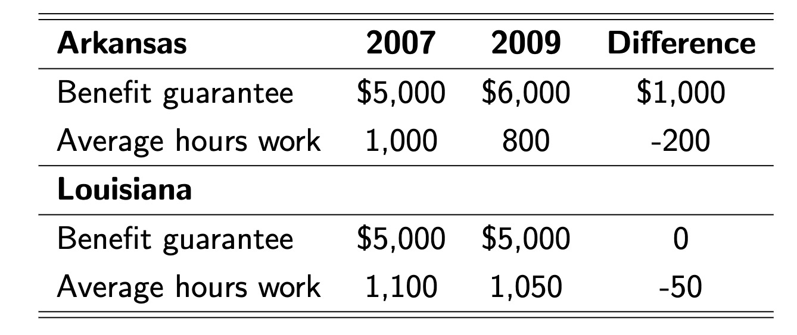

# 25.10.2023 Tools II

## Randomized Control Trials

Gold Standard to find out about causation

- 2 random groups
- one treatment group, one with placebo
- solvest the problem of bias

> **Bias**: source of difference between treatment and control group that is correlated with the treatment but not due to the t.

Example: SAT Courses

- Students taking SAT Prep Courses
- have lower grades in the end
- but due to lower starting point for course takers

Problems of RCT:

- **external validity**: not applicable to other contexts
- **Attrition**: reduction of sample size over time leads to bias
- **Expense**

### RCT in TANF context

- Experiment in Califarion in 1992
- 1/3 families to existing program
- 2/3 treatment group with 15% lower benefits

Results

- Employment rates: 49% vs 44.5%
- Elasticity of Labor: $\frac{ -10\% }{15\%}=0.67$

## Observational Data

> **Obersavtional Data:** Data generated by individual behavior in real world

Problem: Bias

### Time Series Analysis

Analysis of the co-movement of two trends

- can be used to analyze correltaion
- to support theory

TANF Example

Problems:

- separation from correlation to causation
- excldued variables (often macro labor market)

### Regression Analysis

= best fitting linear-relationship between two variables

> **Cross-sectional regression analysis:** Statistical analysis of
> the relationship between two or more variables exhibited by
> many individuals at one point in time.

find best fitting linear elationship between two variables

> **Regression line**: The line that measures the best linear
> approximation to the relationship between any two variables

Example:

Problem of Biases can be solved with **control variables**

> **Control Variables:** Variables that are included in
> cross-sectional regression models to account for differences
> between treatment and control groups that can lead to bias

### Quasi Experiments

> **Quasi Experiments**: Changes in economic environment
> that create nearly identical treatment and control groups for
> studying the effect of that environmental change

Example: Card minimum wage Research uses DiD

> **Difference in Difference (DiD):** The difference between
> the changes in outcomes for the treatment group and control group

Hypothetical Example: one state increases state aid, other does not

Assumption: 

- external effects (financial crisis) affect both states in the same way
- both groups would develop the same (*common trend assumption*)

## Tutorial

> **internal validity**: how valid for the population being studied

> **external validity:** how valid for the general population

Threats to external validiry

- non representative sample
- non represenattive treatment
- general equilibrium 
    - scale and duration might change economic environment
    - ex: training unemployed => higher expectations from employers
    - changes baseline

### Regression 

= best fitting linear-relationship between two variables

- just correlation!
- selection bias, omitted-variable bias
