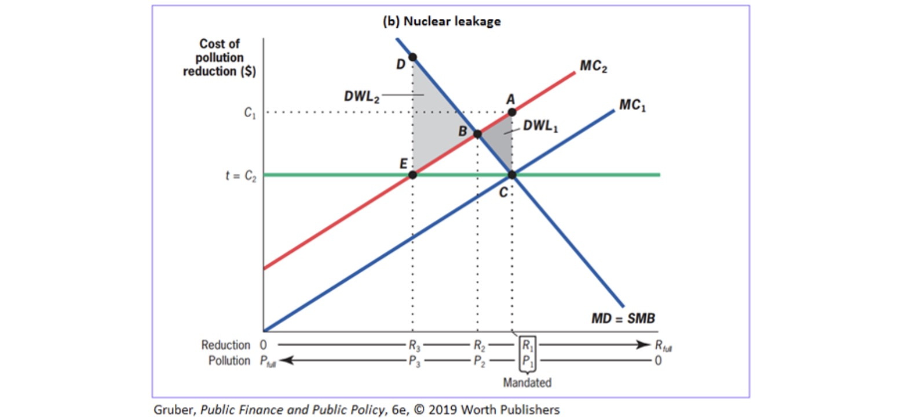

# 06.11.2023 Externalities

> **Externalities:** situation, where ones party action affects others, but is not compensated

Example: Pollution, Education

Externalities = market failure => government intervention

## Externality Theory

Types:

- positive / negative (Pollution / Education)
- from production / from consumption (Pollution / Smoking)

Example: Steel Company

- Production of steel and sludge 
- 1 unit of sludge for every unit of steel
- sludge directed into stream, kills fish from fishers

Externalities: SMC $\neq$ PMC

> **Private Marginal Cost (PMC):** direct cost to produce one good

> **Social Marginal Cost (SMC):** PMC + costs imposed on others

Example: 

Types of Externalities:

- negative production: SMC > PMC
- negative consumption: SMB < PMB (Private Marginal Benefit)
- ...

Solution: **internalize Externalities**

- private negotiation
- government solutions

## Private Sector

> **Coase Theorem:** well defined property rights + negotiations => socially optimal market quantity

Example: 

- Fishers own the property rights
- negotiate compensation with steel plant

**Important:** Efficient solution *does not depend* who owns the property rights!

**Problems**: (especially with many people)

- Assignment Problem
    - who causes the damage?
    - how large is the damage?
- Holdout Problem
    - shared ownership of rights = veto options
    - may demand enormous payments
- Free Rider Problem
- Transaction Costs / Negotiationg Problems

**=> Coase only works with specific problems!**

## Public Interventions

Instruments:

- Taxation / Subsidies
    - internalize externality
    - correct tax = *Pigou Tax*
- Regulation
    - regulate Quantities
    - complicated information needed

Price-Based Approach vs Quantity Based Approach

## Distinction

Right Amount of Pollution

- A = free market
- B = socially optimal: SMC = SMB

**Example 1**: Multiple Plants with differenct reduction costs

- blue line = Tax (*efficient*)
- black line = Regulation

**Example 2:** unvertainty about costs

- high SMB of Reduction => Quantity Based Approach (nuclear leakage)
- Low SMB of Reduction => Price Based Approach (kg of carbon)

High SMB:

Assumption of MC1

- C = Regulation and Tax

if real MC = MC2

- E = Tax 
- A = Regulation
- DWL Regulation  < DWL Tax

**=> when Quantity is important use Regulation, else taxes**

## Tutorial: Addition of Demands

- Vertical Summation = Add up at Quantity Q (**Public Good**)
- Horizontal Summation = Add up Demands at Price P

Example **Horizontal**:

- A: $Q = 21-6P$
- B: $Q = 6-3P$

Addition of the Quantites at given Price
$$
Q_1 + Q_2 = (21-6P) + (6-3P) = 27-9P \\
9P = 27  \to P = 3 - \frac{ 1 }{9}Q
$$

Example **Vertical**

Solve indivudally for P (Demands from above)

- A: $P = \frac{ 7 }{2} - \frac{ 1 }{6}Q$
- B: $P = 2 - \frac{ 1 }{3}Q$

Sum up

$$
P_1 +P_2 = (7/2 - 1/6Q)+ (2 - 1/3Q)
= \frac{ 11 }{2}- \frac{ 1 }{2} Q
$$

### Bike Paths Example 

individual Bike Path Demand

- A: $Q=24-4P$
- B: $Q = 14-P$
- C: $Q = 5-1/3P$

Marginal Cost of one Path = 18

**Version 1**

- town decides to tax evenly
- asks residents, highest number answered gets build
- $MC = a+b+c$, here (a=b=c)
- 18/3 = 6 Cost Units

Demands at this Price (input P=6)

- A: Q=0
- B: Q=8
- C: Q=3

=> Build 8 Paths

**Version 2**: Social Optimum

- solve every Demand for P
- sum Up => SMB
- SMB = MC = 18, solve for Q
- insert Q into individual Demand Functions