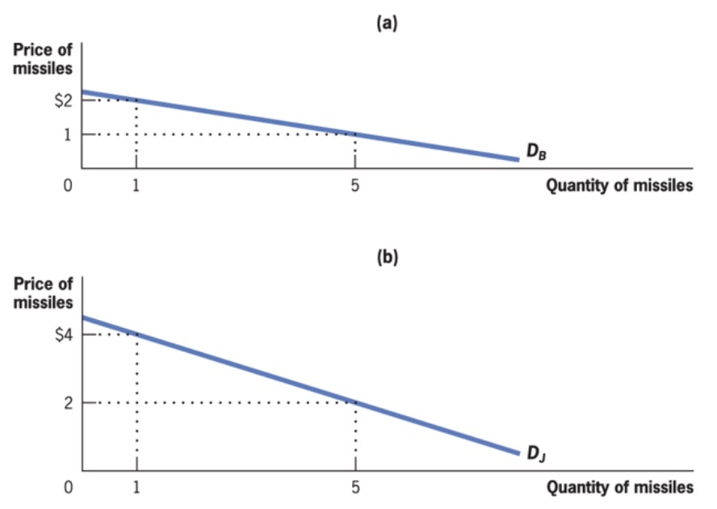
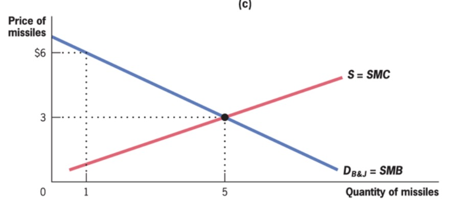

# 08.11.2023 Public Goods

| *Types of Goods* | Excludable   | Non-excludable    |
| ---------------- | ------------ | ----------------- |
| **rival**        | private good | club good         |
| **non-rival**    | common good  | ***public good*** |

Example: atmosphere as a sink for emissions

## Optimal Provision

How much should the society provide?

- Aggregate demands (here two individuals)
- add Demands at each point (**vertically**)

Mathematically: Ben and Jerrys Demand

$$
MRS_{m,c}^B + MRS_{m,c}^J = MC
$$

Visual:

| Addition                                  | Market                                    |
| ----------------------------------------- | ----------------------------------------- |
|  |  |

## Private Provision

Problem: Underprovision due to **Free Rider Problem** = Market Failure

Possible Situations_

- some care more than others
- people are altruistic
- people have **warm glow** from others (like seeing other people happy)

Solution: 

- overcome non-excludability
- charge user the fees

=> often does not work!

## Public Provision

Problems here:

### Crowd Out

- empirically not high
- in laboratory very high

=> not sure about this, but definitely less than full!!

### Provision Mechanism

possible Solution: *Contracting out*

- misaligned incentives
- risk of corruption, not always best offer

=> do it yourself

### Measuring Costs / Benefits

Problems:

- benefits not defined
- opportunity cost of production

=> Cost Benefit Analysis

### Measuring Preferences

Problems 

- **Preference revelation**: people dont want to say their true value because they fear being charged 
- **preference knowledge:** not knowing what value is to you
- **preference aggregation:** how to combine

###  

