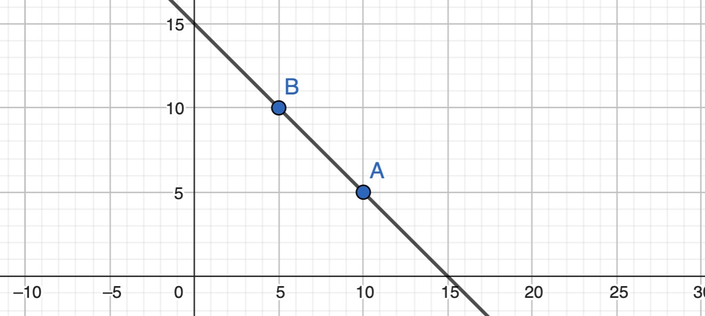
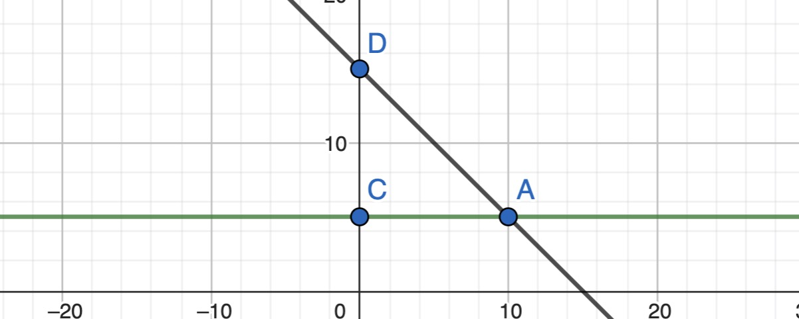

# 15.11.2023 Cost Benefit Analysis

> **CBA:** Comparison of Costs / Benefits of public goods / projects to decide if they should be undertaken

## Measuring Costs

Example Costs:

- Capital Costs
- Operation C.
- Maintenance C.
- Non-Monetary C.

but very important: 

- Opportunity Costs!
- Rents


### Opprotunity Costs in imperfect markets

- Project Hours = 500.000
- project wage = 25$
- but real comp. wage = 20$

$$
Opportunity \ Cost = hours * comp. wage = 10.000.000
$$

### Discounting

how to count costs over time? discount value 

$$
PDV = \frac{ F_1 }{1+r}+\frac{ F_2 }{(1+r)^2}+\frac{ F_3 }{(1+r)^3}+...
$$

Choice of r = very important

- 1% UBA
- 7% US Government 


## Measuring Benefits

### Value of Time Savings

Approaches;

- Martket based = wages
    - time savee = valuet at wage
    - problems: nonmonetary aspects of job
- survey based
    - hypothetical questions 
    - embedding effect = difficulty to value things in larger context
    - people dont know their valuations
- revealed preferences
    - market prices = reveal the individual preferences
    - bias problem


Types of Revealed Preferences

- Hedonic Market Analysis = regression with a lot of controls
- Natural Experiments = naturally occuring variation in prices, how much people want to wait
    - e.g.: different prices at gas stations, but longer queues 


### Value of Lives saved

= most difficult issue 

Approaches:

- Market based (lifetime wages)
    - poorer people = worth less
    - older people = worth less
- survey based (value of statistical life)
    - ask for willingness to pay for certain risk
- revealed preferences
    - compensating differential = higher wages for deadlier jobs (coal miners)
    - Problems: 
        - Information
        - Probabilities
        - Bias
        - Heterogenity 

Example Project


## Issues

- Counting Mistakes
- Uncertainty (gov prefer certain projects = no risk = lower returns)
- Distributional Concerns (Costs and Benefits to different people)


Alternative:

> **Cost-Effectiveness Analysis**: projects with immeasurable benefits => most effective project for goal


## Critique of CBA

not part of the lectrúre, but very important ([Wiki-Link](https://en.wikipedia.org/wiki/Cost%E2%80%93benefit_analysis#Criticisms))

**Distribution**

- no account of dsitribution issues
- only net-benefit for all people (Kaldor Hicks)
- utilitarian approach (1$ for 1 million people worse than 2 million to one person)

**Discounting**

- discounting value of benefits to future generations
- ignore preferences of future generation

**Marginal Utility**

- rich people = lower marginal utility
- no symmetry in agents


## Exercise

Exercise 3: City of Metropolia

Example: 

- new Metro, 
- Commuters save 15 min driving time, 5 days a week, 50 weeks
- Housing Price goes up 10000€
- Discount Rate 5%

Math

- Hours saved (valued today): $15*5*50 = 3750 min = 62.5h$
- Present Discount Value: $\frac{ 62.5 }{0.05}$
- set equal to house price increase: $\frac{ 62.5 }{0.5}= 10000 \to 8$
- Value of hour saved = 8

---

Exercise 4

- Country A: risk of death = 1/20000, Cost = 5000€
- Country B: risk of death = 1/30000, Cost = 5600€

Value of Life:

- Risk Difference $\frac{ 1 }{20000}- \frac{ 1 }{30000} = \frac{ 1 }{60000}$
- Willingness to pay: 600$
- Value of Life: $\frac{ 600 }{1/60.000} = 36.000.000$

---

Exercise 5: Jellystone Park

- City A: Price=5, Quantity = 10
- City B: Price= 10, Quantity = 5

Calculate individual demand curve:

```


a*5+b = 10
a*10+b= 5

a*10+b = a*5+b-5

5a = -5
a = -1

-10 +b = 5 
b = 15

=> -1x+15 = p
```



Consumer Surplus
$$
\frac{ (Price_{intercept} - Price_{market}) * Quantity}{2}
$$

- City A: $\frac{ (15-5) *10}{2} = 50$
- City B: 12.5



 
