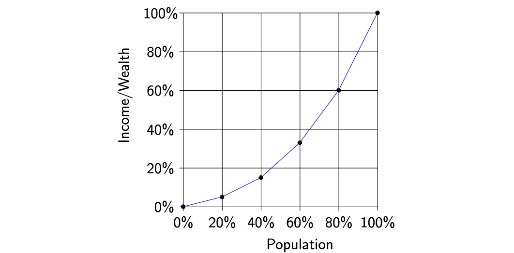
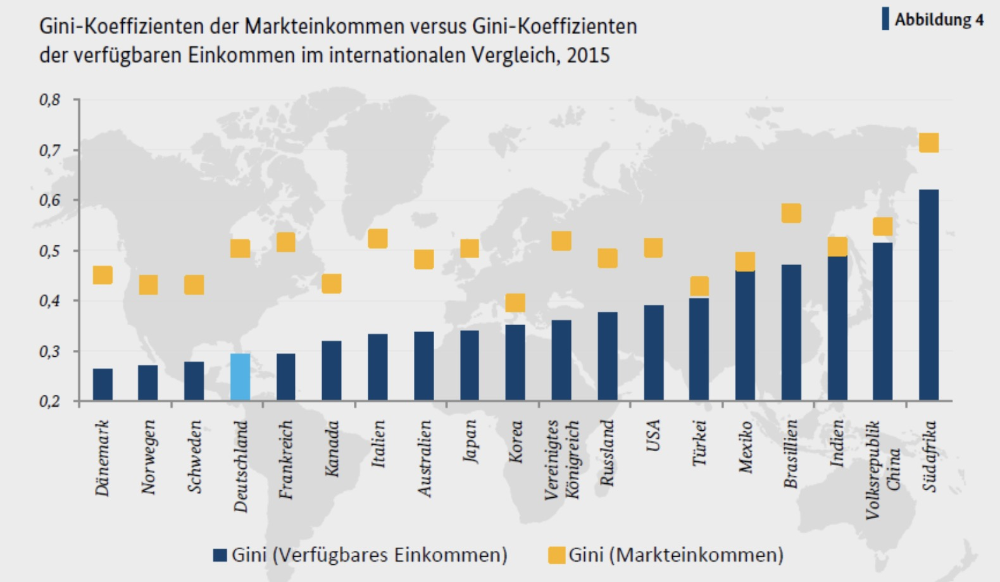
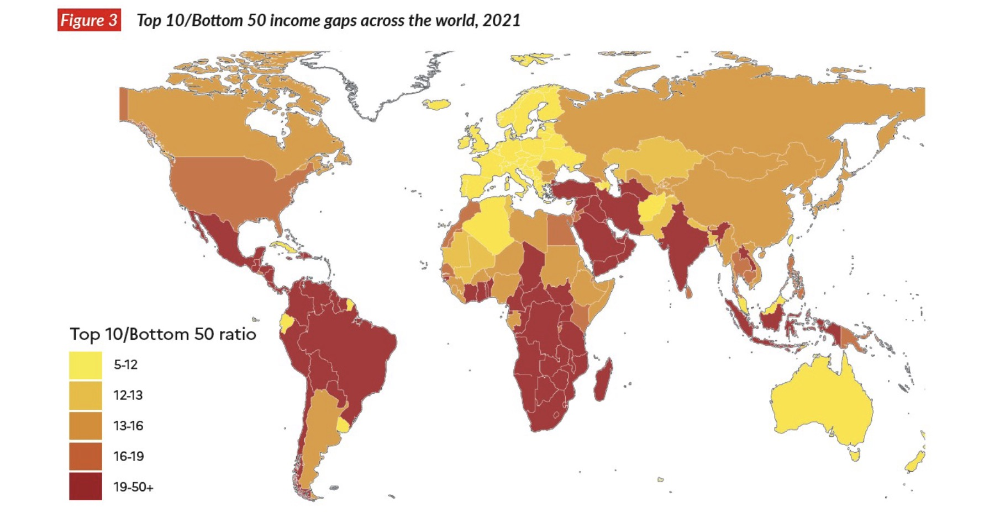
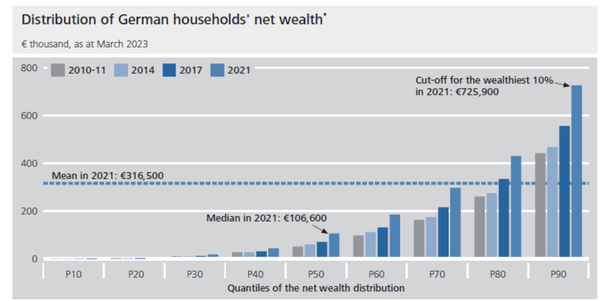
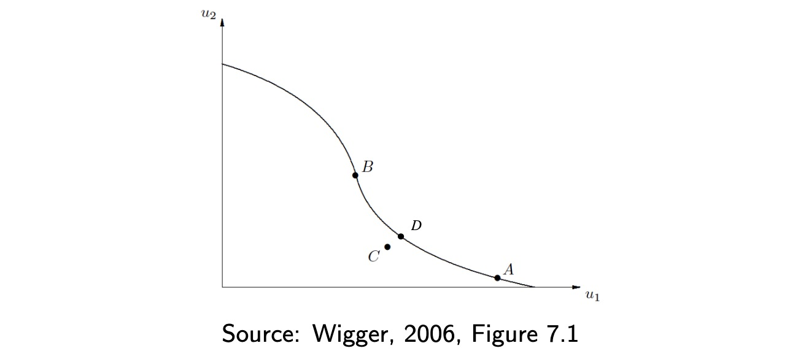

# 06.12.2023 Inequality

## Income Distribution

> **Income**: Amount of Money available for consumption at beginning of period

Measurement = Lorenz Curve

From Here: Calculation of the Gini Coefficient

### Empirical

1. market income = primary income distribution
2. disposable Income = secondary Income distribution

Additional Measures

- 80:20 Quintile Ratio (OECD & Eurostat)
- World Inequality Report: riches 10% vs 50%
- shared prosperity (World Bank): Income Growth of poorest 40%

10:50 Measurement (from [World Inequality Report](https://wir2022.wid.world/))

### Development of Income Inequality

- Globally = sunken
- Reduction of Poverty in East-Asia
- 1% has Grown a lot
- Industrialized Countries = inequality grown

Reasons for higher Ineq.:

- Reduction Wage Rate
- Reduction union bargaining power
- technological change
- market power
- lower tax rate for high-income earners

## Wealth

> **net Wealth**: present value individual including $Demands - Debt$

- difficult to measure
- germany lower than other countries
    - caluclation of pension savings = difficult
- also human capital?

## Equity and Efficiency

Tradeoff?

- Pareto Criterion: make one person better off without making someone esle less
- pareto efficiency 

### Utility Possibility Curve

Set of Options that are *pareto-efficient*

Sets of Options of HH1, HH2 that are pareto efficient (except for C)

if at A = **tyranny of the status quo**

Measuring Inequality

- ordinal: "a better than b"
- Cardinal: "+100 for a is double better than +100 for b"

Trade Off of Redistribution

- change individual behavior
- effiency loss (work less)

**also:** positive effects of redistribution

## Social Welfare Function

Aggregation of individual utilities in Society

$$
SWF: W=W(U_1,U_2,...,U_n)
$$
Requirements to an SWF

- individualistic (based on indiviudals utilities )
- pareto criterion (pareto-superior allocations = higher W)
- inequality aversion (lower inequality = higher W)

Examples of SWF:

- Utilitarian: $W = \sum U_n(x_n)$
    - decreasing marginal utility => inequality aversion
- Rawlsian: $W = \min [U_n(x_n)]$
    - if nobody knows what position they will take in society
    - they will maximize welfare for lowest person in society

=> no right SWF! (or SWF itself are bullshit...)