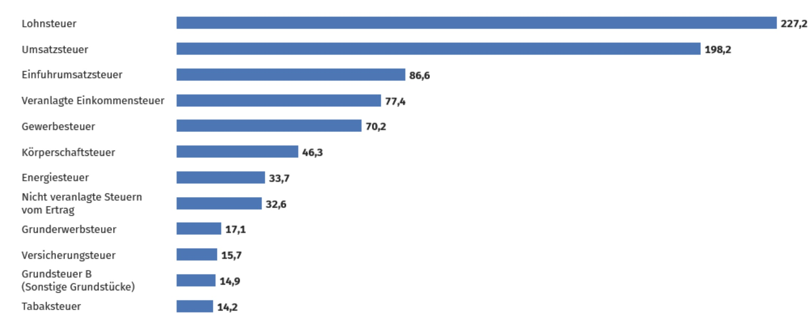
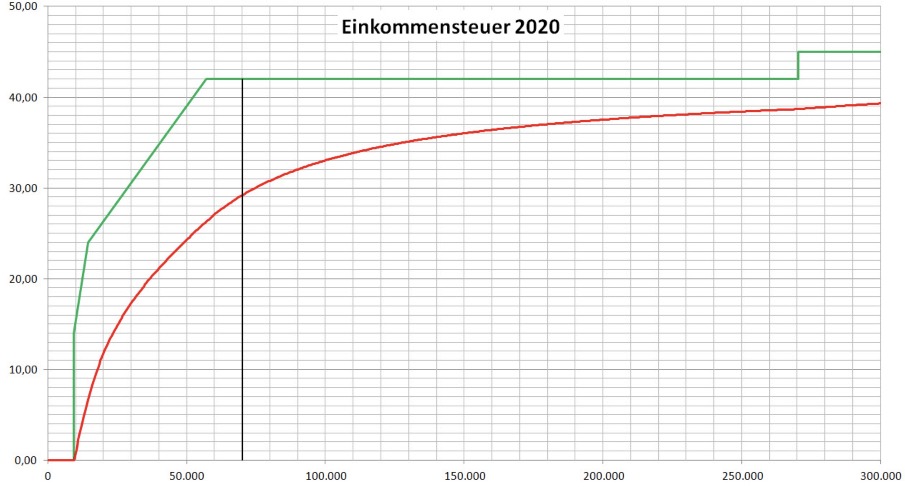

# 20.12.2023 Taxation

Ways of Government Revenue:

- Taxation
- Debt
- Fees / Contributions (Sozialabgaben)
- Sales of Government Assets

## General

> **Tax (Legal):** Cash Payment to State from everyone

> **Tax (Economic):** compulsory levy without specific service in return

Economic = more broad, also non-financial e.g jury duty

### German Taxes

- Earnings (Lohnsteuer)
- Income (Einkommensteuer)
    - Individual income tax
    - capital gains tax
- Corporate Income (Körperschaftssteuer)
- Wealth
    - Wealth Taxes (sadly do not exist currently)
    - Property taxes (Grundsteuer)
    - Estate taxes (Erbschaftsteuern)
- Consumption
    - Sales Tax (Mehrwertsteuer)
    - Excise tax (Zigaretten, Alkohol, ...)

Assignemt to Budgets of

- **Federal**: excise taxes
- **State**: grunderwerbsteuer 
- **Local**: grundsteuer
- **divided**: Einkommensteuer (Gemeinschaftsteuer)

### Revenues

of different Taxes

Effective Tax Rates on Income

Red = effective Tax, green = marginal tax

> **marginal tax rate**: percentage of the next euro of taxable income paid

> **effective tax rate:** percentage of total income paid

## Fairness

Principles:

> **Vertical equity:** higher income = higher taxes

> **Horizontal equity**: similar people = similar taxes

## Tax Base

what income should be taxed? (Exemptions etc.)

Haig-Simons: focus on **individuals ability to pay**

- assess monetary gains of perks (e.g company cars)
- leads to higher equity

Measurement

- Total consumption + Wealth Increases
- deduct 
    - business expenses
    - undesired consumption (e.g medical expenses)

Exception: Reducing Taxes on Activities with external Benefits

- charitable giving
- housing expenditure

Reasons for charity deduction:

- **Crowd In** of additional money (marginal effect)
    - but lower gov. Spending (inframarginal impact)
    - empirical: some crowd in
- consumer sovereignty

