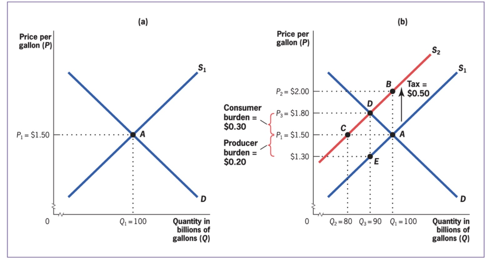
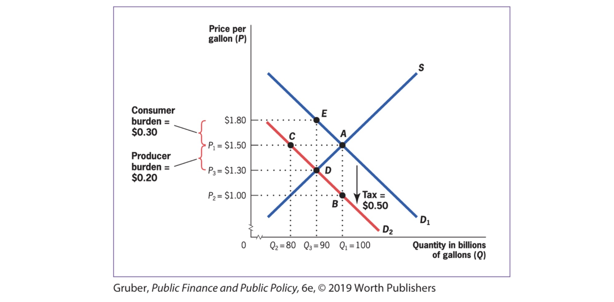
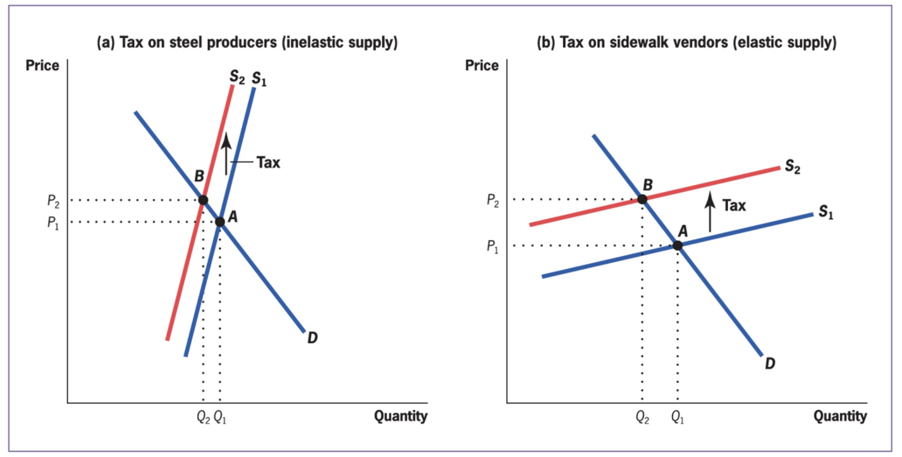

# 10.01.2024 Tax Incidence

## Three rules

1. Statutory burden $\neq$ economic burden
2. side of the market = irrelevant
3. parties with inelastic supply = bear taxes

### Statutory and economic incidence

> **Economic Incidence**: burden of taxation measured by change in resources available

> **statutory incidence:** burden borne by party that sends check to gov.

Example:

Calculation for Consumers:

$$
burden= (price_{post-tax}-price_{pre-tax})+ \text{per unit tax payments by c.}
$$

Producers vice versa

> **Tax Wedge:** difference between consumers pay and producers receive

e.g consumers pay 1.8, producers receive 1.30 => wedge is 0.5 to government

### Tax Side does not matter

Exampel from before, but other side

> **Gross Price:** market price

> **After-Tax price:** gross - tax

### Elasticity

| inelastic demand                          | elastic demand                                               |
| ----------------------------------------- | ------------------------------------------------------------ |
|  |  |
| burden at consumers                       | burden at producers                                          |

Vice-versa for supply side

also applies for factor markets!

## Balanced Budget Incidence

> Tax Incidence Analysis that accounts or tax & benefit

- Hard to determine
- analysis of tax benefits

## General Equilibrium Tax Incidence

**partial Equilibrium tax incidence**: tax effect on one market in isolation

**general equilibrium tax incidence**: tax effect on related markets

- Vertically (within market)
- horinzontally (across markets)

Issues:

- elasticities differ in long / short run
- spill over effects
- easines to find untaxed subsitutes (tax scope)

Example: Tax on Restaurant

effects on other goods

- Income Effect
- Substitution Effect
- Complementary Effect

e.g higher demand for movies as alternative time

## Exercise

