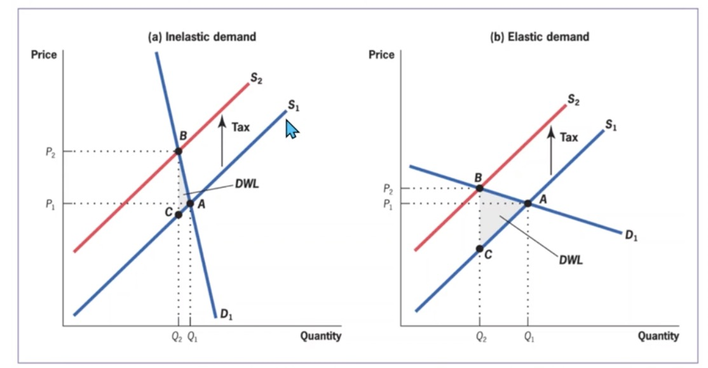

# 17.01.2024 Tax Ineffiencies

Tax system = balance **equity** and **efficiency**

without Taxes: Social Margin Benefit (SMB) = Social Marginal Cost (SMC)

with Taxes: Deadweight Loss, depends on

- Tax height
- elasticities (inelastic = lower DWL, higher tax rev)

## Deadweight Loss

DWL Formula (not relevant!)
$$
DWL = - \frac{ \eta_s \eta_d }{2(\eta_s - \eta_d)}\times \tau^2 \times \frac{ Q }{P}
$$

- $\eta$ = elasticities
- $\tau$ = Tax rate

Implications

1. effiency depends on *preexisting distortions*
    - e.g. taxing positive externalities = very inefficient
2. progressive tax system = higher DWL 
    - higher tax rate for rich = higher DWL
3. low long running taxes > short high taxes (e.g war financing)

## Optimal Commody Taxation

## Optimal Income Taxes

## Tax-Benefit Linkages