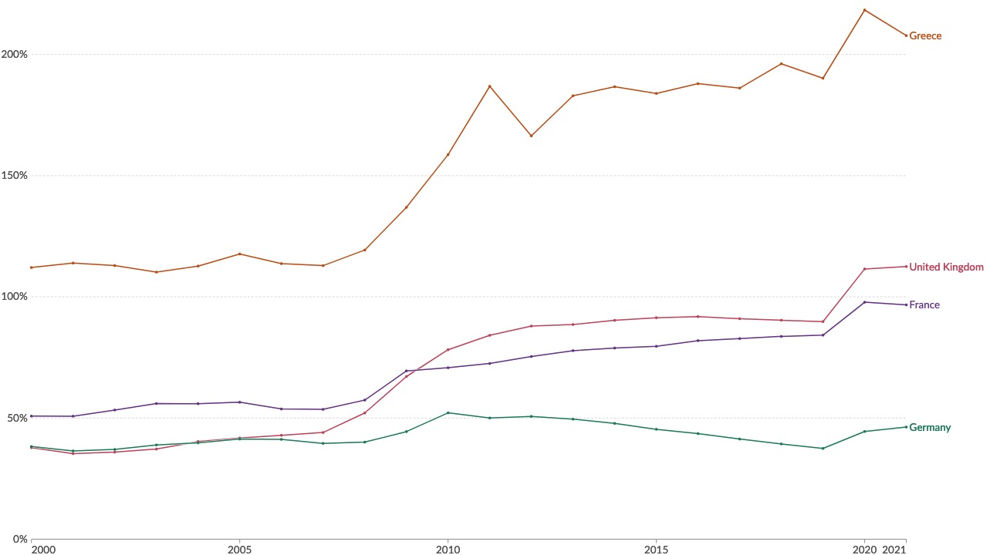
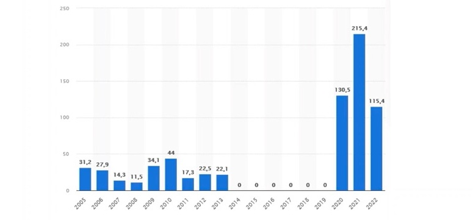

# 24.01.2024 Public Debt

> **Governemtn Debt:** amount gov. borrowed on financial markets

> **government deficits / surplus:** yearly increase / decrease 

Types of gov. debt:

- *Explicit*: official debt given out by the financial ministry
- *implicit:* explicit + promised payouts in the future (e.g pensions etc.)

## Calculation

Present Discounted Value:

$$
PDV = \frac{ F_1 }{1+r}+\frac{ F_2 }{1+r}+...
$$

but:

- very hard to calculate
- (heroic) assumptions about r and F

=> focus on debt

## The Numbers

Development of Debt

Net Borrowing on Federal Level

## Debt Rules

### Stability and Growth Pact

on EU Level 

- deficit =< 3%
- Debt =< 60%

no systematic argument about numbers, just chosen randomly!

*never really enforced, because Germany was first country to breach them*

in SGP, differentation between

- **strucutral deficits**: permament debt
- **cyclical deficits:** due to changes in business cycle

also esacpe clauses due to disasters / external factors

### Debt Brake

on German level = balanced budget amendment

- strucutral deficit =< 0.35%
- cyclical deficit = depends on business cycle
- exceptions allowed in emergeny (covid, Ukraine, ...)

## Ricardian Equivalence

finance via taxes or credit = equivalent

- consumers = forward looking
- anticipate tax increases in future if debt increase today
- higher savings today
- also intergenerational

= bullshit theory

## Effects of Debt

Short Run: Stabilization

- **Automatic stabilization**: automaitc policies e.g unemployment insurance
- **Discretionary stabilisation**: policy actions taken in response (e.g Gaspreisbremse)

= good for the economy

Long Run: Negative?

- limited private capital investment
- less economic growth due to less private investment

Reality:

- depends on capital markets
- and what the debt is used for...

=> evidence is inconclusive

