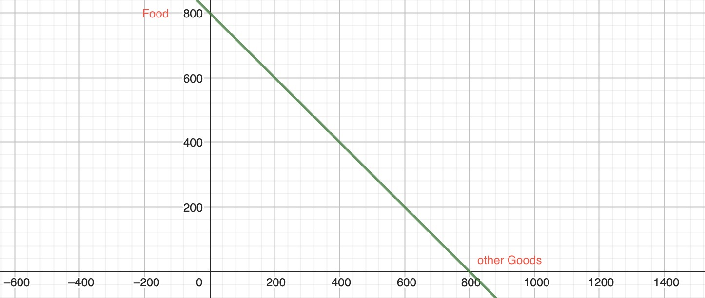
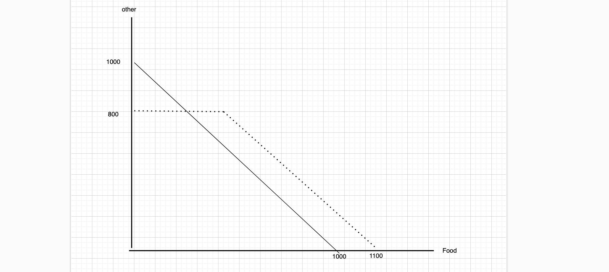

# 30.01.2024 Test Exam

Parts of the Exam

1. Single Choice = 16 Points (8 Q., 2 Points per Q.)
2. Big Task with Subtasks = 24 Points
3. Drawing Task = 20 Points

= 60 Points

## Mock Exam Solutions

### 1. Task: Single Choice

Problem Number) and Solution

- I) 2
- II) 1
- III) 3
- IV) 3
- V) 4
- VI) 1
- VII) 2
- VIII) 2 (asymmetric information problem **learn more**)

### 2. Task

weird example nation with:

- Supply of Labor: $H = 50W$
- Demand for Labor: $H = 2100-10W$

H = quantitiy of Hours, W = Wage

**a)  Income Tax of 15$** 

Normal Equilbrium

$$
50W = 2100-10W \\
60W = 2100 \\
W = 35 \\
H = 50*35 = 1750
$$

After Tax

$$
50 * (W-15) = 2100-10W \\
60W = 2100+(50*15) \\
W = 47,5 (-15) \\
H = 2100-10*(47,5) = 1625
$$

=> higher price, less quantity

Deadweight Loss = $\frac{ 1 }{2}T * \Delta Q$

$$
\frac{ 1 }{2}T * \Delta Q = 7,5*125 \\
= 937,5
$$

**b) poportional tax of 20%** 

before Tax = same

After tax:

$$
50*0.8W = 2100-10W \\
50W = 2100 \\
W = 42 \\
H = 2100-10*42 = 1680
$$

Deadweight Loss

$$
Tax = 0,2*42 = 8,4 \\
DWL = \frac{ 1 }{2}*8,4*(1750-1680) = 294
$$

=> lower DWL in proportional tax scheme

**c) taxing luxury goods**

Pro:

- higher equity (progerssive taxation)
- lower inequality
- War = nation assembly for common goal

Con

- tax evasion
- inefficient (Ramsey Rule)

### 3. Drawing Task

Julia: 

- Income = 800$
- Two Goods = Food / other Goods (each 1$)

**a) Simple Budget Constraint**

**b)**

- Program A: 200$ Subsidy
- Program B: 300$ Food Subsidy

inverse Scales!

**c) indifference Curves**

A = likes Program A more

B = likes porgram B more

C.= indifference

**d) in kind welfare program** worth 300$

Effects

- if food same as bough before = no difference
- if food not liked = bad effect

## Exam Hints

look strongly at:

- **Public Goods**
- **Taxes**
