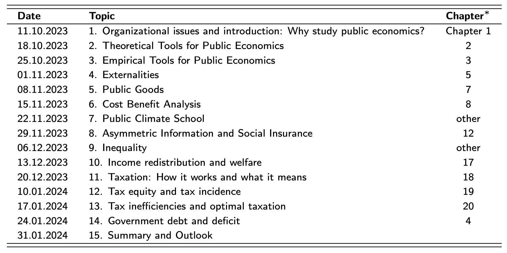
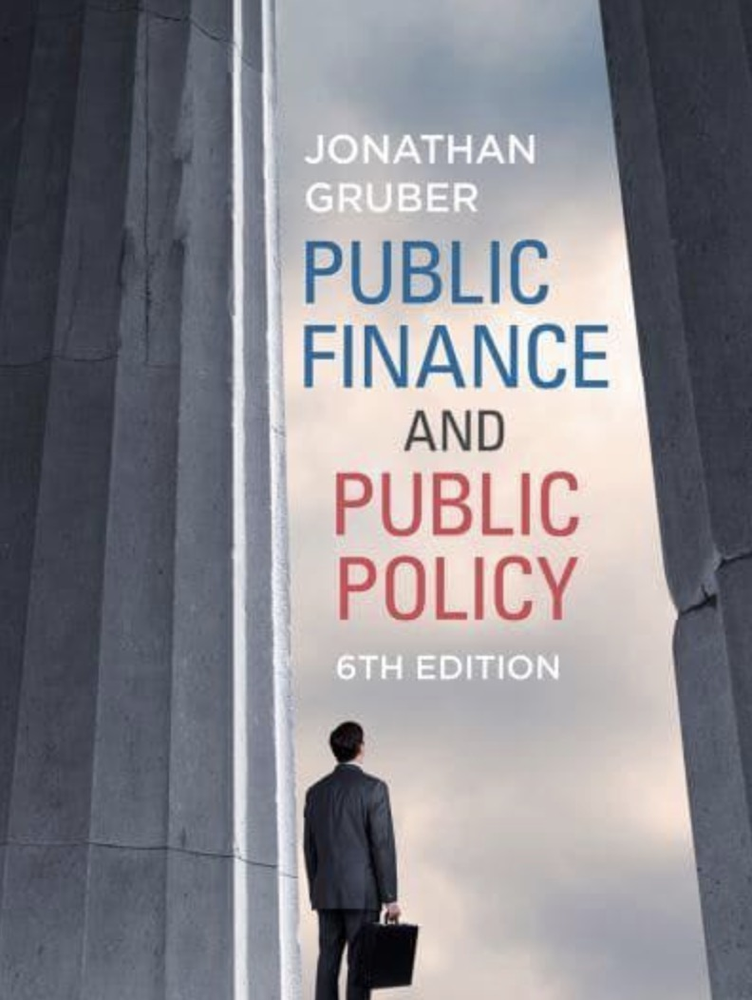

# Public Economics

- Amelie Wuppermann
- Wednesday, 10-12

Schedule:

### Book

"Public Finance and Public Policy" by John Gruber

### Topics

Government Intervention

- Regulation
- Taxation
- Governement expenditure
- Macroeconomic Stabilization

Four Questions:

- When should the G intervene?
- How to intervene?
- What is the effect?
- Why intervene?

