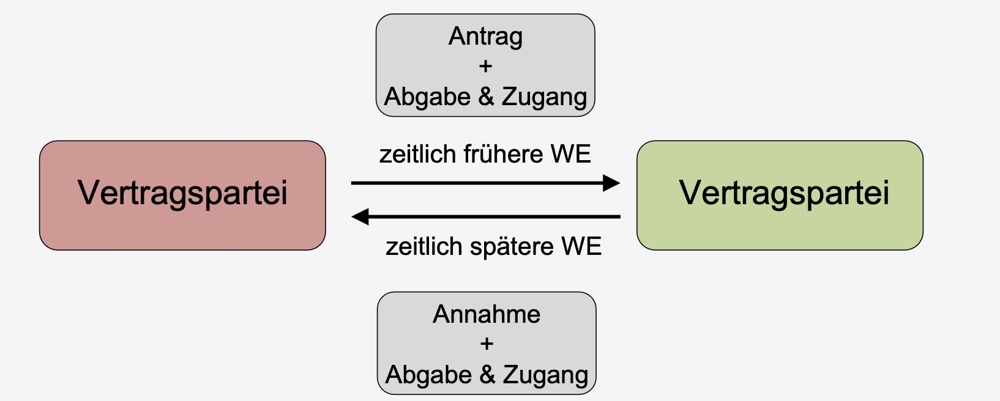
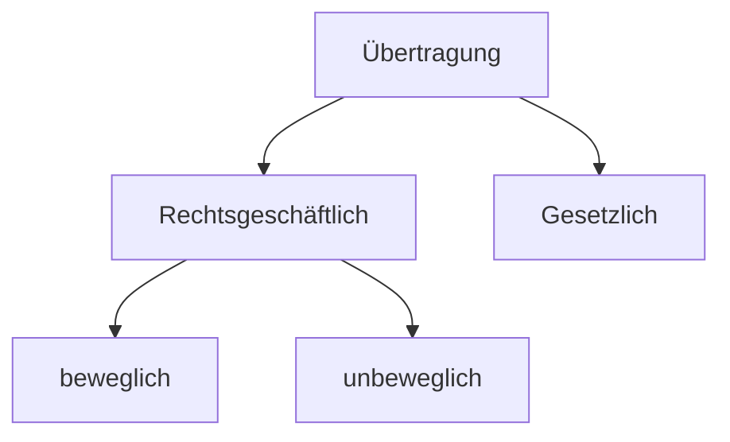
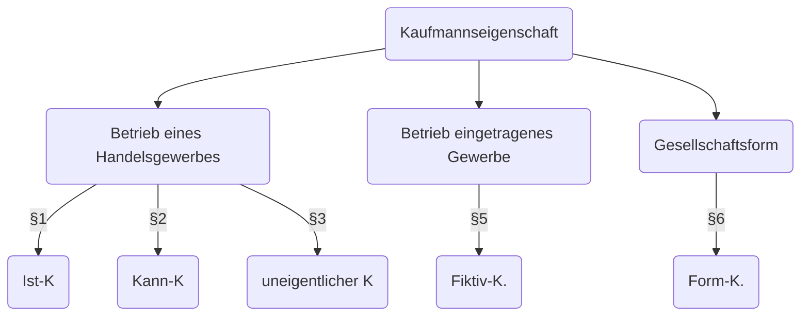

# Zivilrecht Zusammenfassung

Inhaltsverzeichnis

* [Verträge](#verträge)
   + [Willenserklärungen](#willenserklärungen)
   + [Vertragsschluss](#vertragsschluss)
   + [Stellvertreter & Bote](#stellvertreter-bote)
   + [Vertragsende](#vertragsende)
* [Schadensersatz](#schadensersatz)
* [Gewährleistung](#gewährleistung)
* [Sachenrecht](#sachenrecht)
* [Kreditsicherheiten](#kreditsicherheiten)
* [Deliktrecht](#deliktrecht)
* [Handelsrecht](#handelsrecht)
* [Gesellschaftsrecht](#gesellschaftsrecht)

## Verträge

> **Vertrag:** Rechtsgeschäft, das aus inhaltlich übereinstimmenden, mit Bezug aufeinander abgegebenen Willenserklärungen von mindestens zwei *Personen* besteht

> **Rechtsgeschäft:** besteht aus mindestens einer Willenserklärung, die darauf gerichtet ist, eine bestimmte Rechtsfolge herbeizuführen.

### Willenserklärungen

> **Willenserklärung:** private Willensäußerung, die unmittelbar auf das Herbeiführen einer Rechtsfolge gerichtet ist

- Antrag: empfagnsbedürftige WE
- Annahme: WE mit vorbehaltloser Zustimmung

Arten von WE

- ausdrücklich = gesagt
- konkludent = ergibt sich
- Schweigen = nicht wichtig

WE zu unterscheiden von

- Gefälligkeitszusage (bspw unter Nachbarn)
- invitio ad offerendum (Auslage in Laden)

empfangsbedürftige WE: Abgabe und Zugang

- Abgabe = willentliche Entäußerung einer Erklärung
- Zugang = im Machtbereich (Möglichkeit der Kenntnisnahme)

### Vertragsschluss

= durch zwei übereinstimmende WE §433

Grundsatz des BGB = Privatautonomie

begrenzt durch: 

- Formerfodernisse (gesetzlich): §126ff
- Geschäftsfähigkeit
    - 7-17 Jahre: beschränkt geschäftsfähig, WE zählt wenn
        - rechtlich vorteilhaft
        - gesetzlicher Vertreter
        - Leistung mit eigenen Mitteln
    - 18+: voll geschäftsfähig
- Verbote
    - Hehlerei
    - Wucher
    - Sittenwidrigkeit (Ausnutzung Notsituation etc.)

### Stellvertreter & Bote

**Bote:** leitet fertige, fremde WE weiter

**Stellvertreter:** gibt eigene WE ab

- Passivvertretung = vertritt Empfänger von WE
- Aktivvertretung = vertritt Sender von WE

Voraussetzungen

1. Zulässigkeit
2. Abgabe eigener WE
3. Offenkundigkeit
4. im Rahmen der Vertretungsmacht
    - durch Vollmacht (Innen- / Außenvollmacht)
    - oder gesetzlich (Eltern)
    - durch Rechts-schein

---

Fall 1

:::{dropdown} Lamborghini Kaufvertrag

> L will seinen Lamborghini verkaufen, weil es ein neues Modell gibt. Z spricht mit ihm und vereinbart mündlich einen Kaufpreis von 80.000€. 2 Tage später steht er vor der Tür mit dem Geld, L will jedoch nicht den Lambo rausrücken, da er von Dana ein besseres Angebot erhalten hat.

Anspruch auf Übergabe gemäß §433 BGB

- Kaufvertrag: 2 übereinstimmende Willenserklärungen 
    - Antrag: empfangsbedürftige Willenserklärung (von Z)
        - Zustandekommen hängt nur vom anderen ab
        - Abgabe des Antrags (hier mündlich)
        - Zugang und Kenntnisnahme von Vertragspartner (durch L)
    - Annahme: Willenserklärung (von L)
        - WE, durch die sich der Angebotsempfänger mit Vertragsschluss einverstanden erklärt
    - => Vertragsschluss

Ergebnis: Anspruch auf Übergabe und Übereignung des Lamborghini aus §433

:::

Fall Nachbarschaftshilfe

:::{dropdown} Nachbarschaftshilfe

> Geschäftsmann G möchte zu einer wichtigen Konferenz. Allerdings springt sein Fahrzeug nicht an. Deshalbt bittet er seinen Nachbar N, ihn zum Flughafen zu fahren. N sagt spontan zu. 
> Unterwegs geraten sie in einen heftigen Streit. N setzt daraufhin den G an der nächsten Raststätte ab.

Anspruch nach § 662 BGB

- Willenserklräung des N
    - Abgrenzung Rechtsbindungswille | bloße Gefälligkeit 
        - nach sozialer Bedeutung, Interessen der Handelnden
        - hier: Transport zum Flughafen ist durchaus sozialüblich
        - hier Gefälligkeit

=> kein Anspruch

:::

Fall Stellvertretung

:::{dropdown} Stellvertretung

> B bittet Sekretär S Geschenk für Mutter zu kaufen für max 50€.
>
> S geht in Laden von V., kauft Blumen für 40€ und sagt dass Rechnung auf B
>
> B verweigert V. die Begleichung später, da Mutter Blumenallergie

Kann V von B die Herausgabe von 40€ fordern?

aus [§433 BGB](https://www.gesetze-im-internet.de/bgb/__433.html) II:

Kaufvertrag zw V und B?

- Angebot des B?
    - eigene WE? (-) da keine WE von B
    - WE des S [§164 BGB](https://www.gesetze-im-internet.de/bgb/__164.html)?
        - hatte Handlungspielraum (Preis)? (+)
        - im fremden Namen? (+)
        - Vertretungsmacht? (+) *Innenvollmacht* [§167 BGB](https://www.gesetze-im-internet.de/bgb/__167.html)
    - Agnebot des B (+)
- Annahme des V (+)
- => Kaufvertrag

=> Anspruch des V an B

:::

---

### Vertragsende

5 Arten

**1. Erfüllung** §362 = Bewirken der Leistung

- richtige Leistung
- richtige Art und Weise
- richtiger Ort
- richtige Zeit
- richtiger Schuldner

**2. Anfechtung** $142: WE wird unwirksam rückwirkend

- Gründe
    - Irrtümer §119
    - falsche Übermittlung §120
    - Unzulässige Willensbeinflussung §123
- Voraussetzungen
    - Anfechtungsgrund
    - Anfechtungserklärung
    - Anfechtungsfrist

**3. Widerruf**

- ohne Angabe von Gründen
- nur für Verbraucher (§13) ggü. Unternehmer (§14)
- Voraussetzungen
    - Widerrufsrecht §312 (außerhalb von Geschäftsraum, Fernabsatzvertrag)
    - formlose Erklärung
    - Frist (14 Tage nach Erhalt)

**4. Rücktritt**

- beidseitig möglich
- Vorraussetzungen §323
    - gegenseitiger Vertrag
    - Rücktrittsgrund
    - Frist erfolglos
    - Rücktrittserklärung
    - Abschlussgründe
- Folgen §346
    - Rückgewähr Leistung
    - Wertersatz
    - Schadensersatz

**5. Kündigung**

= Beendigung von Dauerschuldverhältnissen (miete etc.)

- ordentliche Kündigung: 
    - keine Leistungstörung
    - Kündigungsfristen
- außerordentliche Kündigung (§314)

---

Fall Widerruf

:::{dropdown} Widerruf

> K bestellt Buch für 50€ am 15.11 für privat, wird geliefert am 20.11. 
>
> K mag das Buch gar nicht, fordert Widerruf am 2.12 per Brief, der am 6.12 ankommt
>
> V meint, Verpackung entfernt => ist unverkäuflich, fordert 50€ ein

- Kaufvertrag
    - Angebot der K (+)
    - Annahme des V (+)
    - Kaufvertrag (+)
- Widerruf wirksam? §355
    - Verbrauchervertrag? §310
        - V = Unternehmer (+)
        - K = Verbraucher (+)
        - entgeltliche Leistung (+)
    - Fernabsattzvertrag (+)
    - => Widerrufsrecht
- Widerrufsfrist
    - Beginn §356 ab Erhalt (20.11)
    - Innerhalb Frist (4.12) abgesendet (+)

=> rechtmäßiger Widerruf, V kreigt kein Geld

:::

Fall Blumenkauf

:::{dropdown} 

> K bestellt Blumengesteck für Beerdigung an 09.11. V verpsricht, bis zu dem Tag fertig zu sein.
>
> Am 09.11 will K Blumen haben, V sagt dass er noch 1 Tag braucht.
>
> K erklärt "für null und nichtig" und zahlt nicht.

- Kaufvertrag (+)
- Rücktrittsrecht §323 
    - keine Leistung (+)
    - hier: Termin war entscheidend, wurde auch mitgeteilt
    - => Rücktrittsrecht
- Rücktrittserklärung (+) ("Null und Nichtig")
- Folgen: Erlöschen der Leistung

=> nicht zahlen ist rechtmäßig

:::

## Schadensersatz

Vertragspflichten:

- Primärpflichten (§241)
    - Leistungspflicht
    - Rücksichtnahme
- Sekundärpflihten 
    - Rückabwicklung (§346) 
    - Schadensersatz (§280)

Voraussetzungen Schadensersatz §280

- Schuldverhältnis
- Pflichtverletzung = nachteilige Abweichung
- Vertretenmüssen §276 (Vorsatz / Fahrlässigkeit)
- Schaden = unfreiwillige Vermögenseinbuße

---

Fall Pferdeturnier

:::{dropdown} Pferdeturnier

> P richtet Reitturnier aus, an dem G mit Pferd Fanta für 150€ Teilnahmegebühr teilnimmt.
>
> Beim Turnier trifft Fanta auf vorschriftswidrigen Fangständer und wird eingeschläfert
>
> Schadensersatz einklagbar?

1. Schuldverhätlnis: Turnier für 150€ Teilnahme (+)
2. Pflichtverletzung: 
    - Leistungspflicht: Turnier wurde ausgerichtet (+)
    - Rücksichtspflicht: sclecht aufgestellter Fangständer (-)
3. Vertretenmüssen
    - Vorsatz = absichtliche Pflichtverletzung (-)
    - Fahrlässigkeit (+) (auch wenn von Mitarbeiter aufgestellt)
4. Schaden = Pferd eingeschläfert = Einbuße (+)

=> Schadensersatzpflicht

:::

## Gewährleistung

Rechte des Käufers nach §437 bei Mängeln

Voraussetzung: **Mangel**

- Sachmangel $434
    - subjektive Anforderungen
    - objektive Anforderungen
    - Sachgemäße Montage
- Rechtsmangel §435

Rechte des Käufers

- **Nacherfüllung** 
- **Rücktritt**, braucht
    - Kaufvertrag
    - Fälligkeit
    - Mangel
    - Fristsetzung
    - Rücktrittserklärung
- **Minderung**
- **Schadensersatz**

## Sachenrecht

= Beziehung zw. Sachen und Personen

> **Sache §90**: körperliche Gegenstände, beweglich oder unbeweglich

> **Eigentum §903 BGB**: umfassendes dingliches Recht, nach Belieben mit Sache verfahren

> **Besitz §854:** tatsächlcihe Herrschaft

Übereignung:

**bewegliche Sache §929**

- Einigung
- Übergabe
- Berechtigung
    - auch gutgläubiger Erwerb §932
    - außer gestohlen §935

**unbewegliche Sachen**

- Einigung (mit Anwesenheit bie Notar) §925
- Eintragung
- Berechtigung
    - wenn Grundbuch falsch, trotzdem ok §892

**gesetzlicher Erwerb**

- Ersitzung §900
- Verbindung §946
- Fund §965

---

Fall bewegliche Sache

:::{dropdown} Autokauf

> E ist Eigentümer Auto, Dieb D klaut dieses und verkauft an X.
> X kauft ohne in Fahrzeugbrief zu schauen. E will Auto von X

Anspruch auf Herausgabe von E an X, [§985](https://www.gesetze-im-internet.de/bgb/__985.html)

- E = Eigentümer? 
    - ursprünglicher Eigentümer (+)
    - Eigentumsverlust durch Übereignung D an X: [§929](https://www.gesetze-im-internet.de/bgb/__929.html)
        - Einigung zw. D und X (+)
        - Übergabe (+)
        - Verfügungsberechtigung (-)
            - X nicht Eigentümer (-)
            - gutgläubiger Erwerb?
                - Da nicht Fahrzeugbrief zeigen lassen (-)
- X = Besitzer (+)
- Kein Recht an Besitz 

=> Herausgabenanspruch

:::

Fall Hauseigentum

:::{dropdown} Hausübereignung

> A ist Egentümer und stirbt. Sohn S lässt sich als Eigentümer eintragen (mit Erbschein)
> S übertragt an X. Danach Testament: Freund F ist Alleinerbe

Wer ist Eigentümer? 

X, da gutgläubig erworben und Glaube an Richtigkeit des Grundbuches

:::

## Kreditsicherheiten

Arten:

- Personalsicherheit (Person mit Vermögen steht ein, Bürgschaft)
- Realsicherheit (Gegenstand)

Realsicherheiten:

- **Sicherungsübereignung §930**: Eigentum geht an Gläubiger, bleibt aber im Besitz des Schuldners)
- **Eigentumsvorbehalt §449**: Eigentum bei Käufer mit Bedingung, bspw. Ratenabzahlung)
- **Hypothek §1113**: Eintragung des Pfändungsrechts in Grundbuch
    - nicht Anspruch an Zahlung
    - heute eher Grundschuld (nicht an eine bestimmte Forderung gebunden)
- **Bürgschaft §765**

## Deliktrecht

Schadensersatz außerhalb von Vertragsverhältnis = §823

1. Rechtsgutverletzung
    - Leben, Körper, Gesundheit = Unversehrtheit
    - Freiheit = Bewegungsfreiheit
    - Eigentum = Beschädigung von Sachen
    - sonstige Rechte = allg. Persönlichkeitsrecht (Beleidigung), Recht am Gewerbe (Streik, Boykott)
2. Verletzungshandlung (Tun oder Unterlassen)
3. Haftungsbegründete Kausalität (Handlung -> Rechtsgutverletzung)
4. Rechtswidrigkeit der Handlung (Einwilligung, Notwehr)
5. Verschulden 
    - Vorsatz / Fahrlässigkeit
    - Deliktsfähig (> 18J)
6. Schaden (Vermögenseinbuße)
7. Haftungsausfüllende Kausaliät  (Rechtsgutverletzung -> Schaden)

## Handelsrecht

how to Kaufmann nach HGB

**Firma** §17 HGB: Name, unter dem Kaufleite Geschäfte betreiben

**Handelsregister**: zentrales Medium zur Publizität

**Handlesgeschäft**: Geschäfte eines Kaufmanns, Vereinfachung von Rechten

## Gesellschaftsrecht

Unternehmensformen

- Einzelunternehmen (Kaufmann, Freiberufler)
- Personengesellschaft (OHG, GbR, KG)
- Kapitalgesellschaft (AG, GmbH)

Gesellschaften

- **Gesellschaft bürgerlichen Rechts GbR**
    - formlose Gründung
    - Haftung: persönlich und Gesellschaftsvermögen
- **Offene Handelsgesellschaft**
    - wie GBR nur mit Handelszweck
    - nur mit EIntragung ins Handelsregister
- **Kommanditgesellschaft**
    - Vollhaftung Komplementäre
    - beschränkt Haftung Kommanditisten
- **GmbH**
    - beschränkte Haftung (nur G.Verm. = 25.000)
    - Notar + Handelsregister
- **AG**
    - Vorstand + Aufsichtsrat
    - höhers Basiskapital (50.000)
    - Aktienausgabe erlaubt

=> Form wählen nach Nutzbarkeit
