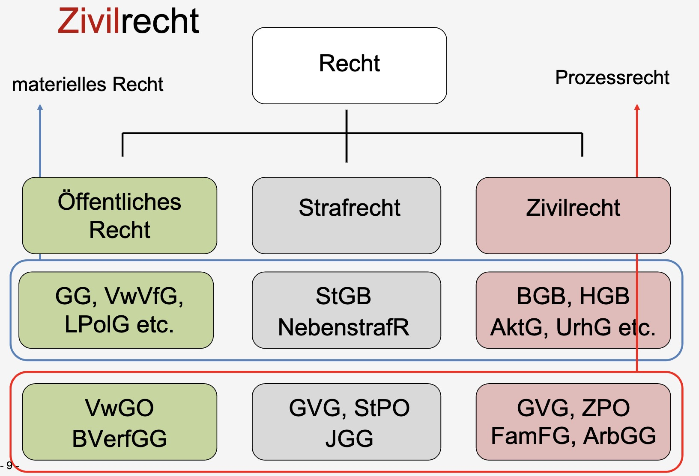

# 17.10.2023 Einführung

### Definition

> **Recht:** normative Ordnung menschlichen Zusammenlebens,
> die mit Hilfe staatlichen Zwangs durchsetzbar is



Unterteioung des Zivilrechtes

```mermaid
graph TD
	Zivilrecht --> A(Allgemeines Privatrecht) & B(Sonderprivatrecht)
	A --> C[Bürgerliches Recht]
	B --> HandelsR & ArbeitsR
```

### Beispiel Jacke

```
Studentin A fährt Freitagabend mit dem Fahrrad in das Hallesche
Brauhaus, um dort mit anderen Studierenden ein kühles „Hallsch“ zu
trinken. Im Brauhaus angekommen, hängt sie ihre graue Jacke an einen
Kleiderständer. Als das Brauhaus schließt und die Gruppe aufbricht,
nimmt die Kommilitonin K versehentlich die Jacke der A, die der der K
sehr ähnlich sieht, vom Kleiderständer, zieht sie sich an und verlässt das
Lokal

Kann A, die dies gesehen hat, von K die Jacke herausverlangen?
```

Schrittverfahren:

1. **Wer** will: *Anspruchsteller:in*
2. **Was**: *Anspruchsinhalt*
3. von **Wem**: *Anspruchsgegner:in*
4. **Woraus**: *Anspruchsgrundlage*


| Schritt            | Beispiel   | Position      |
| ------------------ | ---------- | ------------- |
| Anspruchsteller:in | A          | Eigentümer:in |
| Anspruchsinhalt    | Herausgabe |               |
| Anspruchsgegner:in | K          | Besitzer:in   |
| Anspruchsgrundlage | § 985 BGB  |               |

> **§ 985 BGB:** Der Eigentümer kann von dem Besitzer die
> Herausgabe der Sache verlangen.

- Sache = körperlicher Gegenstand = Jacke
- Eigentümerin = rechtliche Herrschaft = A
- Besitzerin = tatsächliche Gewalt = K

=> A hat somit gegen K einen Anspruch auf Herausgabe der Jacke gem. §§
985, 986 BGB