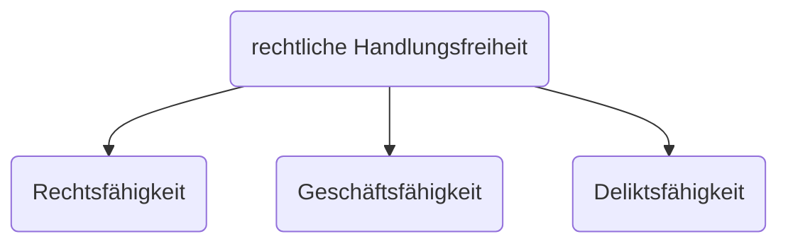
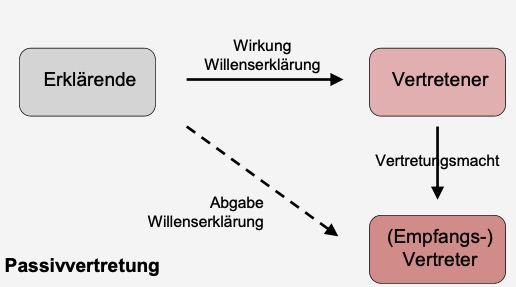
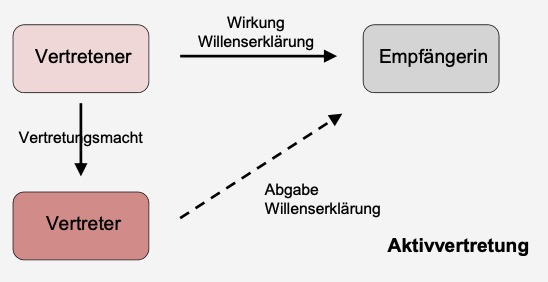

# 05.11.2023 Privatautonomie

## Definition

> **Privatautonomie**: das Recht, seine privaten Rechtsverhältnisse nach eigener Entscheidung zu gestalten

- Eigenstädnigkeit von Rechtsentschiedungen
- zwei Menschen können alles im Vertrag unterzeichnen was sie wollen


## Grenzen

### Formerfordernisse

- Grundsatz: Mündlich ist einfach, aber beweisschwer
- mögliche Formtypen: 
    - Schrift, 
    - elektronisch, 
    - Text, 
    - notariell beurkundet 
    - öffentliche Beglaubigung


### Geschäftsfähigkeit



> **Geschäftsfähigkeit:** Fähigkeit, eigene Willenserklärungen abzugeben und entgegenzunehmen

- ab 18+ Jahren voll
- Beschränkt bei Minderjährigen auf rechtlich vorteilhaft / Einwilligung


### Verbote

**Gesetzliche Verbote** gegen Inhalt des Rechtsgeschäfts (bspw. Wucher)

**Sittenwidrigkeit**

> **Sittenwidrig:** Widerspruch gegen Anstandsgefühl aller *billig und gerecht Denkenden*

- Gesamtschau des Vertrages
- bspw. Knebelverträge etc.


### Veträge mit Hilfe Dritter

Arten

| Passivvertretung                          | Aktivvertretung                           |
| ----------------------------------------- | ----------------------------------------- |
|  |  |

Voraussetzungen

- **Zulässigkeit** (nicht bei höchstpersönlichen Sachen)
- Abgabe einer **eigenen WE** (nicht Bote)
- **Offenkundigkeit** der Stellvertretung ("im namen eines anderen")
- im Rahmen der **Vertretungsmacht**


**Vertretzungsmacht**:

- per Gesetz (Eltern für Kinder)
- per Vollmacht (Patientenverfügung)
- Kraft durch Rechtsschein (Anschein trotz bspw Widerrufen)


Beispiel Stellvertretung

```
B bittet Sekretär S Geschenk für Mutter zu kaufen für max 50€.

S geht in Laden von V., kauft Blumen für 40€ und sagt dass Rechnung auf B

B verweigert V. die Begleichung später, da Mutter Blumenallergie
```

Kann V von B die Herausgabe von 40€ fordern?

aus [§433 BGB](https://www.gesetze-im-internet.de/bgb/__433.html) II:

Kaufvertrag zw V und B?

- Angebot des B?
    - eigene WE? (-) da keine WE von B
    - WE des S [§164 BGB](https://www.gesetze-im-internet.de/bgb/__164.html)?
        - hatte Handlungspielraum (Preis)? (+)
        - im fremden Namen? (+)
        - Vertretungsmacht? (+) *Innenvollmacht* [§167 BGB](https://www.gesetze-im-internet.de/bgb/__167.html)
    - Agnebot des B (+)
- Annahme des V (+)
- => Kaufvertrag

=> Anspruch des V an B

