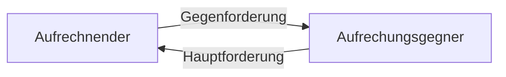

# 10.11.23 Vertragsende

5 verschiedene Arten des Vertragsendes

## Erfüllung

= Bewirken der geschuldeten Leistung [§362 BGB](https://www.gesetze-im-internet.de/bgb/__362.html)

- richtige Leistung
- richtige Art und Weise
- richtiger Ort [§269 BGB](https://www.gesetze-im-internet.de/bgb/__269.html)
- richtige Zeit [§271 BGB](https://www.gesetze-im-internet.de/bgb/__271.html)
- richtigen Schuldner [§267 I BGB](https://www.gesetze-im-internet.de/bgb/__267.html)

wenn alles, dann Forderung erlischt

Special Fälle

- Leistung an Erfüllung statt (Spülen in Restaurant statt Zahlen)
- Leistung erfüllungshalber (Kreditkarte)
- Hinterlegung (Urkunde bei Amtsgericht hinterlegen)

### Aufrechnung

Vorausssetzungen für Forderungen

- Gegenseitigkeit 
- Gleichartigkeit (meist Geld)
- Bestehen + Fälligkeit + Durchsetzung Gegenforderung (keine Rechnung in die Zukunft )
- Erfüllbarkeit der Hauptforderung

=> Erlöschen der Ansprüche

## Anfechtung

Wille und Erklärung fallen auseinander

Anfechtung = rückwirende Beseitung der WE

Anfechtungsgründe

- Irrtümer nach [§119 BGB](https://www.gesetze-im-internet.de/bgb/__119.html) :
    - Inhaltsirrtümer: "weiß was er sagt, aber nicht was er *damit* sagt"
    - Erklärungsirrtum: "weiß nicht was er sagt"
    - Eigenschaftsirrtum: bild ist nicht von Maler X sondern Y, aber nicht im Wert geirrt
- falsche Übermittlung nach [§120 BGB](https://www.gesetze-im-internet.de/bgb/__120.html)
- Unzulässige Willensbeinflussung [§123 BGB](https://www.gesetze-im-internet.de/bgb/__123.html)
    - Arglistige Täuschung
    - Widerrechtliche Drohung

Voraussetzungen für Anfechtung

1. Anfechtungsgrund 
2. Anfechtungserklärung [§143 BGB](https://www.gesetze-im-internet.de/bgb/__143.html)
3. Anfrechungsfrist
    - §121 BGB: unverzüglich
    - §124 BGB: Jahresfrist

## Widerruf

-  kein Grund erforderlich
-  Verbraucherschutz

> **Verbraucher [§13 BGB](https://www.gesetze-im-internet.de/bgb/__13.html)**: natürliche Person, die Rechtsgeschäft für private Zwecke abschließt

> **Unternehmer [§14 BGB](https://www.gesetze-im-internet.de/bgb/__14.html):** natürliche / juristische Person, die Rechtsgeschäft in Ausübung ihrer gewerblichen / selbststädnigen Tätigkeit handeln 

Voraussetzungen [§355 BGB](https://www.gesetze-im-internet.de/bgb/__355.html)

- gesetzliches Widerrufsrecht vorhanden [§312](https://www.gesetze-im-internet.de/bgb/__312.html):
    - außerhalb von Geschäftsräumen geschlossene Verträge (Kaffeefahrt)
    - Fernabsatzverträge (online)
    - Verbraucherdarlehen
- Erklärung: ggü Unternehmer
- Form
    - formlos
    - eindeutiger Entschluss
- Frist: 14 Tage mit Erhalt der Ware

## Rücktritt

Beidseitig möglich

Voraussetzungen nach [§323 BGB](https://www.gesetze-im-internet.de/bgb/__323.html)

- gegenseitiger Vertrag
- Rücktrittsgrund: Schlecht / Nichtleistung
- erfolglose Fristsetzung
- Rücktrittserklärung [§349 BGB](https://www.gesetze-im-internet.de/bgb/__349.html)
- keine Auschlussgründe

Rechtsfolgen [§346](https://www.gesetze-im-internet.de/bgb/__346.html)

- Rückgewähr der Leistung
- Wertersatz
- Herausgabe der erzogenen Nutzung
- Schadensersatz

## Kündigung

Beendigung von Dauerschuldverhältnissen (Bsp. Miete)

- ordentliche Kündigung: 
    - keine Leistungstörung
    - Kündigungsfristen
- außerordentliche Kündigung

speziell geregelt (Arbeitsrecht, Mietrecht)

## Verjährung

nach [§194 BGB](https://www.gesetze-im-internet.de/bgb/__194.html)

Durch Zeitablauf automatisch weg? **NEIN**

- Anspruch des Gläubigers erlischt nicht
- Verjährung geltend machen! 

Standard Frist = 3 Jahre

- Beginn: regelmäßige Verjährungsfrist
- Hemmun: Zeitraum wird nicht berücksichtigt
- Neubeginn

