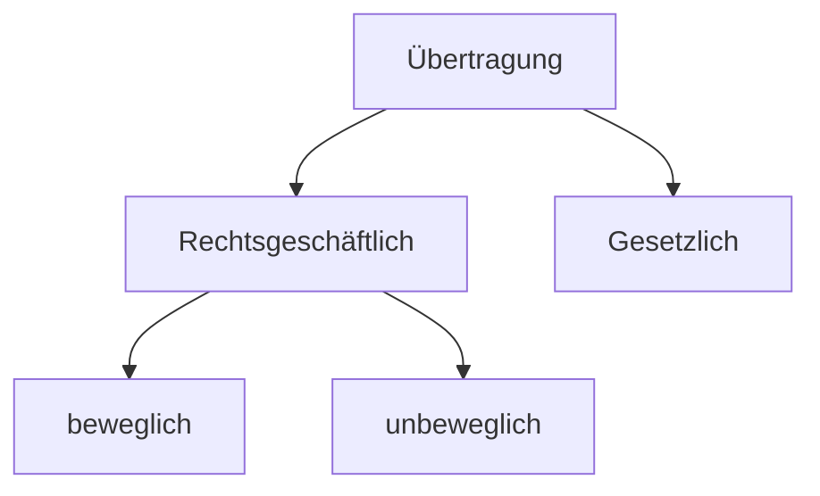

# 08.12.23 Sachenrecht

Erinnerung Trennungs / Asbtraktionsprinzip

- Kaufvertrag nach §433 BGB = beidseitig
- Übereignung nach §929 BGB = einseitig

= Sachenrecht

> **Sachenrecht:** Beziehung zw. Sachen (*Rechtsobjekte*) & Personen (*Rechtsubjekte*)

Sachen nach §90 BGB

- körperliche Gegenstände
- bewegliche / unbewegliche

## Eigentum

nach §903 BGB

- umfassendes dingliches Recht
- Eigentümer kann nach Belieben mit der Sache verfahren
- Herausgabeanspruch ggü Besitzer

unterschieden von **Besitz**

> **Besitz §854 BGB:** tatsächliche Herrschaft einer Person über Sache


## Übertragung des Eigentums

unterschieden zw.

- Rechtsgeschäftlich: mit Eineigung zw. Parteien
- Gesetzlich: ohne Einigung



### bewegliche Sachen

Grundsatz: §929 BGB

Voraussetzungen

1. **Einigung** = 2 auf Eigentumsübergang gericht. WE
2. **Übergabe** = Aufgabe des Besitzes von A
3. **Berechtigung** = des Veräußerers 
    - ohne Berechtigung auch möglich mit gutgläubiger Erwerb §932 (Verkehrsschutz)
    - außer Eigentum gestohlen §935

### unbewegliche Sachen

Grundsatz: §873, 925 BGB

1. **Einigung** = wie oben
    - aber: gleichzeitige Anwesenheit Notar §925
    - also andere Form
2. **Eintragung** im Grundbuch
3. **Berechtigung** des Veräußerers
    - fehlende Berecht kann überwunden werden §892
    - Unrichtigkeit Grundbuch + Legitimatin + Gutgläubig + kein Widerspruch


Beispielfall

```
A ist Egentümer und stirbt. 
Sohn S lässt sich als Eigentümer eintragen (mit Erbschein)
S übertragt an X
Danach Testament: Freund F ist Alleinerbe
```

Wer ist Eigentümer? X. Übertragung an X war rechtens

### Gesetzlicher Erwerb

- **Ersitzung** §900 BGB: durch Zeitablauf 10/30 Jahre
- **Verbindung** §946 BGB: Zusammebau verschiedener Sachen
- **Fund** §965 BGB: mit Anziege, ohne Meldung des Eigentümers


