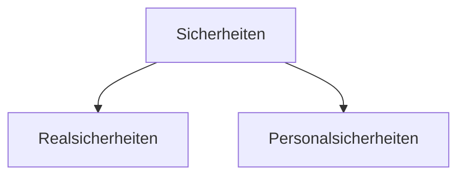

# 15.12.2023 Kreditischerheiten

- bei gegenseitigen Verträgen
- Leistung Zug-um-Zug $273 BGB

Personalsicherheit = eine Person steht mit Vermögen (Bsp. Bürgschaft)

Realsicherheit = ein Gegenstand zum Haftungsobjekt (Bsp. Pfändung)

## Sicherungsübereignung

nach [§930 BGB](https://www.gesetze-im-internet.de/bgb/__930.html)

- Absicherung offener Darlehen
- Eigentumsübertragung, aber nicht Besitzübertragung

Bsp.: Firma hinterlegt Maschine als Sicherheit bei Bank, Maschine bleibt aber in Fabrik

Erst wenn kritisch wird Bank holt sich Maschine

## Eigentumsvorbehalt

nach [§449 BGB](https://www.gesetze-im-internet.de/bgb/__449.html)

- Verkäufer liefert, Käufer nimmt Ratenzahlung
- Eigentum bei Käufer mit Bedingung
- Erfüllung = vollständiges Eigentum

Sonderformen

- **verlängerter Eigentumsvorbehalt**: 
    - Verfügung bei Käufer zur Weiterverarbeitung
    - Abtretung sämtlicher Rechte aus Weiterveräußerung
- **erweiterter Eigentumsvorbehalt**
    - Absicherung auch vergagnener Forderungen etc.

## Hypothek

= Dingliches Sicherungsrecht [§1113 BGB](https://www.gesetze-im-internet.de/bgb/__1113.html)

Zahlung im Gegenzug zu Eigentums-"änderung"

- Eintragung ins Grundbuch
- Erteilung eines Hypothekenbriefes
- Grundsatz der Akzessorität: alles abhängig von Forderung

heutzutage meist Grundschuld (flexibler, nicht an eine konkrete Forderung gebunden)

## Bürgschaft

nach §765 BGB

