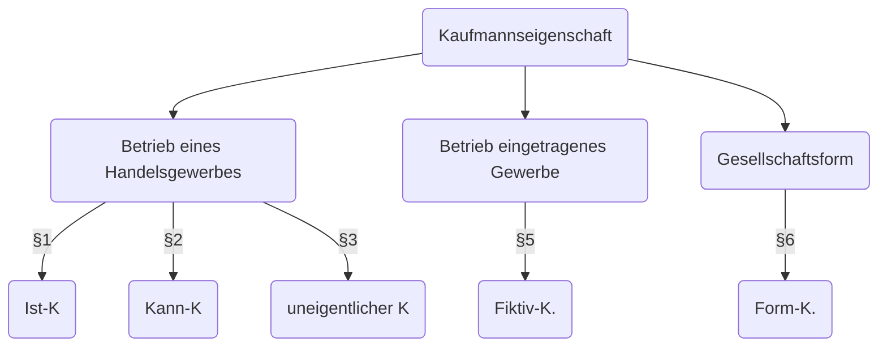

# 19.01.2024 Handelsrecht

= Sonderrecht für Kaufleute

## Kaufmann

> **Kaufmann §1 HGB**: wer Handelsgewerbe betreibt

> **Hadnelsgewerbe §1 HGB**: jeder Gewerbebetrieb, es sei denn in *Art und Umfang* kein kaufmännischer Betrieb benötigt

Gewerbebetrieb:

- selbstständig
- nach außen erkennbar
- planmäßig & dauerhaft
- Gewinnerzielungsabsicht
- Erlaubtheit

Kein Freiberufler

Alternativ: **Kann Kaufmann**

nach §2 HGB

- wenn trotzdem kaufmäänischer Betrieb haben wollen. trotz nicht müssen nach §1
- Eintragung im Handelsregister

=> vollwertiger Kaufmann

How to Kaufmann:

## Firma

> **Firma §17 HGB**: Name, unter der Kaufleute Geschäfte betreiben

- nur von Kaufleuten
- entsteht durch Gebrauch
- Pflicht zur Eintragung
- erlischt mit Einstellung Betrieb

Unterscheidungskraft §18 I

Irreführungsverbot §18 II

## Handelsregister

= zentrales Medium zur Publizität

- kostenlsoe Einsicht
- am Amtsgericht
- für
    - A: Einzelkaufleute
    - B: Kapitalgesellschaften

eingetragene Infos:

- Firma, Ort, Niederlassung
- Insolvenz
- Geschäftsführung

## Vertretungsformen

Standard nach §164 BGB

- Zulässigkeit
- eigene WE
- Offenkundigkeit Stellvertretung
- Vertretungsmacht

im HGB

- **Prokura** §48-53
    - alle Arten von Geschäften in Betrieb
    - gerichtlich & außergerichtlich
- **Handlungsvollmacht** §54-58
    - alles außer Prokura
- **Ladenvollmacht** §56
    - alle üblichen Sachen in einem Laden

## Handelsgeschäft

> **Handelsgeschäft §343 HGB:** alle Geschäfte eines Kaufmanns, die zum Betriebe seines Handelsgewerbes gehören

rücksichtnahme auf Handelsbräuche §346 HGB

- Ausnahme vom Grundsatz "schweigen ist keine Zustimmung"
- Kaufmännisches Bestätitgunsschreiben
    - schriftliche Bestätigung von mündlichem Vertragsabschluss
    - Braucht: Redlichkeit, zeitlichen Zusammenhang, Verhandlungen
- Formfreiheit Bürgschaft §350
- Rügeobliegenheit §377

## Gesellschaftsrecht

Unternehmensformen

- Einzelunternehmen (Kaufmann, Freiberufler)
- Personengesellschaft (OHG, GbR)
- Kapitalgesellschaft (AG, GmbH)

Personengeselslchaft = beteiligte echte Personen

Kapitalgesellschaft = jurisitsche Person

### Gesellschaft bürgerl. R. (GbR)

Gründung nach [§705 BGB](https://www.gesetze-im-internet.de/bgb/__705.html)

- formloser Vertrag
- gemeinsamer Zweck

Geschäftsführung: alle gemeinsam im Zweifel (§715)

Haftung: Gesellschaftsvermögen & persönliche Haftung

### Offene Handelsgesellschaft (OHG)

nach [§105 HGB](https://www.gesetze-im-internet.de/hgb/__105.html)

- formloser Vertrag
- gemeinsamer Zweck
- Handelsregister Eintragung (§106)

Geschäftsführung: jeder selber (§116)

Haftung: Gsell.vermögen und persönlich (§126)

### Kommanditgesellschaft

Gründung wie OHG

Haftung:

- Gesellschaftsmerögen
- Persönliche Haftung Komplementäre
- beschränkte Haftung Kommanditisten

= Mischform, einer haftet voll, einer nur mit Einlage

Geschäftsführung: nur der voll haftende

### GmbH

Gründung [§1 GmbHG](https://www.gesetze-im-internet.de/gmbhg/__1.html)

- notariell beurkundeter Gesellschaftsvertrag
- Bestellung der Organe
- Handelsregister Anmeldung

Geschäftsführung: auch fremder möglich

Haftung: nur Gesellschaftsvermögen! (min 25.000)

### AG

Gründung nach [§1 AktG](https://www.gesetze-im-internet.de/aktg/__1.html)

- notariell beurkundete Satzung
- Bestellung Organe
- Erinzahlung Betrag auf jede Aktie
- Anmeldung & Eintragung Handelsregister

Geschäftsfürhung: Vorstand (Kontrolle Aufsichtsrat)

Haftung: nur Gesell. Vermögen (min 50.000)

### AG vs GMBH

|                       | GmbH           | AG           |
| --------------------- | -------------- | ------------ |
| Stammkapital          | 25.000         | 30.000       |
| Gesellschafterwechsel | notar          | formfrei     |
| Kontrolle             | Geselslchafter | Aufsichtsrat |

### How to Choose

= Zweckmäßigkeitsfrage

- Anzahl Gründer
- Bedeutung Haftunsfrage
- externe Kapitalgeber = beschränkte Haftung
- externes Management = Kapitalgesellschaft
- Verwaltungsaufwand = Personengeselschaft

