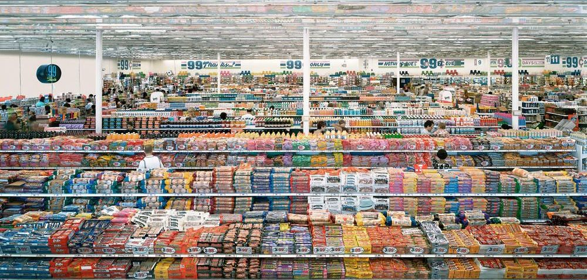

*99 Cent* by Andreas Gursky

Notizen zu meinem 6 Semester Volkswirtschaftslehre Uni Halle

##  6. Semester VWL

| Modul                     | Prof               | Übersicht                              |
| ------------------------- | ------------------ | -------------------------------------- |
| Introductory Econometrics | Christoph Wunder   | [Übersicht](VL_Econometrics/README.md) |
| Umweltökonomik            | Bartosz Bartkowski | [Übersicht](VL_Umwelt/README.md)       |
| Sozialistische Ökonomien  | Magnus Neubert     | [Übersicht](VL_Sozialismus/README.md)  |
| Makroökonometrie?         | Malte Rieth        |                                        |

 

Klausuren

- Umweltökonomik: 11.07.2024
- Econometrics: 15.07.2024
- Makroökonometrie: 19.07.24
- Socialist Economics: 13.06.24
