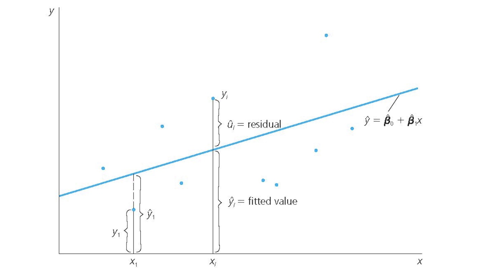

# 11.04.2024 Simple Regression

## Basics

Basic Structure:

$$
y = \beta_0 + \beta_1 x + u
$$

only one explanatory variable

- y = dependent / explained / regressand
- x = independent / explanatory / regressor
- u = unobserved

Functional relationship:

- x ~ y (linear)
- $\beta_1$ = slope
- $\beta_0$​ = constant / intercept
- u = unobserved factors

**Note:** linear is not always realistic assumption!

Assumptions:

1. $E(u) = 0$ : avg. unobserved is zero
2. $E(u | x) = u$: conditional average is independent
    - avg. of *u* does not depend on *x*!
3. $E(u|x) = 0$ : zero conditional mean 

---

Example: $wage = \beta_0 + \beta_1 education + u$

- assume *u* = ability
- requires that avg. ability = same for different years of education
    - example: $E(ability|8) = E(ability|16)$

=> unrealistic

---

Proof

$$
y = \beta_0+ \beta_1 x + u \\
E(y|x) = E[ \beta_0 +  \beta_1 x + u|x] \\
= \beta_0 + \beta_1 E(x|x) + E(u|x) \\
\implies E(y|x) = \beta_0+ \beta_1 x + 0
$$

Interpretation: one-unit change in x => change y by $\beta_1$

## OLS Estimator

With a lot of facny math it is derived to:
$$
\hat{\beta_1} =& \frac
	{\widehat{Cov}_{xy}}
	{\widehat{Var}_x} 
= \frac
	{\sum (y_i-\bar{y})(x_i - \bar{x})}
	{\sum (x_i-\bar x)^2}
\\
\hat{\beta}_0 =& (\bar{y}- \hat{\beta_1} \bar{x})
$$

Residuals:

$$
\hat{u}_1 = y_i - \hat{y_i} = y_i - \beta_0 - \beta_1x
$$

Graphic Representation

Interpretation of Regression Line: $\hat{\beta_1}$ amount of change of y when x changes by one unit

Solution for Best Line: minimize Squared Residuals
$$
R^2 =& \frac{ \text{Total Sum of Squars}}{\text{Sum of Squared Errors}} \\
TSS =& \sum(y_i - \bar{y})^2 \\
SSE =& \sum(\hat{\epsilon}_i)^2 = \sum(y_i-\hat{y_i})^2
$$

### Algebraic Properties of OLS / R2

$$
f
$$

 

## Units

## Expected Values

## Regression trough Origin