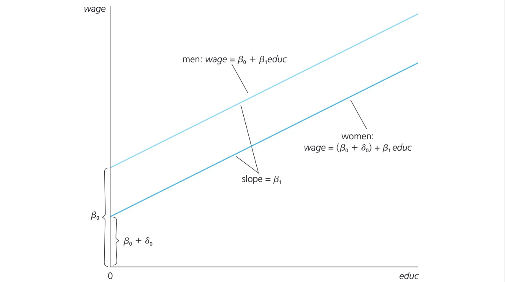

# 08.06.2024 Binary Variables

## Single Dummy Variable

> **Binary Variable**: represent qualitative factors in TRUE/FALSE format

Notation

$$
female = \begin{cases} 
 1 \text{ if person is female}\\
 0 \text{ otherwise}
\end {cases}
$$

 Interpretation:

$$
wage = \beta_0 + \delta_0 female + \beta_1 educ + u
$$

-  $\delta_0$ = difference in wage between men and women (c.p)
- $\delta < 0$: women earn less

Representation:

Log Interpretation of Dummy Variables, e.g $\ln wage = female + educ + exper$

- Roundabout: like a normal estimate: $100 \cdot \delta$
- exact: $100 \cdot [exp(\delta) - 1]$

## Dummies for multiple categories

e.g. Model for wage differences across groups (married men, married women, single men, ...)

- create dummies for each (*marrmale*, *marrfem*, *singfem*)
- base group = single males (have 0 and 0 on both categories)

Difference between single women and married women? Reestimate

Alternative: ***Interactions***

e.g:

$$
\ln wage = .321 - .110 female + .213 married - \bold{.301 female \cdot married} + u
$$

- single men: female=0, married=0
- married men: female=0, married=1 => $.321+.213 = 0.534$

## Binary as dependent variable

a.k.a *linear probability model*

- Try to explain the binary outcome
- e.g. college student using drugs in given school year

$$
P(y=1|x) = \beta_0 + \beta_1 x_1 + ... + \beta_k x_k
$$

 Example: Wome working outside home (labor force participation)

$$
\widehat{lfp} = .586 - .0034 nwifeinc + .038 educ + .039 exper + ...
$$

- another yerar of education = increase probability by 0.038
- *10 years = 10(0.038) = 0.38* 

**Note**: 

- LPM is always *heteroskedastic*
- caution with standard errors

