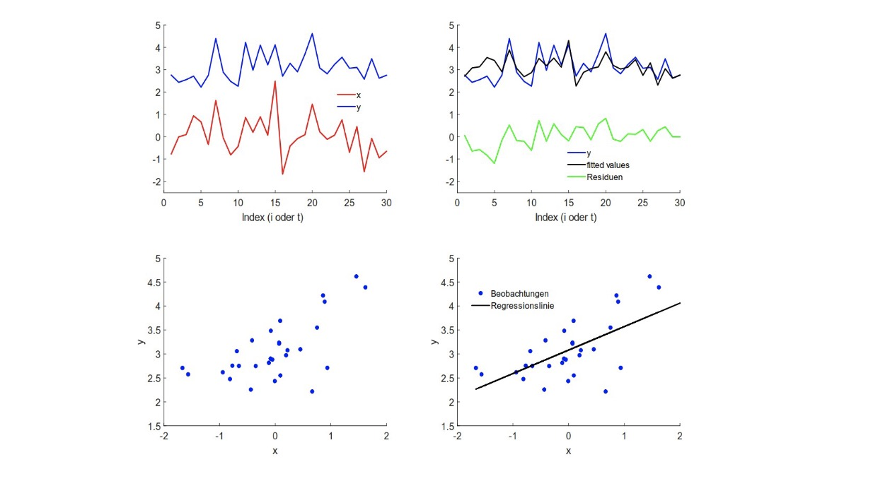
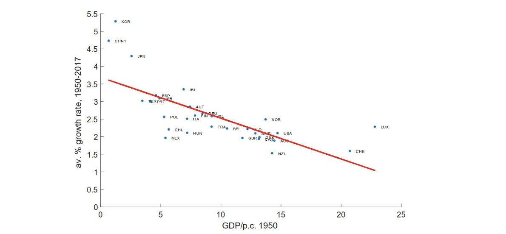

# 03.04.2024 Intro

> **Ökonometrie** : statistische Methoden zur Beantwortung ökonomischer Fragestellungen

= Theorie + Daten + Methoden => empirische Resultate

Makroökonometrie

- *lange Frist*: Querschnittszusammenhänge (bspw. Solow)
- *kurze Frist*: Zeitreihenzusammenhänge (Konjunktur)

Daten:

- US: Federal Reserve St Louis (*FRED*)
- Eurozone: EZB
- Deutschland: Bundesbank, Destatis

Modelle

- *Einfachregression*: 1 regressand, 1 Regressor
- *multiples Regressionsmodell*: 1 Regressand, 2+ Regressor
- *Mehrgleichungsmodelle:* 2+ Regressand, 2+ Regressor

## Einfache Regression

lineares Modell:
$$
y_i = \beta_0+ \beta_1 x_1 + ... + \epsilon_i
$$

Notation:

- $y_i$ = skalare Zufallsvariable
- $y$ = Vektor von Zufallsvariablen (ohne Index)
- $Y$​ = Matrix
- $\beta_n$ = wahre Parameter; $\hat{\beta}_n$ = geschätzte Parameter
- $\epsilon_i$ = Fehlerterme, $\hat{\epsilon}_i$​

Arten von Daten

- Querschnittsdaten: $y = \{y_i\}_{i=1,...,n}$
- Zeitreihendaten: $y = {y_t}_{t=1,...,n}$

Schätzungen

$$
\hat{y}_i = \hat{\beta_0} + \hat{\beta_1} x_i + ...
$$

dann Residuen: $\hat{\epsilon_i} = y_i - \hat{y_i}$

## OLS

Ordinary Least Squares = Minimiere die Quadrate der Residuen

$$
min \sum_1^n(\hat{\epsilon})^2 = 
min \sum_1^n(\epsilon-\beta_0-\beta_1 x)^2
$$

Herleitung (siehe jedes Lehrbuch ever)

$$
\beta_1 =& \frac
	{\widehat{Cov}_{xy}}
	{\widehat{Var}_x} 
= \frac
	{\sum (y_i-\bar{y})(x_i - \bar{x})}
	{\sum (x_i-\bar x)^2}
\\
\beta_0 =& (\bar{y}- \hat{\beta_1} \bar{x})
$$

### R-Squared

$\mathbf{R^2}$​​ = Anpassungsgüte 

Berechnung

$$
R^2 =& \frac{ \text{Total Sum of Squars}}{\text{Sum of Squared Errors}} \\
TSS =& \sum(y_i - \bar{y})^2 \\
SSE =& \sum(\hat{\epsilon}_i)^2 = \sum(y_i-\hat{y_i})^2
$$

- Bereich: $ 0 < R^2 < 1$ (no fit - perfect fit)
- $R^2$ = Anteil der Varianz, der durch Regression erklärt werden kann

## Beispiel Konvergenz

Hypothese: arme Länder wachsen Schneller

Modell: $y = \beta_0 + \beta_1x+\epsilon$

- Regressor: BIP p.P = x
- Regressand: Wachstumsrate BIP

Hypothese: $\beta_1 < 0$ 

Schätzung: $\hat{y} = 3.6889 - 0.1162 x, R^2 = 0.5087$

## Multiple Regression

Allgemein

$$
y_1 = \beta_0 + \beta_1 x_1i + ... + \beta_n x_{ni} + \epsilon_i, i=1,...,n
$$

 Darstellung als Vektoren:

$$
y = \begin{pmatrix}
 y_1\\
 ...\\
 y_n
\end{pmatrix} ;
\beta  = \begin{pmatrix}
 \beta_1\\
 ...\\
 \beta_n
\end{pmatrix};
x_1 =  \begin{pmatrix}
 x_{1,1}\\
 ...\\
 x_{1,n}
\end{pmatrix};x_2=... \\
$$

 Zusammenfassen der Regressanden als Matrix

$$
X = (1 \ x_1 \ x_2 \ ... \ x_n)
$$

Schreibweise dann: $y = X\beta+ \epsilon$

Berechnungen dann: 

$$
\hat{y} = X\hat{\beta} + \hat{\epsilon} \\
\hat{\epsilon} = y - \hat{y} = y- X\hat{\beta} \\
\hat{\beta} = (X'X)^{-1} X'y
$$

 

## Statistische Eigenschaften OLS

Annahmen des Regressionsmodells

1. Linearität des Zusammenhangs (Modell beschreibt Wirklichkeit)
2. Regressoren linear unabhängig
3. Erwartungswert Störterme null: $E(\epsilon_i)=0$
4. Varianz der Störterme = konstant: $Var(\epsilon_i)= \sigma^2$ (Homoskedastizität)
5. Störterme unkorreliert: $Cov(\epsilon_i,\epsilon_j)=0$​
6. Störterme stochastisch unabhängig von Regressoren
    - starke Annahme
    - Schwächer: Exogenität der Regressoren
    - $E(\epsilon| X)=0$
7. Normalität der Fehlerterme: $\epsilon \in N(0, \sigma^2I_n)$ (Normalverteilung)

Vereinfachungen

$$
Cov(\epsilon_i,\epsilon_j) = E(\epsilon_i,\epsilon_j) \\
Var(\epsilon_i) = E(\epsilon_i^2) \\
E(\vec{\epsilon}) = 0
$$

 

Eigenschaften von geschätztem $\hat{\beta}$

- Unverzerrt: $E(\hat{\beta})= E(\beta)$​
    - Durchscnitt der Schätzung = echter Durchschnitt
- geringe Varianz
- konsistent (je größere Stichprobe = näher an Wahrheit)

## Hypothesentests

**S. 48**
