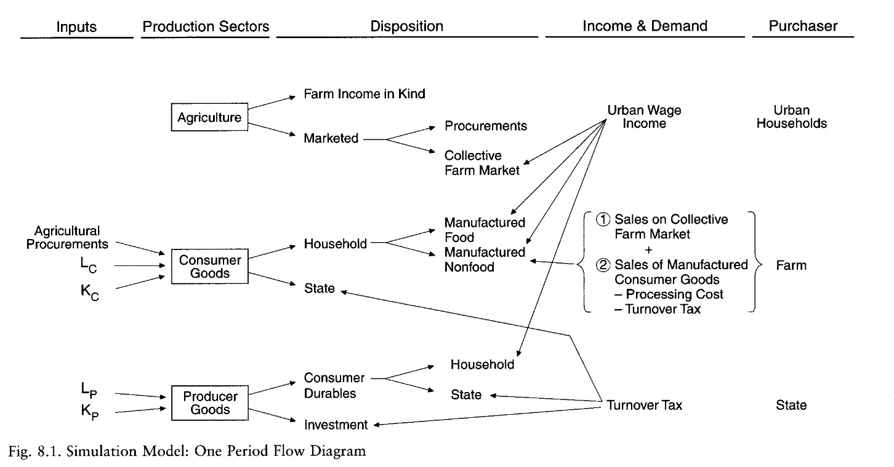

# 25.04.2024 Schockindustrialisierung 

## Ch. 5: Soviet Industrialization

before Stalin

- indsustries organized in trusts
- pofit maximizing
- price mechanism

after 1928

- 5 year plan
- output maximizing
- centralized prices

effects

- no more cost control
- soft budget constraint
- target rarely met
- labor ineffiency
    - only focus on marginal product of next worker
    - not marginal cost
- target adjusted in view of performance
    - inefficient build up of reserves

### Sectors

Capital accumuliation trough

- exporting grain (limited)
- heavy industry prioritazition
    - underinvestment in housing etc
    - rapid acceleration of physical capital

Human Capital

- before: low literacy, few higher ed.
- studys then showd ROI on education
- after 1928: universal ed, fast human capital accumulation

Agriculture

- (forced) collectivization
- extermination of kulak class (exile, expropriation)
- income divided according to days worked
- unpopular! silent protests
    - => nationalization
- 1930s: mechanization

Industrialization

- growth = 5.3% p.y
- urban boom, rural suffering
- farm output: 3x (28-1940)
- iron output: 4x
- consumer goods: 0.8x
    - due to bad collectivization of agricutlure (=input)
    - takes time

Urbanization:

- city pop. growth: 2x (1928-1940)
- demand side: higher wages
- supply side: less work due to mechaniztaion in rural
- forced labor supply in gulags
- amenities not rise with pop

## Ch. 8: Caused of Rapid Industrialization

quantitative analysis with Simulation Model

**Inputs**: Agriculture, Labor, Capital

**Sectors**: producer goods, consumer goods, agriculture

**Purchasers**: State, urban Households, peasants

### Simulation

- Capital = compounded from last year - consumption
- labor supply = demographic model
- 1928-1940

3 Model Trajecotires

- Collectivized (actual)
    - obligatory deliveries
    - turnover tax
    - antipeasant
- NEP forward simulation
    - no collect.
    - market relationship urban-rural
- capitalist
    - hard budget constraint
    - unemployment

### Results

Collectivized

- highest value added at end of period
- lower consumptio in middle, but higher afterward
    - spillover of growht from producer goods
- hindered by 2.WW buildup of military , cost on investment
- higher migration = more efficient

NEP

- lower investment rates
- but also no livestock deaths due to collectivization
- general = lower value added comp. to coll.
- but onyl slightly less GDp
    - due to more efficient agriculture

Capitalism

- 25% unemployment
- probably large informal sector
- worse performance overall

General

- Agriculture Collectivization: small economic gains, large human misery!
- structural unemployment = solved by soft budget constraint + high targets (keynesianismus)
- NEP would have sufficed
- export oriented strategy was not needed (grain etc.)

investment strategy + soft budget constraint => Soviet growth

Question: Financial Crisis in NEP / Capitalism Model?