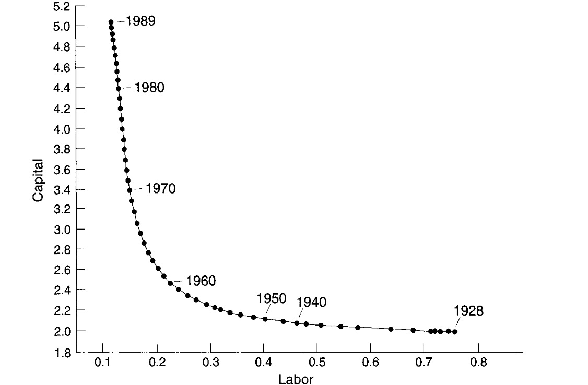

# 02.05.2024 Ende der Sowjetunion

## Ch. 10 After Stalin

2. WW: loss of pop and GDP

after 2WW - 1980

- exceptional growth capital stocl
- big increase employment
- some expansion cultivated acreage

after 1980 = slowdown

classical explanation = extensive growht / intensive growth

- institutions not made for efficient combination of output
- system was good for shifting of underused labor surplus
- after full employment = useless

### Weitzman Analysis

- Soviet Model = Cobb Douglas with elasticity of substitution = 0.4 (not one as normal)
- missing technological growth = no longer problem
- but shrinking labor supply
- rapid growth => abrupt slowdown

- Soviet Union Isoquant Figure:
    - in 1928: 1% more capital = 0.97 more output (=capital constrained)
    - in 1960 = labor and capital both efficient
    - in 1980: 1% more labor = 0.8% more output (=labor constrained)
- with better elasticity of substitution = grwoth would go on (similar to Japan)

### Allen analysis

- not EOS problem, but investment

**Reconstruction Investment**

- e.g refitting old factories
- high input needed
- less output growth
- wasteful

Politcal Reasons for reconstruction investment

- employment protection
- provision of housing was trough employer
- believe to be more economic

**Resource Depletion**

- 1970s: western russian resources depleted
- shift to siberia = wasteful + espensive
- resource course
- example: energy (coal)
    - coal in west (donezk) depelted
    - shift to siberia = more expensive
- solution would have been trade
- but focus in self-suffiency in SU
- no conservation of energy
    - soft budget constraint = not rising prices
    - lacking monitoring
    - no agreement
- no politicaln will for long run investment

poor incentives => not efficient resource use

**Technology**

**classical analysis:** conservative towards new technology

- no in house research, but in institutes
- benefits of technology = only to consumers, not enterprises
- output target = no incetinve to innovate

**Allen analyisis**

- significant research on site (ex. cement industry)
- external factor = arms race
- reallocation to military sector (esp. R&D)
- military-industrial secotr = take all bright heads
- plans did not make sense generally

=> market driven technological change needed

- not one person has to solve problems (like Gorbachev)
- but the market in general