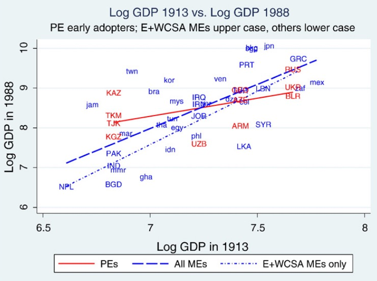
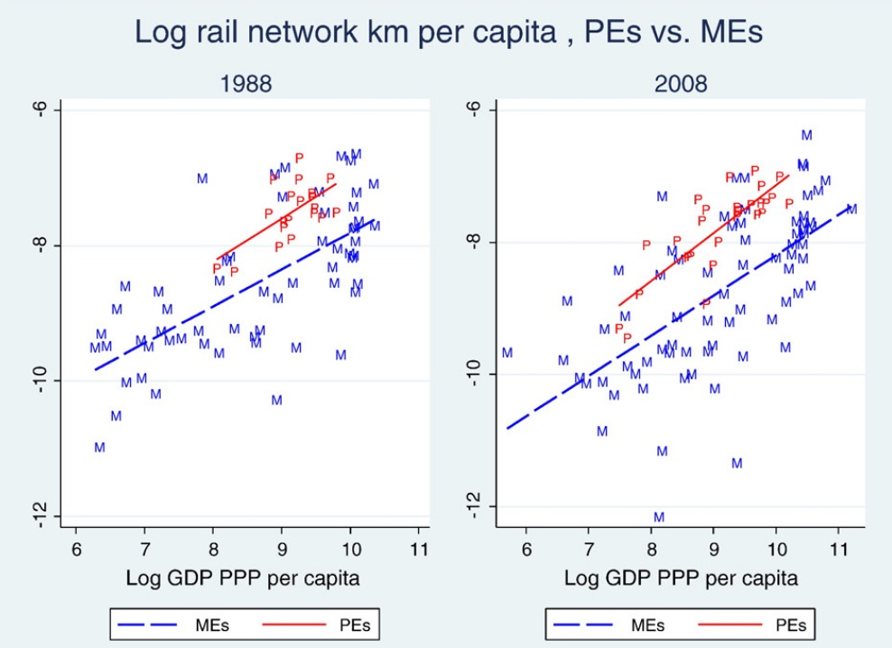
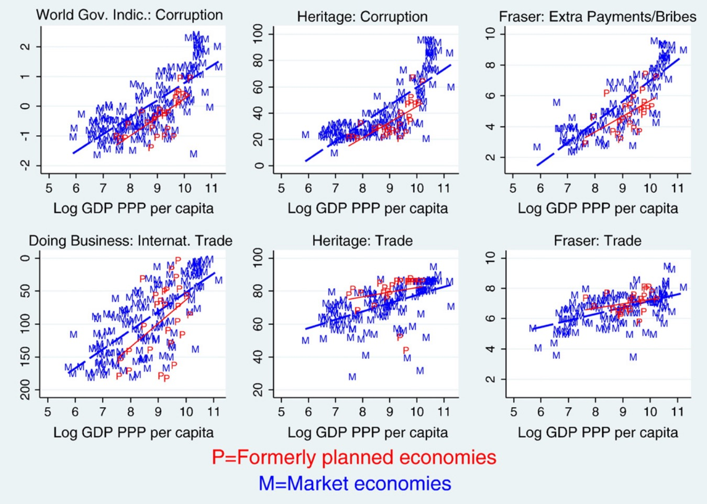
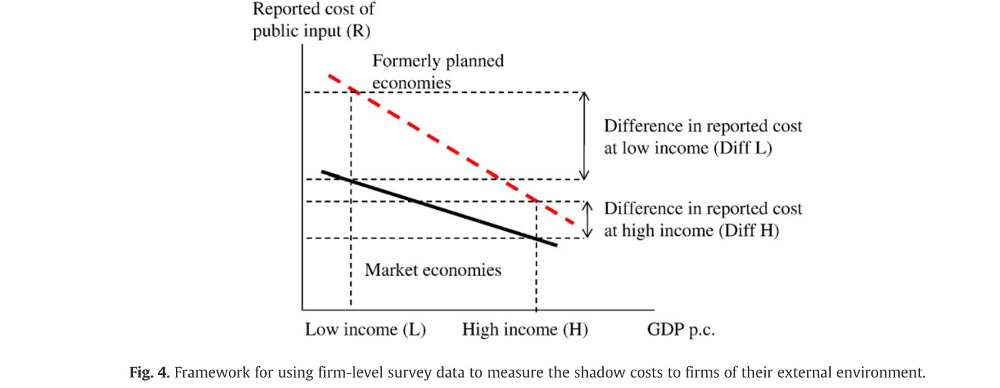

## 23.05.2024 Effects in the Long run

> Communism = Soviet Power + Electrification (**Lenin**)

Hypotheses:

1.  Planning = long run bad for growth
    - static allocative inefficiencies
    - inhibits adoption of higher up technology
    - no creative destruction
2. Planning = over-focus on physical investment and education

Methods: Regressions and a *new Model*

### Planning and Growth

Initial Advantage of Planning 

- mobilize savings better
- better infra => higher ROI on investment
- more ducation => higher real wages

=> good for pre-industrial countries 

Adoption of Planning

1. Group: Russia and extended after 1.WW
2. Group: bloc expansion after 2.WW

Different types of adopter countries:

- Agrarian (Balkan etc.)
- industrious (Czech, East Germany, …)

Comparators:

- European, Central Asian …

**Method**: Regression
$$
ln(GDP) = \beta_0 + \beta_1 PLAN+ \beta_2 ln(GDP_{t1}) + \beta_3 (PLAN \cdot GDP)
$$

- PLAN = Dummy for planned economy
- Esitmation of Contrafact

**Results:**

- ME = Market Economy
- PE = planned economy
- countries with higher GDP at start = comparatively lower GDP in end
- vice-versa

## Education and Investment

Method = similar to above

Results:

- Caveat: Aggreagte Infastrucutre =! usable infrastructue
- planners planed only transport infratstructure, not personal (eg. commuter rail)
- human capital measurement as years =! always usable in market economy (e.g Marxist study)

Insitutional Heritage

- measured with "Ease of Doing Businnes" Indicator
- difficult indicators
- no clear picture emerges

## Model 

Data = individual Business Surveys

- World BAnk Questionnaires
- firms asked to evaluate public inputs
    - Telecoms, electriciy, skills, stability, ...
    - how hindering they are
- => shadow price interpretation

General Results:

- PE = hgigher shadow prices of public inputs
- means more difficult business environment
- rich PE = differ less from ME peers than poor PE vs their peers
- poor PE vs their peers
    - better education, physical capital, labor costs etc
    - worse institutions: corruption, courts, ...

**=> Benefit of Communism depends on inital stage**

