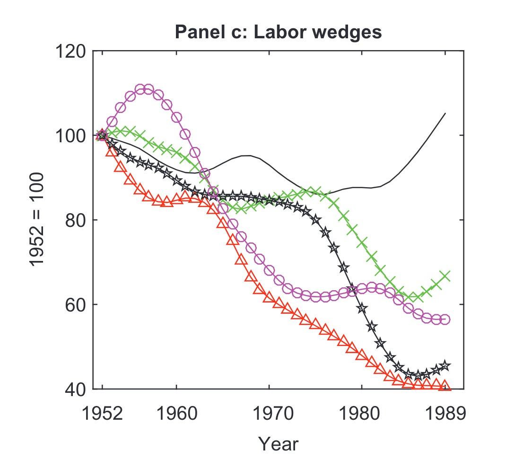
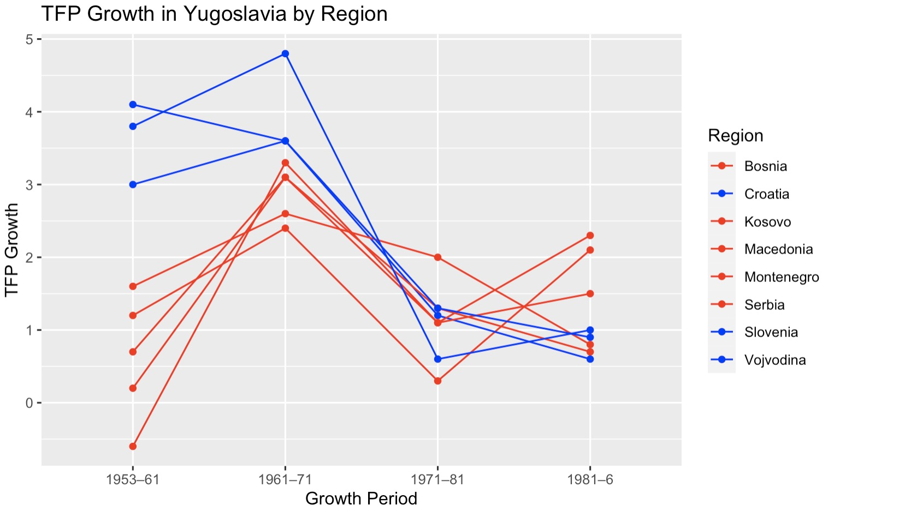

# 13.06.2024 Empirie ASV

## Über die Texte

Leonard Kukic

- Assistant Prof: Universitad Madrid
- Topics: Economic History, Eastern Europe

2018: 

2020:

## Wirtschaftsgeshichte Jugoslawiens

- 45-51: Schockindustrialisierung
    - wie Sowjetunion
    - zentralisiert
- 48-65: eigenes Modell der Zentralplaung
  - Entscheidungsfreiheit in Unternehmen
  - Arbeiterselbstverwaltung
  - softere Targets, keine Kollektivierung
  - zentralen Investment-Fond (staatliches Kapital)
- 65-74: Marktsozialismus
  - GATT-Beitritt (WTO Pred.)
  - Einbindung internationaler Handel
  - Arbeiterräte in Firmen
  - Banken als Finanziers
  - Bewegungsfreiheit / Migrationsphase
- 74-91: Untergang
  - Überregulierung
  - Backlash gegen Liberalisierung
  - Tito stirbt
  - ethnische / politische streitigkeiten über Zukunft

## Definitionen

**Solow Modell** 

- exogenes long-run growth model
- Cobb Douglas Produktionsfunktion
- grundlage von Growth Accounting (erwähnt in Paper)
- Versuch zu erklären, warum einige Länder arm, andere reich sind
    - basierend auf Kapitalstock / Labor Force / Investments etc

**TFP** = Total Factor Productivity

- Effizienz der Verwendung der beiden Produktionsfaktoren in Output
- "Measure of our Ignorance" = was wir nicht messen können
- Institutionen, Culture, Geography, Technology
- insbesondere wichtig, wenn Wirtschaft weiter entwickelt ist

## Paper 1: BCA

Wachstumsfaktoren Analyse mit Business Cycle Accounting

- neoklassisches wachstumsmodell
- wedges = abweichung vom "perfekten Pfad"
- vergleich mit anderen staaten (Griechenland, USA, ...)

Ergebisse:

- TFP = insgesmat wichtig für Wachstum
- ab 1980: sinkendes TFP Growth
- besonders relecant aber: labor wedge sinkt

> **Labor wedge:** structure of incentives determining provision of labor  
>
> => interpreted as distortion arising due to increased taxation

sozialistische firma = distorted version of perfectly competitve economy

Grund für Labor Wedge: 1965 Reform

- maximize income per worker
- wage rate above market rate
- less investment
- restrict labor entry (like strong unions?)

## Paper 2: Divergence

> **(Solow)-Convergence** (Conditional)
>
> - Tendenz dass sich arme Länder höhere Wachstumsrate haben
> - sich reichen damit annähern (Catch Up Growth)
> - typisches Beispiel: Südstaaten Nordstaaten USA

reichere Regionen

- höheres Ausgangsniveau = Vergangenheit in Austro-ungarn
- und dann auch noch mehr Wachstum

## Rolle des Ölschocks

externer Schock

- balance of payments krise = devisenmangel
- energieineffizienz der Wirtschaft = teuer

=> jugoslawischen Wirtschaft den Todesstoß gegeben

## Kritik / Gedanken

- Finanzielle Unterstützung von *Mercatus Center* (neoliberaler Think Tank)
    - gibt dem ganzen ein Geschmäckle
    - abneigung gegen gewerkschaften / income per worker maximizing
    
- wie hat der Öl schock andere Länder gebrochen (die kapitalistisch waren)
    - bspw. **XX?**
- wenn 1965 reformen wichtig für downfall waren, warum dann erst ab 71 sichtbar?
- sozialismus = abweichung von perfket competitive economy?

