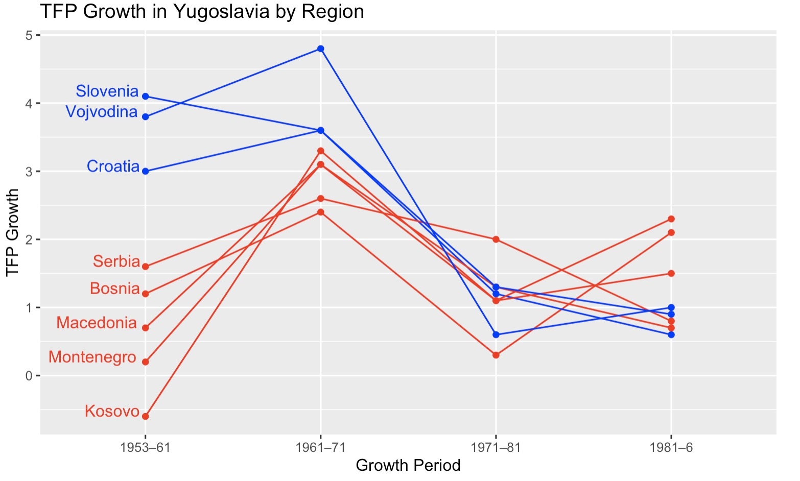

# 13.06.2024 Empirie ASV

## Über die Texte

Leonard Kukic

- Assistant Prof: Universitad Madrid
- Topics: Economic History, Eastern Europe
- PhD + MA LSE

## Wirtschaftsgeshichte Jugoslawiens

- 45-51: Schockindustrialisierung
    - wie Sowjetunion
    - zentralisiert
- 48-65: eigenes Modell der Zentralplaung
  - Entscheidungsfreiheit in Unternehmen
  - Arbeiterselbstverwaltung
  - softere Targets, keine Kollektivierung
  - zentralen Investment-Fond (staatliches Kapital)
- 65-74: Marktsozialismus
  - GATT-Beitritt (WTO Vorreiter)
  - Einbindung internationaler Handel
  - Arbeiterräte in Firmen
  - Banken als Finanziers
  - Bewegungsfreiheit / Migrationsphase
- 74-91: Untergang
  - Überregulierung
  - Backlash gegen Liberalisierung
  - Tito stirbt
  - ethnische / politische streitigkeiten über Zukunft

## Paper 1: BCA

Wachstumsfaktoren Analyse mit Business Cycle Accounting

- neoklassisches wachstumsmodell
- wedges = abweichung vom "perfekten Pfad"
- vergleich mit anderen staaten (Griechenland, USA, ...)

### Refresher

**Solow Modell** 

- exogenes long-run growth model
- Cobb Douglas Produktionsfunktion
- grundlage von Growth Accounting (erwähnt in Paper)
- Versuch zu erklären, warum einige Länder arm, andere reich sind
    - basierend auf Kapitalstock / Labor Force / Investments etc

**Labor wedge:** structure of incentives determining provision of labor  

- Anreizstruktur für einen bestimmten Produktionsfaktor

sozialistische firma = distorted version of perfectly competitve economy

### Ergebnisse

Ergebisse:

- TFP = insgesmat wichtig für Wachstum
- ab 1980: sinkendes TFP Growth
- besonders relecant aber: labor wedge sinkt

Grund für Labor Wedge: 1965 Reform

- maximize income per worker
- wage rate above market rate
- less investment
- restrict labor entry (like strong unions?)

## Paper 2: Divergence

Analyse in Jugoslawien: 

- reichere Regionen: ehemaliges Austro-ungarn (stärkere INdustralisierung)
- Ärmere Regionen: ehemaliges osmanisches Reich

reichere Regionen

- höheres Ausgangsniveau = Vergangenheit in Austro-ungarn
- und dann auch noch mehr Wachstum
- War ein Land, vergleichbar als wäre UK und Kongo in einer Nation verbunden

**Frage** des papers: Warum keine Konvergenz?

**Daten**: von westlicher Seite konstruierte Wachstumsdaten, da Original Daten viele verscihede Problematiken hatten (Preisverzerrung, Inflation, etc)

**Modell**: Standard Growth Accounting Model

### Refrheser

**(Solow)-Convergence** (Conditional)

- Tendenz dass sich arme Länder höhere Wachstumsrate haben
- sich reichen damit annähern (Catch Up Growth)
- typisches Beispiel: Südstaaten Nordstaaten USA
- durch Insituttionene etc.

**TFP** = Total Factor Productivity

- Effizienz der Verwendung der beiden Produktionsfaktoren in Output
- "Measure of our Ignorance" = was wir nicht messen können
- Institutionen, Culture, Geography, Technology
- insbesondere wichtig, wenn Wirtschaft weiter entwickelt ist

### Ergebnisse

konvergenz bei Phyischem Kapital und Humankapital

- Asuweitung der Bildung (sozialistisch typisch)
- Ausweitung des physischen Kapitals (durch soft budget constraint)

insbesondere verantwortlich Divergenz: TFP

- gerade schon gelernt: TFP war wichtigster Wachstumstreiber
- reichere Regionen = stärkeres Wachstum
- insbesondere in 60er und 70er, = Wachstumsphase

Kontraintuitiv:

- im gegensatz zu Rest von Europa in der Zeit
- oder in YG die Zeit davor + danach
- innerhalb eines Landes sind Institutionen / Geographie / etc meistens ähnlich

## Gründe

Warum?

- Firmen im Süden: softer budget constraint
    - mehr Misallokation 
    - weniger technologische Druck
- Norden = besser integriert in Welthandel
    - Technoligische Frontier 
    - dadurch effizientere Technologie = TFP
- wenig interregionale Labour Migration
    - außer bischen Slowenien
    - größtenteils in Westen
    - Grenzöffnung in 60ern

1965 Reform

- Firmen maximieren Löhne 
    - auch über den Gleichgewichtslohn / Produktivitäswachstum
- beschränken Eintritt von labour Entry

## Kritik / Gedanken

- Finanzielle Unterstützung von *Mercatus Center* (neoliberaler Think Tank)
    - gibt dem ganzen ein Geschmäckle
    - abneigung gegen gewerkschaften / income per worker maximizing
    - marginal productivity
- wie hat der Öl schock andere Länder gebrochen (die kapitalistisch waren)
    - bspw. **XX?**
- regionale Divergenzen in gescheiterten Ländern? (Russland etc)
    - erklärender Faktor?
    - in yugoslawien gab es auch sehr wenig interregionalen Handel / Austausch
    - und keine Migration
- politische Folgen
- Lohn als keynesianische Komponente 
    - Lhnkompression stärker
    - Vorteile für Gesellschaft
    - Aggregate Demand

## Rolle des Ölschocks

externer Schock

- balance of payments krise = devisenmangel
- energieineffizienz der Wirtschaft = teuer

=> jugoslawischen Wirtschaft den Todesstoß gegeben

