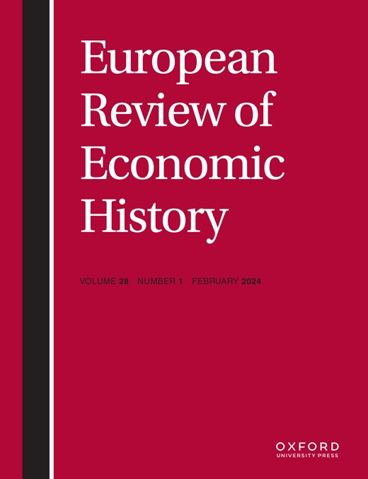
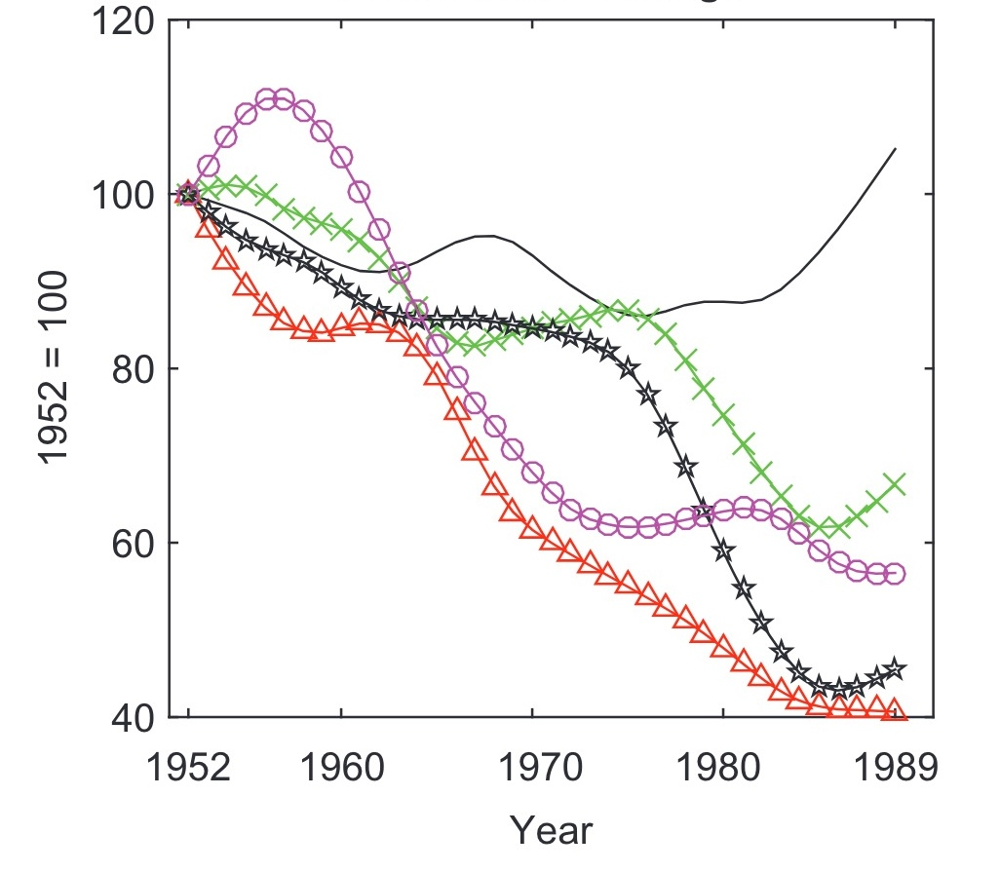

## Empirie zur Arbeiterselbstverwaltung

von Marten Walk

---

## Allgemein

:::: {.columns}

::: {.column width="50%"}

[@kukicSocialistGrowthRevisited2018]

\

{height=40%}

:::

::: {.column width="50%"}

[@kukicOriginsRegionalDivergence2020]

\

{height=40%}

:::

::::

---

:::: {.columns}

::: {.column width="60%"}

- Visiting Professor
- Universität Carlos III Madrid
- LSE Economic History (MA, PhD)

:::

::: {.column width="40%"}

:::

::::

---

## Wirtschaftsgeschichte

| Zeitraum | Modell                   | wirt. Entscheidungen |
| -------- | ------------------------ | -------------------- |
| 1948-51  | Schockindustrialisierung | Zentralregierung     |
| 1948-65  | eigenes Zentralmodell    | Zentralregierung     |
| 1965-74  | Marktsozialismus         | Arbeiterräte         |
| 1974-91  | Backlash + Niedergang    | Firmenabteilungen    |

---

## Refresher

##### **Solow-Modell** 

- exogenes long-run Wachstumsmodell
- basierend auf erweiterter Cobb-Douglas Produktionsfunktion

##### **TFP** = Total Factor Productivity

- *"measure of our ignorance"*
- Maß für Effizienz in Kombination von Faktoren

****

## Socialist Growth Revisited

- neoklassisches Wachstumsmodell
- Anteile der Produktionsfaktoren an Wachstum

##### **Wedge**

Anreizstruktur für den Produktionsfaktor = Verzerrung / Abweichung

---

::::{.columns}

::: {.column width="50%"}

- TFP = steigende Bedeutung für Wachstum
- Labor-Wedge = retardierende Rolle bei Wachstum ab 1965
- ineffizente Anreize für Arbeit

:::

::: {.column width="50%"}

:::

::::

---

## Regional Divergence

Sind die ärmeren und reicheren Regionen Jugoslawiens konvergiert?

Model: Standard Growth Accounting Model

##### **Convergence**

- arme Länder = höheres Wachstum (*Catch-Up*)
- Angleichung der Einkommensniveaus

---

---

## Gründe

- softer budget-constraints (Süden)
- stärkere Integration in den Welthandel (Norden)
- institutionelle Kapazitäten

---

## Ölschock

<!-- -->

Aus [@yarashevichEconomicReasonsBreakup2013]

---

## Kritik

- Mercatus-Funding
- Öl-Schock in kapitalistischer Peripherie

---

## Bibliographie

:::{#references}

:::
