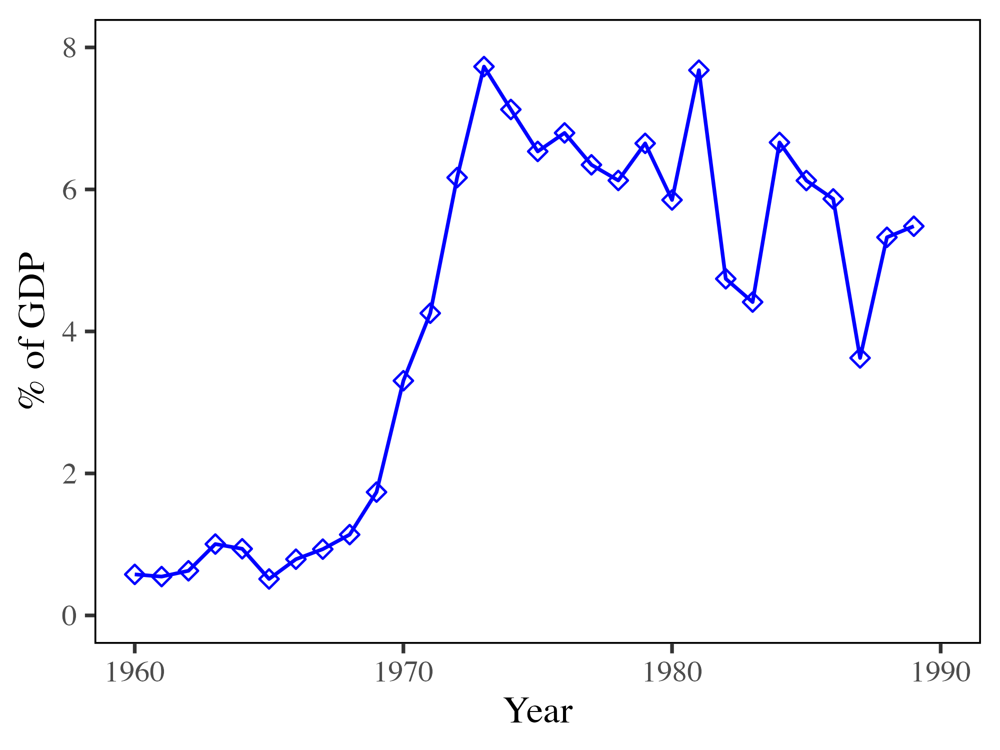
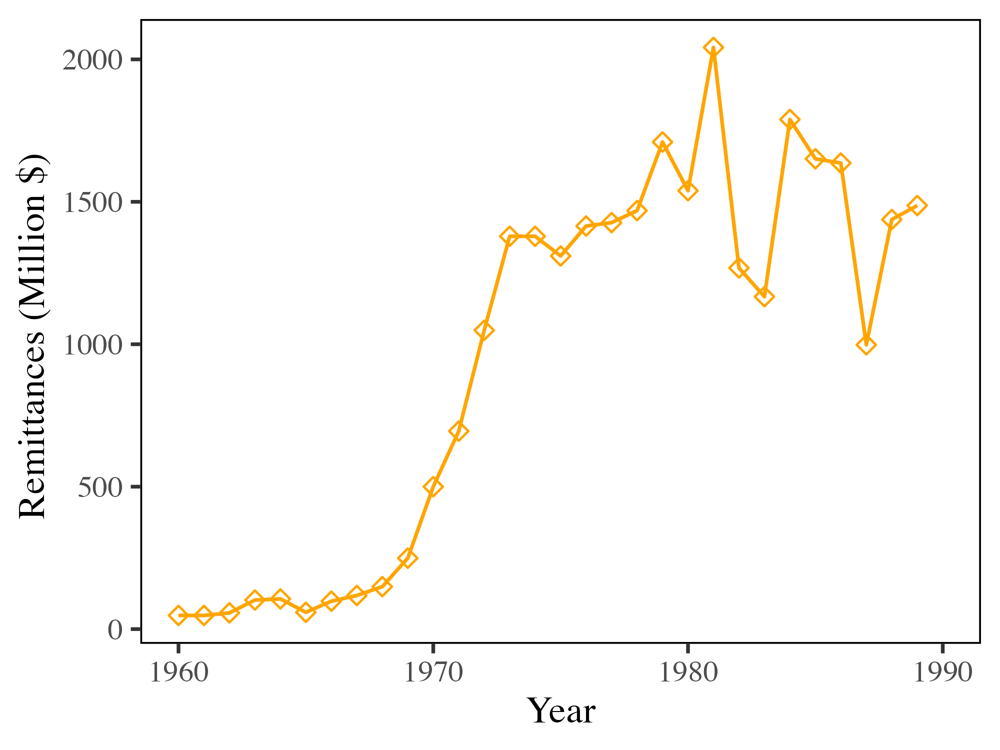



The early 1990s marked a pivotal moment in world history, famously described as the "end of history" by political theorist Francis Fukuyama [@fukuyamaEndHistory1989]. With the collapse of the Soviet Union and the widespread adoption of liberal capitalism, it seemed as though Western democratic capitalism had triumphed as the ultimate and unchallenged form of socio-economic organization. Amidst this global shift, socialism—the greatest socio-political experiment of the 20th century—appeared to be consigned to the past, discredited and dismantled across much of the globe.

Yet, the story of socialism’s demise is not a simple tale of ideological failure; it is intertwined with complex internal and external dynamics. Among the various socialist models, Yugoslav socialism stood out for its unique blend of market mechanisms and worker self-management, presenting an alternative vision of socialism that diverged from the centralized planning of the Soviet model. However, by the 1980s, this once-promising system found itself in deep crisis, ultimately unraveling in the face of insurmountable economic challenges.

This essay explores the downfall of Yugoslav market socialism, arguing that its collapse cannot be attributed to internal inefficiencies or ideological shortcomings. Instead, it posits that external factors played the decisive role in undermining the Yugoslav economy and bringing the end of its socialist experiment.

The first section provides a brief overview of Yugoslavia's economic history, setting the stage for an analysis of existing explanations for its collapse. Following this, the essay examines four major external shocks that significantly impacted the Yugoslav economy: beginning with the Oil Shock of the 1970s, it then explores the global economic downturn, the escalation of external debt, and concludes with an analysis of the IMF Adjustment Programs.

## Economic History 

After World War II, the Communist Party of Yugoslavia rose to power under the leadership of Josip Broz Tito, who became the country’s first president. Initially, Yugoslavia adopted a Soviet-style centrally planned economy, prioritizing heavy industrialization. However, following a decisive split between Tito and Stalin in 1948, Yugoslavia began to forge its own distinctive path, developing a unique form of socialism. This shift was marked by a move away from the Soviet bloc and towards a prominent leadership role within the Non-Aligned Movement.

The following period until the start of the 1980s was defined by rapid growth in Yugoslavia. For a time, it was one of the fastest growing economies [@sapirEconomicGrowthFactor1980] and praised by contemporaries as a "third way", combining capitalism and socialism. 

The Yugoslav economic system was defined by the central role of workers' self-management, in which workers effectively owned the firms. A significant portion of decision-making occurred within workers' councils, which had the authority to hire and fire managers and determine how profits were distributed between investment and wages.

Unlike other socialist economies, Yugoslavia maintained a relatively open stance towards both Eastern and Western trade. As a founding member of the General Agreement on Tariffs and Trade (GATT), it engaged extensively in international trade, particularly from the 1960s onwards. Yugoslavia’s imports and exports were notably diversified, spanning a wide range of trading partners and products.

## Existing Explanations

A variety of theories seek to explain the disintegration of the Socialist Federal Republic of Yugoslavia (SFY). Jović’s overview [@jovicDisintegrationYugoslaviaCritical2001] outlines seven distinct arguments, including economic, cultural, nationalist, and international political factors. My argument straddles the economic and international political explanations, with a primary focus on the collapse of the economic system rather than the disintegration of the state itself.

Yarashevich’s analysis [@yarashevichEconomicReasonsBreakup2013] explores the economic reasons behind the breakup of Yugoslavia, identifying four key factors. These include two internal issues—labor market challenges and the system of self-management—as well as two external pressures—external debt and foreign trade dynamics.

Additional economic factors are highlighted by Kukić [@kukicOriginsRegionalDivergence2020], who examines the regional economic divergence within Yugoslavia. He argues that the failure of the regions to converge economically can be attributed to the soft-budget constraint and the inherent flaws of the workers' self-management system.

While all these explanations offer valid insights, the collapse of a system as complex as Yugoslavia’s can never be attributed to a single cause. However, arguments that focus solely on internal economic inefficiencies fall short of explaining why other, similarly diverse countries experienced comparable trajectories in the 1980s. Despite their different political and economic systems, these countries exhibited strikingly similar patterns of decline, suggesting that broader external factors played a critical role beyond internal dynamics.

In the following sections, I will outline the key external shocks and their overlapping effects that may explain the similar trajectories taken by many countries during this period. These factors are crucial in understanding why external forces, rather than internal inefficiencies alone, are to blame for the collapse of Yugoslavia’s economic system.

## Data

Economic data series for Yugoslavia are notoriously difficult to obtain and often unreliable. Official growth data for the Social Product, Yugoslavia’s equivalent to GDP, are particularly problematic due to price distortions and data fabrication. Therefore, this analysis relies on alternative time series from the Maddison Project Database, which draws on the independent research conducted by the Research Project on National Income in East Central Europe.

Many of the additional data sources used throughout this analysis are drawn from the OECD Economic Surveys [@OECDEconomicSurveys]. These biannual surveys, conducted from 1962 to 1990, provide standardized tables on various economic indicators, including foreign trade, debt, balance of payments, and the federal budget, among others. Some of the data in these reports were sourced directly from Yugoslavia’s Official Statistics Office, while other figures were calculated by OECD researchers. Data from these digitized reports have been extracted using OCR (Optical Character Recognition) technology, then transformed into time-series data for further combination and analysis.

## The Effect of the Oil Shocks

The oil shocks of 1973 and 1979 marked a turning point in the global economy, as sudden and dramatic increases in oil prices sent shockwaves through oil-dependent nations worldwide. These crises saw global oil prices nearly triple, rising by almost 300%, and profoundly disrupted the economic stability of many countries. For Yugoslavia—a nation without domestic oil production and heavily reliant on imported energy—these shocks presented a formidable challenge that would strain its economic model. 

During this tumultuous period, the impact on Yugoslavia’s economy was stark: the share of energy imports in total imports surged from about 5% in the 1960s to nearly 30% by the early 1980s (see @fig-imports2). Similarly, energy imports as a share of GDP rose sharply, climbing from roughly 1% in the 1960s to almost 15% at the beginning of the 1980s, as visible in @fig-imports1. These shifts underscored the country’s growing vulnerability to external economic forces and contributed to the mounting pressures on its socialist economy.

::: {#fig-imports layout-ncol=2}
{#fig-imports1}

{#fig-imports2}

The Impact of Rising Energy Prices on Imports
:::

Even for advanced Western nations like Germany, the two oil shocks triggered significant crises. However, for a less developed country like Yugoslavia, whose currency was weaker on international markets, affording these costly imports became nearly impossible. As Rogel [@rogelBreakupYugoslaviaIts2004] explains, "for a country like Yugoslavia, which was greatly dependent on imported fuel paid for in hard currency, the oil price crisis alone could have resulted in financial ruin" (p. 14).

### Global Economic Downturn

To cope with rising import prices, a country typically has three options: reduce imports, increase exports, or offset the costs through capital account inflows. Yugoslavia, however, found it difficult to significantly cut imports, despite implementing various policies and imposing substantial reductions in energy access. For an industrialized economy, energy is the backbone, and reducing its consumption without causing serious economic disruption is rarely feasible. The dramatic surge in prices made it nearly impossible to offset these costs through reductions alone, leaving the country vulnerable to external pressures.

The second option—boosting exports—proved only partially successful and fell far short of generating the necessary hard currency. Yugoslavia's main trading partners, the members of the European Economic Community (EEC), were grappling with their own macroeconomic challenges. The stagflation of the 1970s, characterized by low growth and high inflation, sharply reduced demand for foreign products, particularly for Yugoslavia’s key export category: finished manufactures. As a result, the external market for Yugoslav goods shrank, further exacerbating the country’s economic difficulties.

**XX GRafik Exporte Machinery**

### Immigration Restrictions

Additionally, countries that had previously been key destinations for Yugoslav emigrants, such as Germany and France, closed their borders to economic migrants. Germany, in particular, ended its "Anwerbeabkommen" (recruitment agreement) in 1973 following the first oil shock, and further tightened immigration rules in 1979 after the second. This shift made it increasingly difficult for Yugoslav workers to find employment abroad, reducing the flow of remittances—an important source of hard currency for Yugoslavia’s economy.

As a result, the number of emigrants dropped significantly, and Yugoslavia began to experience net negative migration, with more people returning to the country than leaving it. In the 1970s, a record 230,000 people emigrated, but by the following decade, this figure had fallen to just 30,000 and continued to decline, as shown in @fig-migrants. 

{#fig-migrants}

As a result, remittances from foreign workers fell significantly, exacerbating the capital account issues faced by Yugoslavia. This problem became particularly acute in the 1980s due to the delayed impact of the policy changes. Both in absolute terms and relative to GDP, remittances decreased notably, especially after 1981 (see @fig-remittances). This decline in remittances further compounded the economic challenges facing the country, straining its financial stability.

::: {#fig-remittances layout-ncol=2}

Importance of Remittances for Yugoslavia
:::

### External Debt

The oil crisis precipitated a balance of payments crisis in many countries, including Yugoslavia. To address its growing current account deficit, Yugoslavia turned to Western lenders for assistance. In search of attractive investment opportunities outside their stagnating domestic markets, these Western investors are estimated to have covered approximately 90% of Yugoslavia’s current account deficit up to 1975 [@yarashevichEconomicReasonsBreakup2013].

This reliance on Western capital would become a significant liability starting in the 1980s. The second oil shock triggered inflationary pressures in the West, particularly in the United States, where the Federal Reserve responded by raising interest rates to as high as 20% in 1981. Emerging economies, including Yugoslavia, felt the impact of these soaring interest rates acutely. They were forced to pay a steep premium to finance their debt and faced escalating costs for servicing it.

With the onset of the Mexican debt crisis in 1982, access to foreign credit rapidly dried up for many countries. Foreign lenders quickly pulled back from emerging markets, retreating to safer investments such as US Treasury Bonds. During this period, "Yugoslavia completely lost its access to international financial markets" [@mojmirFormerYugoslaviasDebt1996], leaving the country with no choice but to seek alternative methods for financing essential imports, such as energy, crucial for sustaining its economy.

A major strain on the economy was the debt servicing payments, which escalated to 10% of GDP in 1980 and reached a record 21.7% in 1986. For any country, such substantial debt payments would be a severe challenge, but for Yugoslavia—already struggling with numerous economic difficulties—this situation became exceptionally dire. It left the country with no option but to seek external assistance from Western sources.

## The Role of the IMF

This situation presented a prime opportunity for the International Monetary Fund (IMF), which was originally established to manage balance of payments crises as a lender of last resort. During the 1980s, the IMF expanded its role beyond mere stabilization to become a leading advocate for market-liberalizing reforms. As the "world's leading promoter of market-liberalizing reforms" [@kentikelenisMakingNeoliberalGlobalization2019], the IMF began to push for a broader agenda of economic liberalization and structural adjustments in countries facing financial turmoil.

The IMF's approach during this period involved imposing stringent conditions on countries seeking financial assistance, including market-oriented reforms, privatization, and deregulation. For Yugoslavia, this meant that in addition to securing emergency funding, it was required to implement significant economic reforms that aimed to align its economy more closely with market principles. These reforms were intended to stabilize the economy in the short term but often led to considerable social and economic adjustments, influencing the country's economic trajectory and contributing to the broader wave of neoliberal reforms globally.

## Conclusion



## References