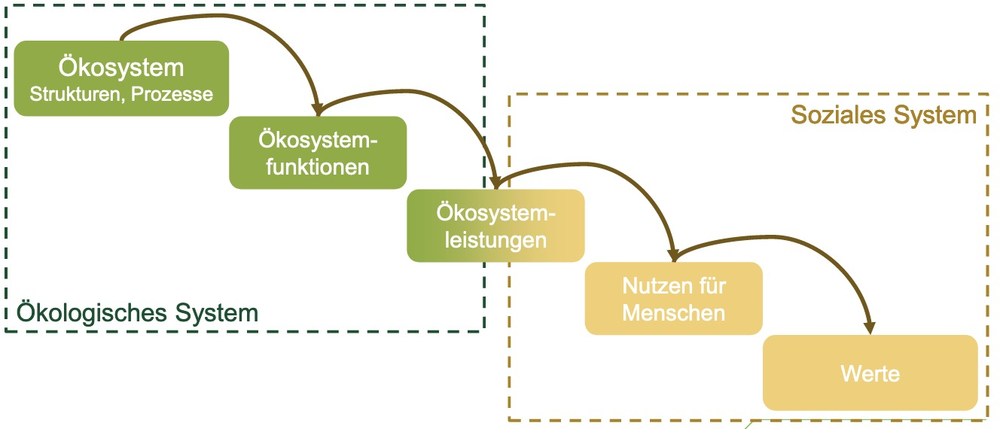
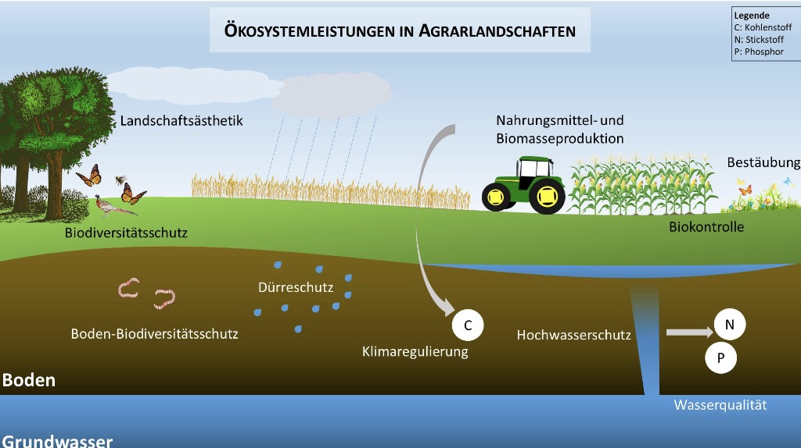

# 29.04.2024 Naturkapital

> **Naturkapital**: Bestandsgröße der natürlichen Produktionsfaktoren

- wächst nach!
- Bestandsgröße

> **Ökosystemleistungen**: Direkte / indifrekte Beiträge von ökosystemen zu menschlichem Wohlergehen

- weit gefasster Begriff
- antropozentrische Perspektive
- an Nutzen für Menschen gebunden

Kategorien von Ökosystemleistungen

- Versorgung
- Regulierung
- Kulturelle

Beispiele für Ökosyatemleistungen

- Nahrungsmittelproduktion 
- Landschaftsästhetik
- ...

## Arten der Nachhaltigkeit

schwache Nachhaltigkeit = Substituierbarkeit 

Starke Nachhaltigkeit = wenig Substituierbarkeit

- kritisches Naturkapital
- absolut notwendig
- teil des fairen Vermächtnisses für die nächste Generation
    - Notwendige (stabiles Klima)
    - Nützliche (Forst)
    - Außergewöhnliche (Lüneburger Heide)

