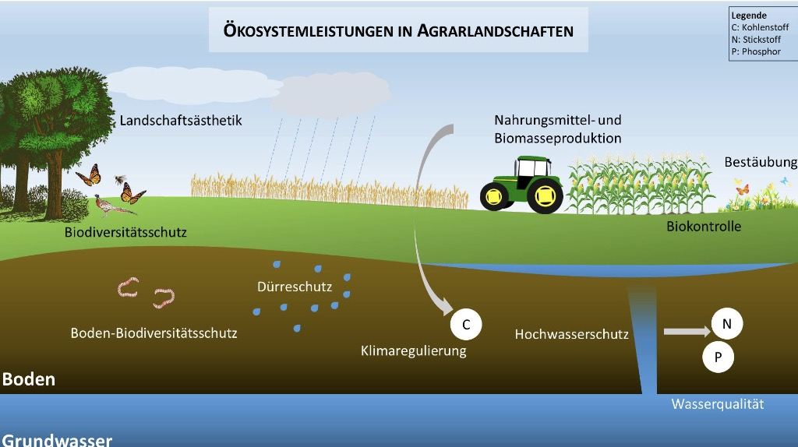

# 10.06.2024 Politik & Externalitäten

## Externalitäten

> **Externalitäten**: Auseinanderfallen von privaten | gesellschaftlichem Nutzen

Lösung: Steuern / Subventionen

Probleme: Information über soziale Kosten, Transaktionskosten

Ansätze zur Internalisierung:

- **Pigou**: Steuer
    - Ansatz: gesellschaftl. Kosten = private Kosten -> Internalisierung
    - Problem: Information über soziale Kosten

- **Coase**: Verhandlungen
    - Ansatz: bilatere Verhandlungen über Nutzungskonflikt
    - Problem: Transaktionskosten, Durchsetzung

- **Ostrom**: dezentrale Governance
- **Baumol** / Oates: Standard-Preis-Ansatz (bspw. Emissionshandel)
    - Festlegen eines Standards (bspw. Emissionshöchstmenge)
    - Preisbildung auf Märkten (bspw. Zertifikate)

## Prinzipien der Umweltpolitik

> **Vorsorgeprinzip:** Vermeidung von Umweltgefahren über akute Gefahr hinaus

Voraussetzung:

- begründete Gefahrvermutung
- Unsicherheit
- Strategie zur Reduzierung

> **Verursacherprinzip**: Internalisierung beim Verursacher (meist Gerechtigkeitsgründe)

Probleme:

- wer ist Verursacher (Nutzungskonflikte)
- mehr als zwei Seiten bei Umweltproblem
- Internationale Regulierung?!

## Umweltpolitik

wie geht gute Politik?

- **Ziel** adäquanz
- **Instrument** Adäquanz
- **Behaviorale** Adäquanz
- **Objekt** Adäquanz

### Instrumente

- Ordnungsrecht = Verbote / Gebote
    - Quoten
    - Emissionsttandards (absolut / relativ)
    - Technologiestandards
- Anreize (positiv / negativ)
    - Lenkungsteuern
    - Emissionshandel (cap & trade)
    - Subventionen
- sonstige "weiche" Instrumente 
    - Beschafffung
    - Siegel 
    - Nudges

Lenkungsteuern: 

Analyse von Instrumenten

| Kriterium                  | Emissionsstandard | Steuer / Subvention | Zertifikate |
| -------------------------- | ----------------- | ------------------- | ----------- |
| *Wirksamkeit*              | +                 | +                   | +           |
| *Wirkungsgeschwindigkeit*  | -                 | ++                  | +(+)        |
| *Statische Effizienz*      | -                 | +                   | +           |
| *Dynamische Anreizwirkung* | -                 | ++                  | +           |

Statische Effizienz = niedrigste mögliche Kosten

dynamische Effizienz = gute Anreize für umweltfreundliche Innovation

kontextabhängig => **Policy Mix**