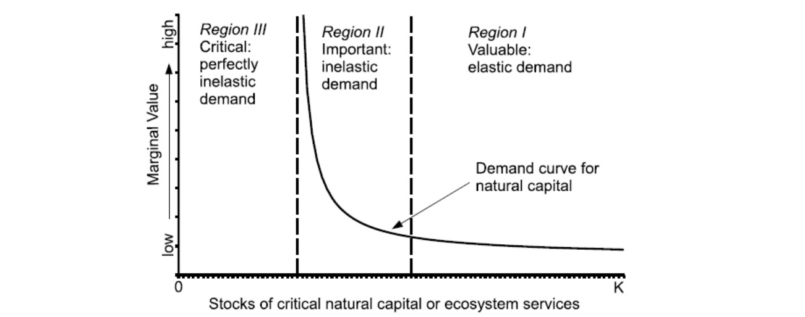
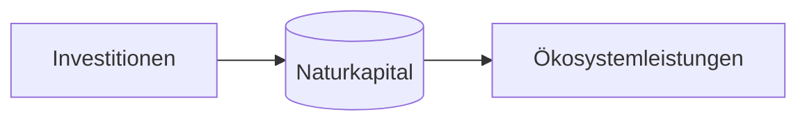
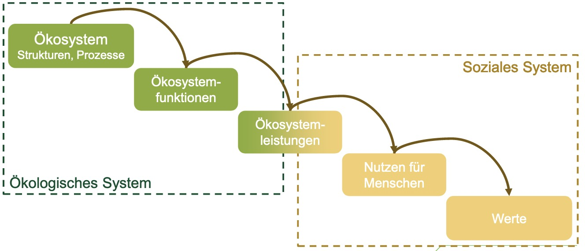
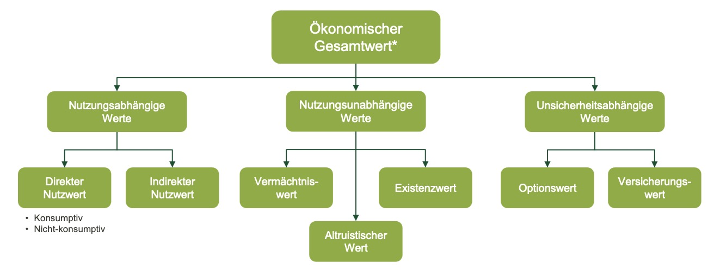
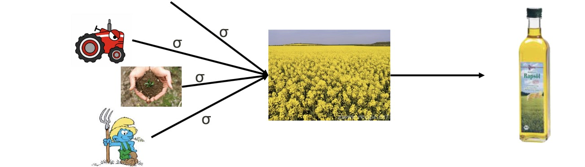
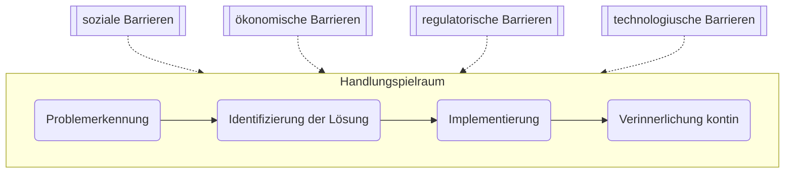
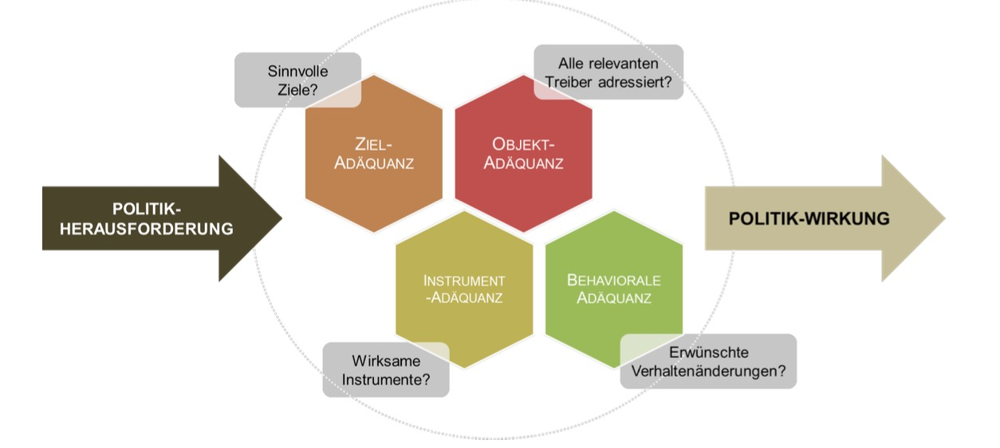
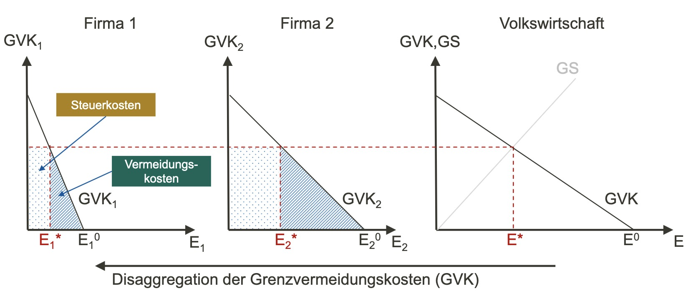

# Allgemein

Umwelt = knappes Gut => braucht Ökonomik

- umweltrelevantes menschliches Verhalten
- Opportunitätskosten von Umweltschutz
- Zielkonflikte

## Knappheit

- relative Knappheit:
    - Vorhandensein von Alternativen (Subsitution)
    - Preise = Maß der rel. Knappheit
- absolute Knappheit
    - nicht subsituierbar
    - keine (sinnvollen) Preise
    - Bsp.: stabiles Klimasystem

Darstellung

## Externalitäten

> **Externalität:** nicht durch Verträge erfasste "Nebeneffekte" wirtschaftliche Handels

- positiv / negativ
- Gesellschaftliche Kosten $\neq$ soziale Kosten

=> braucht Internalisierung

Problem: viele Umweltgüter = **öffentliche Güter**

- nicht handelbar => kein marktpreis
- andere Lösungsansätze, sonst *Tragedy of the Commons (Hardin)*

dezentrale Governance nach **Elinor Ostrom**, braucht:

- klar definierte Grenzen
- Überwachung
- Sanktionsmöglichkiten
- Konfliktlösungsmechanismen
- Anerkennung durch Regierung

Umweltschutz = Prinzipal-Agenten-Problem; Informationsasymmetrie zw. 

- Prinzipal (Staat, Gesellschaft)
- Agent (Landwirt:in, Förster:in)

> **Informationsasymmetrie**: ungleiche Verteilung von Informationen zw. Vertragspartnern

- ex-ante: vor Vertrag => *adverse Selektion*
- Ex-post: nach Vertrag => *moral hazard*

## Gefangenendilemma

soziales Dilemma: rationales Verhalten => suboptimales Ergebnis

| Gefangener A/B     | Nicht gestehen | Gestehen |
| ------------------ | -------------- | -------- |
| **Nicht Gestehen** | 2, 2           | 1, 20    |
| **Gestehen**       | 1, 20          | 10, 10   |

Lösungsansötze:

- Mafia-Omerta: Druck von außen, nicht zu gestehen
- Mehrmalige Wiederholung (tit-for-tat)

# Sozial-ökologische Systeme

> **sozial-ökologische Systeme**: komplexe Systeme mit zwei Teilsystem (Sozial & Ökologisch)

## Eigenschaften

1. Emergenz
2. rückkoppelung
3. Resilienz & Kipppunkte
4. Heterogenität

---

> **Emergenz:** Mikroverhalten + Interaktion => Makrophänomen

geht einher mit:

- nicht lineare Effekte
- Kipppunkte

Beispiel: Schellings Wohnraumsortierung

---

> **Rückkopplung**: Bidirektionale Beziehungen zw. Systemkomponenten

- positiv oder negativ
- verstärkend / schwächend

Beispiel: $\Delta T \implies Eisschmelze \implies Albedo \downarrow \implies + \Delta T$​

---

> **Kipppunkte:** Systempunkte, an denen ein System zusammenbricht, die nicht linear abschätzbar sind

Beispiel: Klimakipppunkte

Modellierung auf [Netlogo](https://netlogoweb.org/launch), siehe *Fire* Beispiel

---

> **Resilienz**: capacity of system to absord bisturbance rend retain essentially the same function, structure and identity

Bsp.: Monowälder im Harz = nich resilient

Bsp. 2: QWERTY-Lock IN

---

Effekte in sozial-ökologischen Systemen

- **Verlagerungseffekt**
    - Lokale Reduktion in Umweltbelastung
    - => Preisverschiebung
    - => Ausgleich anderswo
- **Reboundeffekt**
    - Effizienzsteigerung 
    - => Reduktion in Umweltbelastung & Preis
    - => höhere Nachfrage durch niedrigeren Preis

## Relevanz von SES

normale VWL: **problematische Annahmen**

- mur lineare Zusammenhänge
- repräsentative Agenten (statt emergentes Verhalten)
- nur Partial-Analyse, nicht Gesamtzusammenhänge

=> begrenzte Aussagekraft

# Naturkapital

> **Naturkapital**: Bestandsgröße der natürlichen Produktionsfaktoren

- wächst nach!
- Bestandsgröße

> **Ökosystemleistungen**: Direkte / indifrekte Beiträge von ökosystemen zu menschlichem Wohlergehen

- weit gefasster Begriff
- antropozentrische Perspektive
- an Nutzen für Menschen gebunden

Kategorien von Ökosystemleistungen

- Versorgung
- Regulierung
- Kulturelle

Beispiele für Ökosyatemleistungen

- Nahrungsmittelproduktion 
- Landschaftsästhetik
- ...

## Arten der Nachhaltigkeit

schwache Nachhaltigkeit = Substituierbarkeit 

Starke Nachhaltigkeit = wenig Substituierbarkeit

- kritisches Naturkapital
- absolut notwendig
- teil des fairen Vermächtnisses für die nächste Generation
    - Notwendige (stabiles Klima)
    - Nützliche (Forst)
    - Außergewöhnliche (Lüneburger Heide)

# Bewertung

Methoden der ökonomischen Bewertung

- Kostenbasierte Methoden
- Produktionsfunktion
- Offenbarte Präferenzen
- Geäußerte Präferenzen

## Wert

> **Wert** = Einheit einer entscheidungsrelevanter Größe, meist Geld

beachte: **Tauschwert vs. Nutzwert** (Diamanten vs Wasser)

ökonomischer Wert

- relative Knappheit
- Präferenzen
- Substitiuerbarkeit
- Subjektivität

Bestandteile

## Kostenbasierte Methoden

Grundidee: Kosten einer Maßnahme = Proxy für Wert

Beispiele:

- Vermeidungskosten
- Opportunitätskosten
- Ersatzkosten (Flutmauer statt Aue)

Vorteil: wenig Aufwand

Nachteil: nur selektiv anwendbar, keine Informationen über Präf.

## Produktionsfunktion

Formulierung einer Produktionsfunktion für auf Märkten gehandeltes Gut

Kalkulation des Beitrags der Erde / Biene zu Endprodukt

Nachteil: aufwendig, nur für nutzungsabhängige Werte

## offenbarte Präferenzen

Grundidee: Entscheidungen auf Märkten mit Umweltgütern

- auf Nachfrageseite
- mit statistischen Methoden

**Reisekostenmethode**

Reiseausgaben zu Nationalparks = Bereitschaft für NAturgut zu zahlen

**Hedonische Bewertung**: Beiträge zu Immobilien / Bodenpreisen

Vorteile: Präferenzen aus tatsächjlichen Entscheidungen

Nachteile: 

- nur für bestimmte ÖSL
- hoher Aufwand
- existierende Marktverzerrung

## geäußerte Präferenzen

Grundidee: direkte Befragung nach Präferenzen (mit Fragebögen)

Varianten:

- **Kontingente Bewertung:**  *Wie viel wären sie bereit zu zahlen für X*
- **Choice Experimente:** Auswahl zwischen verschiedenen Szenarien
- **Deliberative Methode**: Erweitung der Befragung
    - mit Gruppendiskussionen
    - für komplexe Umweltgüter

Vorteile: alle ÖSL, keine Verzerrugnen

Nachteile: Hypothetisch, aufwendig

## Diskontierung

Vergelich von Kosten / Nutzen zu unterschiedlichen Zeitpunkten

- Diskontrate (p): Wertverlust von zukünftigen Zahlungsstrom
- Diskontfaktor (ß): Kehrwert von Diskontrate
- Barwert (BW): abdiskontierter Wert

Individuelle vs soziale Diskontrate = **unterschiedlich!**

- für künftige Generationen (intergenerationelle Ethik)
- Aussterbe Wahrscheinlichkeit (Long Tail)

Ramsey Formel: für *soziale Diskontrate*

$$
p = \underbrace{ \delta }_{Zeitpräferenz} + \underbrace{ n }_{Einkommenselast.} * \underbrace{ g }_{Wachstumsrate}
$$

verschiedene Annahmen:

- g = BIP? Trend in die Zukunft?
- d = welche Güter, wie ermitteln?

=> **Social Cost of Carbon**

- ökonomischer Wert einer vermiedenen Tonne CO2eq
- mithilfe von Integrated Assessment Model

## Kosten-Nutzen Analyse

Grundidee: Gegenüberstellung von Kosten - Nutzen

- Vergleich von 2 oder mehr Optionen
- Option mit größten Nettonutzen wählen
- Statische Analyse

Arten

- Qualitative KNA
- Monetäre KNA

Beispiel: Autobahnbau in Stadt Halle

# Umweltrelevantes Verhalten

Problem: Leute wollen sich umweltfreundlich verhalten, aber tun es dann in der Realität nicht (Bewusstsein $\neq$ Verhalten)

Warum?

- Falsche Informationen = teilweise
- Unterkomplexe Darstellung 
- Individualismus

## Heuristics and Biases

Arten der begrenzten Rationaliät (Daumenregeln etc.)

- **Ankerheuristik** = Orientierung an bekannten Zahlen
- **Verfügbarkeitsheuristik** = Ereignisse an die man sich leicht erinnert -> gefühlt häufiger
- **Repräsentativitätsheuristik**
- **Verlustaversion** = 100€ verlieren = mehr Nutzenverlust als 100€ gewinnen 

## Relative Motivation

nach *Amartya Sen*

- Altruistische Präferenzen: 
    - Sympathy: eigener Nutzen beinhaltet anderen Nutzen
    - Commitment: Misery von anderen Menschen ablenken ohne eigenen Nutzen
- Meta Präferenzen: Präferenzordnung, die von aktueller Präferenz abweicht
    - Bsp.: Raucher, die eigentlich nicht rauchen wollen

Veblen: Conspicous Consumption

- konsum von Status Gütern
- Protzen
- verwand mit Positionale Güter (Fred Hirsch)

## Sozial eingebettetes Verhalten

Bordieu: 

- Habitus
- Kulturelles Kapital => Symbolisches Kapital => Sozialkapital
- Soziale Identität

Luhmann:

- Systemlogiken
- Hermetische Systeme

Diffusion von Innovation

## Motivation

individuelle Handlung = vielschrittiger Prozess

- begrenzt von vielen Faktoren (Gesellschaft, Geld, etc)
- soziale Dilemmata erschweren Handeln

=> kollektives Handeln in Institutionen benötigt!

- bspw. soziale Norme / Rechte / Steuern
- Insbesondere großskalige Probleme

# Externalitäten

> **Externalitäten**: Auseinanderfallen von privaten | gesellschaftlichem Nutzen

Lösung: Steuern / Subventionen

Probleme: Information über soziale Kosten, Transaktionskosten

Ansätze zur Internalisierung:

- **Pigou**: Steuer
    - Ansatz: gesellschaftl. Kosten = private Kosten -> Internalisierung
    - Problem: Information über soziale Kosten

- **Coase**: Verhandlungen
    - Ansatz: bilatere Verhandlungen über Nutzungskonflikt
    - Problem: Transaktionskosten, Durchsetzung

- **Ostrom**: dezentrale Governance
- **Baumol** / Oates: Standard-Preis-Ansatz (bspw. Emissionshandel)
    - Festlegen eines Standards (bspw. Emissionshöchstmenge)
    - Preisbildung auf Märkten (bspw. Zertifikate)

## Prinzipien der Umweltpolitik

> **Vorsorgeprinzip:** Vermeidung von Umweltgefahren über akute Gefahr hinaus

Voraussetzung:

- begründete Gefahrvermutung
- Unsicherheit
- Strategie zur Reduzierung

> **Verursacherprinzip**: Internalisierung beim Verursacher (meist Gerechtigkeitsgründe)

Probleme:

- wer ist Verursacher (Nutzungskonflikte)
- mehr als zwei Seiten bei Umweltproblem
- Internationale Regulierung?!

## Umweltpolitik

wie geht gute Politik?

- **Ziel** adäquanz
- **Instrument** Adäquanz
- **Behaviorale** Adäquanz
- **Objekt** Adäquanz

### Instrumente

- Ordnungsrecht = Verbote / Gebote
    - Quoten
    - Emissionsttandards (absolut / relativ)
    - Technologiestandards
- Anreize (positiv / negativ)
    - Lenkungsteuern
    - Emissionshandel (cap & trade)
    - Subventionen
- sonstige "weiche" Instrumente 
    - Beschafffung
    - Siegel 
    - Nudges

Lenkungsteuern: 

Analyse von Instrumenten

| Kriterium                  | Emissionsstandard | Steuer / Subvention | Zertifikate |
| -------------------------- | ----------------- | ------------------- | ----------- |
| *Wirksamkeit*              | +                 | +                   | +           |
| *Wirkungsgeschwindigkeit*  | -                 | ++                  | +(+)        |
| *Statische Effizienz*      | -                 | +                   | +           |
| *Dynamische Anreizwirkung* | -                 | ++                  | +           |

Statische Effizienz = niedrigste mögliche Kosten

dynamische Effizienz = gute Anreize für umweltfreundliche Innovation

kontextabhängig => **Policy Mix**

