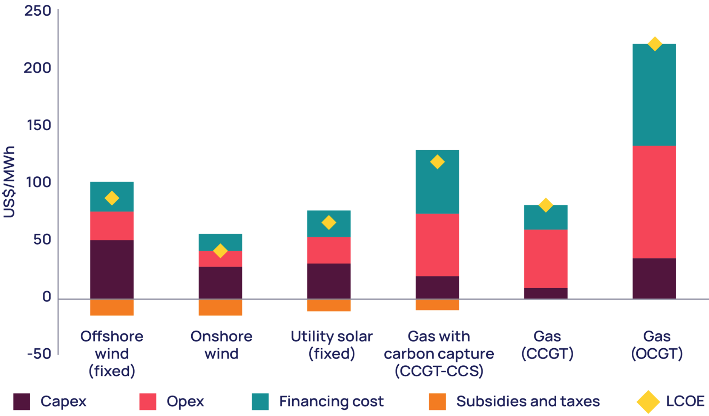
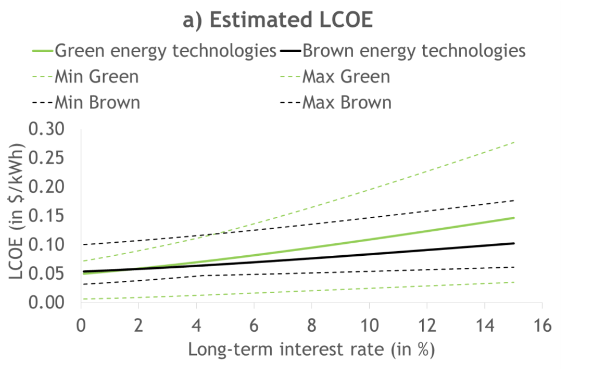
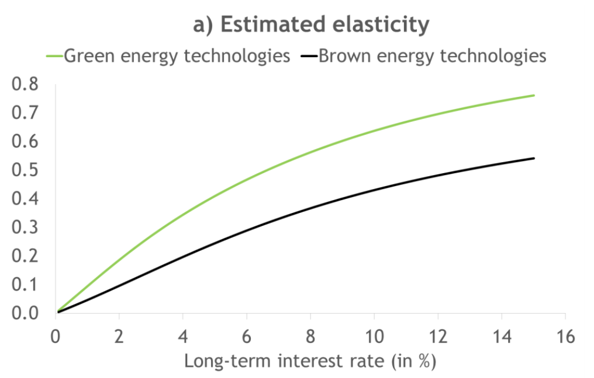
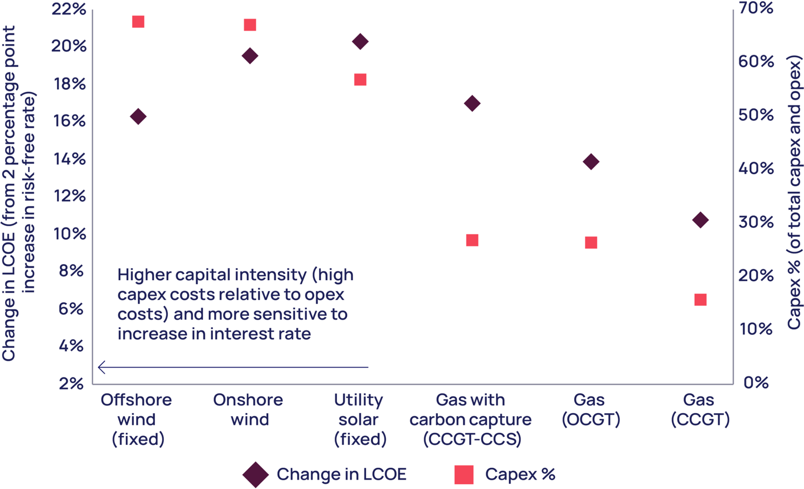

# Team Project

## Requirements

- 15 Min Presentation 
- completely present subject
- 10 Min Questions + Discussions
- 30% of final Grade
- Files 1 week before
  potentially relevant for exam

Subject: Climate Change and Monetary Policy!

Contents: 

- Data and Figures! 
- Backup Slides with expanding Material
- discussion question
- short Conclusion

### **Interest Rate Relevance for Renewables**

[Role of capital costs in decarbonizing the electricity sector](https://iopscience.iop.org/article/10.1088/1748-9326/11/11/114010)

[Impact of Interest Rates on Electricity Production Costs](https://www.cepweb.org/wp-content/uploads/CEP_DN_Interest_Rates_Energy_Prices.pdf)

[Wood Mac Report:](https://www.woodmac.com/horizons/energy-transition-investing-in-a-high-interest-rate-era/) 

- reaction to inflation: FED and European Central Banks raise interest rates
- Green Energy vs Brown Energy: 
  - high upfront cost - cap expenditure
  - low operational costs 

lower LCOE (Levelized Cost of Energy) in long-term

- but due to capex = very susceptible to interest rates
- if the interest rates rise from 2% historic to 4%
- much higher rise in LCOE for Green Energy

aka Elasticity to interest rate is much higher

As one graph: what happened in post-2020:

