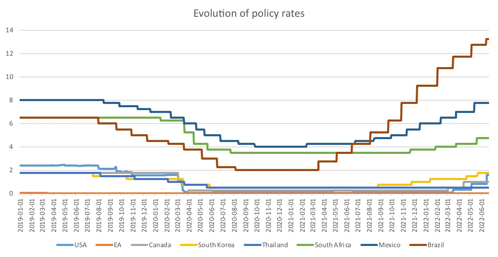

# 4. Covid and Central Banks 

## Market Liquidity

Problem: missing liquidity after Covid-Crunch, more sellers then buyers

> **Liquidity**: efficiency to convert assets to cash 

Role of CB: step up the buying of assets in crisis
Problem: missing access to Dollar for foreign (central) bank

Actions of CB

1. Loans + Payment Facilities (Repo) to Commercial Banks
2. Quantitative Easing (Purchasing Programs etc.) 
3. Reduction of Reserve Requirements
4. on international level: Swap Lines (e.g by FED)

## Household Credit Access

Problem:
- HH out of work due to Covid Lockdowns
- Shutdown of Businesses due to lower Demand + Lockdowns

Actions:
- lower interest rates
- lower credit requirements for SME (like KFW-Kredit)

## Easing the Deficit

Problem: rising Rates = higher payments = even faster debt spiraling

Actions:
- lower interest rates
- direct buyment programs of Gov. Bonds

